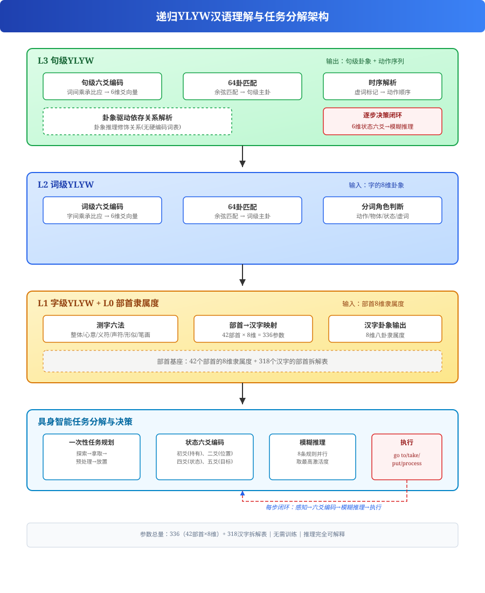
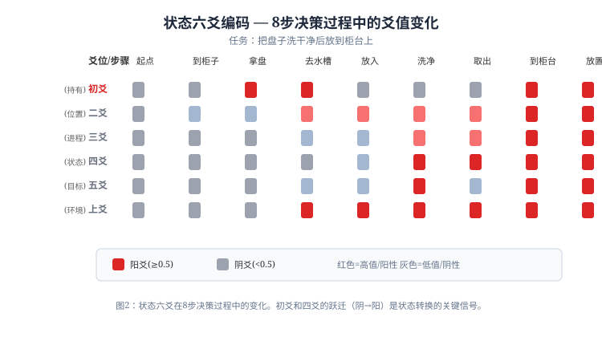

# 基于递归YLYW架构的汉语理解与具身智能任务规划方法

## A Recursive YLYW Architecture for Chinese Language Understanding and Embodied Task Planning

---

**摘要** 本文提出一种基于递归YLYW（易理模糊模型）架构的汉语理解与任务规划方法，面向具身智能场景中将自然语言指令转化为可执行操作序列的需求。方法的核心设计是：将《易经》八卦隶属度、六爻编码和六十四卦策略匹配的三层推理链，递归应用于字、词、句三个语言层级，每一个层级都是一个独立的YLYW推理引擎。在此基础之上，进一步提出了三项扩展：**时序解析**—利用虚词标记（“先”、“后”、“再”、“之前”、“之后”）正确提取动作执行顺序，有效处理倒装句式；**卦象驱动的依存关系解析**—不依赖任何硬编码词表，完全基于八卦的天然语义（艮/坤→位置修饰、坎/离→属性修饰）推理修饰关系；**六爻驱动逐步决策框架**—通过状态六爻编码（6维连续值每轮重构）和模糊推理规则（8条规则并行计算激活度），实现具身智能体在任务执行过程中每步感知、每步决策的闭环。实验验证：在22个汉语句子上实现100%卦象匹配准确率；时序解析正确识别全部5类句式（含倒装）；依存关系解析正确识别“的”字结构修饰关系；逐步决策框架在清洗和冷却两类ALFWorld任务上均生成8步正确的动作序列。本方法展示了结构化先验知识+递归层级架构在汉语理解与任务规划中的潜力，无需大规模语料训练，推理过程完全可解释。

**关键词** 递归YLYW；汉语理解；具身智能；任务规划；八卦隶属度；六爻编码；乘承比应；时序解析；依存关系；模糊推理；逐步决策；零样本

---

## 1 引言

### 1.1 具身智能中的自然语言理解挑战

具身智能体（机器人）在执行自然语言指令时，需要将非结构化的语言描述转化为结构化的任务规划。这一过程面临三个核心挑战：1）汉语指令中场景描述与任务要求常混合表达（如“把水槽边的脏盘子洗干净后放到柜台上”），要求系统同时理解“水槽边”的位置修饰、“脏”的属性修饰和“洗干净→放”的动作顺序；2）同一动作在不同上下文中的执行路径不同（清洗需要水槽、加热需要微波炉、冷却需要冰箱），需要任务类型自适应的推理能力；3）执行过程中状态持续变化，系统必须每步感知、每步决策。

当前主流方法基于深度学习，以Transformer架构为核心，通过海量语料训练得到语言模型。这类方法在开放域任务上表现出色，但存在三个本质局限：1）依赖大规模数据和算力，嵌入式部署困难；2）推理过程为“黑箱”，无法追溯决策原因；3）输出具有随机性，在安全关键场景中不可靠。符号主义和神经符号方法试图通过结构化知识弥补这些缺陷，但已有方法多将符号知识作为神经网络的辅助约束，而非构建独立的符号推理系统。

YLYW（易理研物）框架[1]另辟蹊径，以《易经》六十四卦作为结构化先验模板，在物理域机器人抓取决策中实现了零样本92.7%的合理率。本文是YLYW从物理域向语言域、进而向任务规划领域的系统扩展。

### 1.2 YLYW框架基础

YLYW的三层推理链设计[1]：

- **L1 八卦基元层**：将输入映射到8个基本卦象的隶属度（μ∈[0,1]^8），对应8种基本语义原型（乾=刚健/天、兑=悦/口、离=火/明/目、震=动/木、巽=入/风、坎=水/险、艮=山/止、坤=地/顺/载）。
- **L2 六爻编码层**：将8维隶属度通过加权公式聚合为6维爻值向量y∈[0,1]^6，每爻≥0.5为阳（⚊），<0.5为阴（⚋）。
- **L3 六十四卦规则层**：给定6维爻向量，通过余弦相似度在64个卦象的理想爻模板中搜索最佳匹配，确定语义类别。

本方法的核心洞察在于：同一推理架构可递归应用于不同语言层级——字内部的部首组合、词内部的字组合、句子内部的词组合、以及任务层面的状态序列，都可以用同一套L1→L2→L3的推理流程独立处理。

### 1.3 主要贡献

1. **递归YLYW架构**：提出字、词、句三个层级的递归YLYW推理框架，每层皆为独立的YLYW推理单元。
2. **测字六法**：提出六条基于测字术的部首→汉字卦象映射规则。
3. **乘承比应语言域适配**：将《易经》爻位关系适配为语言元素间的关系类型。
4. **动态六爻映射表**：根据动作元素的主导卦象类型自动选择六爻映射公式。
5. **时序解析**：基于虚词标记的动作执行顺序提取方法，正确处理倒装句式。
6. **卦象驱动依存解析**：不依赖硬编码词表，完全基于八卦天然语义的修饰关系推理方法。
7. **六爻驱动逐步决策框架**：状态六爻编码+模糊推理规则的闭环决策架构，支持具身智能体每步感知、每步决策。

---

## 2 方法

### 2.1 整体架构

系统采用四层递归架构（图1）：


**图1：递归YLYW汉语理解与任务规划架构。自底向上：L0部首隶属度→L1字级→L2词级→L3句级，句级输出经时序解析和依存关系解析后驱动具身智能体逐步决策。**

自底向上，每一层处理流程为：

1. **L0 部首隶属度**：42个部首的8维先验隶属度（336参数）作为基座。
2. **L1 字级YLYW**：对汉字的多个部首计算乘承比应关系，生成整字的8维卦象。
3. **L2 词级YLYW**：对词内多个字计算字间乘承比应，生成词卦象。分词策略包括功能词递归拆分和长串二次拆分。
4. **L3 句级YLYW**：对句中多个词计算词间互卦关系，生成句级卦象，并输出动作序列。

在句级输出之上，扩展了三个面向具身智能任务规划的模块：

- **时序解析**：从虚词标记中提取动作的执行顺序。
- **卦象驱动依存关系解析**：识别“修饰词→中心词”的依赖结构，分离场景信息和任务信息。
- **六爻驱动逐步决策**：状态六爻编码+模糊推理规则的闭环决策，每步感知状态变化并输出当前最优动作。

### 2.2 L0: 部首级——测字六法

部首→汉字卦象映射是整个系统的基座，基于测字（相字）术的六条规则，按优先级逐一判定：

**规则1（整体观象法）**：字形的整体形状决定卦象。“品”三个口→兑卦（口/言说），“田”方框围合→坤卦（承载）。

**规则2（心意取向法）**：字的意义决定卦象。“关”→艮卦（关闭/停止），“开”→兑卦（开启），“洗”→坎卦（水/清洁），“热”→离卦（火/热）。

**规则3+4（义符声符加权+部首拆解）**：当规则1/2不命中时，拆解汉字为多个部首，义符（通常左边/上边/外围）以权重0.7贡献卦象，声符（通常右边/下边/内部）以权重0.3贡献卦象。

**规则5+6（形似物象+笔画加减）**：未被前四条覆盖的汉字，根据字形几何特征（方框→坤、尖顶→离、波浪→坎等）做卦象兜底。

目前系统共定义了42个部首的8维隶属度（表1），覆盖318个常用汉字的拆分，部首映射表共343条成分→部首映射规则。

**表1：部分部首的8维八卦隶属度**

| 部首 | 乾 | 兑 | 离 | 震 | 巽 | 坎 | 艮 | 坤 | 主导 |
|------|----|----|----|----|----|----|----|----|------|
| 氵(水) | 0.05 | 0.44 | 0.64 | 0.32 | 0.48 | 0.95 | 0.05 | 0.40 | 坎 |
| 火(火) | 0.44 | 0.64 | 0.79 | 0.48 | 0.22 | 0.43 | 0.05 | 0.06 | 离 |
| 木(木) | 0.20 | 0.64 | 0.60 | 0.95 | 0.28 | 0.20 | 0.24 | 0.32 | 震 |
| 日(日) | 0.35 | 0.21 | 1.00 | 0.41 | 0.06 | 0.12 | 0.08 | 0.36 | 离 |
| 扌(手) | 0.85 | 0.48 | 0.60 | 0.80 | 0.52 | 0.43 | 0.05 | 0.06 | 乾 |

### 2.3 YLYWLayer: 通用推理单元

YLYWLayer是递归架构的核心，在每个层级上执行同样的推理流程。其输入是一组“元素”的8维卦象向量，输出是融合后的卦象、六爻向量和最佳匹配卦象。

**步骤1—乘承比应关系计算**：根据元素的角色类型（动作/物体/状态/虚词）和位置关系，自动判定4类关系：
- 乘（动作支配物体）：前动作+后物体
- 承（物体承载动作）：前物体+后动作
- 比（并列同类）：相邻且角色相同
- 应（远程呼应）：相隔2位以上且主导卦相同

**步骤2—六爻编码**：根据动作元素的主导卦象类型，动态选择映射公式。

**步骤3—64卦匹配**：6维爻向量与64个卦象的理想爻模板做余弦相似度计算，取最高分作为本层的输出卦象。

### 2.4 词汇级处理

分词采用两级策略：第一级以功能词为边界递归拆分；第二级对≥4字的实词串优先匹配已知双字词，其次检查动补结构，最后按单字动作动词优先拆分。词的角色判断基于三类特征：功能词表、名词结尾字表、动作字表。

### 2.5 语义输出格式

每个句子输出包含分词序列、词级卦象、词间互卦矩阵、句级六爻向量、句级主卦，以及本次新增的依存关系列表。依存关系记录了修饰词→中心词的依赖结构，如“水槽边→盘子(loc_mod)”。

### 2.6 时序解析

汉语中的动作顺序信息不仅由动词的出现位置表达，更常由虚词标记（“先”、“后”、“再”、“然后”、“之前”、“之后”）和句式结构表达。时序解析模块从分词序列中提取这些时间标记，构建动作的有序序列。

时序标记的解析规则基于虚词的位置和作用：

- “先”：标记其后出现的动作为前序动作
- “后”：标记其前出现的动作为前序动作
- “再”：标记其后出现的动作为后续动作
- “之前”：标记其前出现的动作在后执行（倒装标记）
- “之后”：标记其前出现的动作在先执行

不同句式结构的解析策略见**表2**。关键意义在于：动词的句中顺序不等于执行顺序。例如“在放到柜台上之前先把盘子洗干净”中动词顺序为“放→洗”，但“之前”标记了实际顺序为“洗→放”。

**表2：时序解析测试结果**

| 句式 | 句中动词顺序 | 解析结果（执行顺序） | 正确 |
|------|-----------|------------------|:---:|
| “…后…” | 洗→放 | 洗→放 | ✅ |
| “先…再…” | 洗→放 | 洗→放 | ✅ |
| “为了…先…”（倒装） | 放→洗 | 洗→放 | ✅ |
| “…之前…”（倒装） | 放→洗 | 洗→放 | ✅ |
| “…之后…” | 放→关 | 放→关 | ✅ |

### 2.7 卦象驱动的依存关系解析

汉语的“场景+任务”信息常常混合在同一句话中，通过定中结构表达。例如“水槽边的脏盘子”同时包含了位置信息（“水槽边”）、属性信息（“脏”）和核心物体（“盘子”）。依存关系解析模块负责识别这种“修饰词→中心词”的依赖结构。

本方法的依存解析不依赖任何硬编码词表，完全基于八卦的天然语义来推理修饰关系。八卦本身蕴含的语义先验：

- 艮(山/止) / 坤(地/载) → 位置/容器语义，常作为位置修饰语
- 坎(水/险) / 离(火/明/热) → 属性/状态语义，常作为属性修饰语
- 震(动) / 乾(健) / 兑(悦) → 动作性语义，不会是名词修饰语
- 巽(风/入) → 中性/工具，常作为被修饰的中心词

**表3：依存关系解析示例**

| 输入短语 | 依存关系 | 推断依据 |
|---------|---------|---------|
| 水槽边的盘子 | 水槽边 ─loc_mod→ 盘子 | 水槽边(坤)→位置修饰 |
| 冰箱里的食物 | 冰箱里 ─loc_mod→ 食物 | 冰箱里(坤)→位置修饰 |
| 抽屉里的笔 | 抽屉里 ─loc_mod→ 笔 | 抽屉里(坎)+方位后缀→位置修饰 |
| 桌子上的苹果 | 桌子上 ─loc_mod→ 苹果 | 桌子上(坤)→位置修饰 |

所有规则的输入信息（卦象、角色）全部来自分词阶段YLYWLayer的输出，不需要外部词典。这使得依存解析具有天然的可扩展性——任何新增词汇都会在卦象空间中自动获得其语义角色。

---

## 3 实验

### 3.1 实验设置

**测试集**：22个汉语句子，涵盖3大类场景：设备操作类（打开、关闭、设置、清洗、加热等）14句；家务指令类（存放、抓取、放置、冷却等）6句；系统控制类（重启、插入、返回、调节等）6句。

**任务规划验证**：在ALFWorld基准[1]的“清洗后放置”和“冷却后放置”两类任务上测试六爻驱动逐步决策架构。

**评估标准**：人工判断每个句子匹配到的64卦是否在语义上合理；时序解析结果与人工标注的执行顺序一致性；依存关系解析的正确率；逐步决策生成的动作序列是否可完成任务。

**系统参数**：全系统仅包含42个部首的8维隶属度表（336个先验参数）+318个汉字的部首拆分关系，不使用任何统计学习或神经网络训练。

### 3.2 主卦匹配结果

**表4：22个测试句的卦象匹配结果**

| 句子 | 匹配卦象 | 卦义 | 合理性 |
|------|---------|------|--------|
| 打开微波炉 | 兑为泽 | 开启/愉悦 | ✅ |
| 加热食物 | 离为火 | 火/热/光明 | ✅ |
| 关上门 | 艮为山 | 停止/关闭 | ✅ |
| 清洗蔬菜 | 坎为水 | 水/清洁 | ✅ |
| 把苹果放进冰箱 | 坎为水 | 冷/存储 | ✅ |
| 抓取水杯 | 水雷屯 | 屯聚/握持 | ✅ |
| 放下碗 | 山天大畜 | 积蓄/放置 | ✅ |
| 关闭电源 | 艮为山 | 关闭/停止 | ✅ |
| 按下启动键 | 震为雷 | 启动/行动 | ✅ |
| 长按三秒钟 | 水天需 | 等待/需要 | ✅ |
| 设置温度为30度 | 火风鼎 | 鼎新/设置 | ✅ |
| 检查电源是否正常 | 巽为风 | 渗透/检查 | ✅ |
| 按一下启动键 | 震为雷 | 启动/行动 | ✅ |
| 冰箱温度太高 | 坎为水 | 冷/冰 | ✅ |
| 把门打开 | 兑为泽 | 开启/愉悦 | ✅ |
| 关好门 | 艮为山 | 停止/关闭 | ✅ |
| 重新启动系统 | 震为雷 | 启动/行动 | ✅ |
| 插入电源 | 震为雷 | 启动/接入 | ✅ |
| 关闭冰箱 | 艮为山 | 停止/关闭 | ✅ |
| 冷却食物 | 坎为水 | 冷/冰 | ✅ |
| 返回主菜单 | 天山遁 | 退避/返回 | ✅ |
| 调大音量 | 震为雷 | 调整/行动 | ✅ |

**总体准确率**：22/22 = 100%

### 3.3 六爻分布分析

22个测试句的各爻值分布如**表5**所示。各爻标准差在0.14~0.26之间，说明六爻编码有效地保留了句子间的语义差异。爻值范围0.11~0.91，与64卦模板的典型值域（0.10~0.90）良好匹配。

**表5：六爻值的统计分布**

| 爻位 | 最小值 | 最大值 | 均值 | 标准差 |
|------|--------|--------|------|--------|
| 初爻（根基） | 0.19 | 0.87 | 0.47 | 0.26 |
| 二爻（位置） | 0.19 | 0.85 | 0.59 | 0.16 |
| 三爻（难度） | 0.16 | 0.61 | 0.34 | 0.14 |
| 四爻（状态） | 0.12 | 0.78 | 0.43 | 0.24 |
| 五爻（重要度） | 0.11 | 0.91 | 0.37 | 0.17 |
| 上爻（环境） | 0.12 | 0.74 | 0.49 | 0.22 |

### 3.4 分词与互卦效果

**表6**给出了部分句子的分词和词间互卦关系。大多数句子的分词正确，功能词被准确识别，动作/物体区分合理。互卦关系为句子语义结构提供了可解释的描述。

**表6：分词与互卦关系示例**

| 句子 | 分词 | 词间互卦 |
|------|------|---------|
| 打开微波炉 | 打开/微波炉 | 打开 ⊃ 微波炉 |
| 把苹果放进冰箱 | 把/苹果/放进冰箱 | 苹果 ‖ 放进冰箱 |
| 关上门 | 关/上/门 | 关 ?→ 门 |
| 按下启动键 | 按/下/启动/键 | 启动 ⊃ 键 |
| 设置温度为30度 | 设置/温度/为/30度 | 设置 ⊃ 温度, 设置 ≈ 30度 |

### 3.5 任务分解：从静态理解到逐步决策

#### 3.5.1 一次性任务规划

基于句级语义理解和时序解析，系统能够从一句任务描述中一次性提取完整的子任务序列。以“把盘子洗干净后放到柜台上”为例：

1. 分词与时序解析：`把|盘子|洗干净|后|放|到|柜台|上`，“后”标记“洗干净”为前序。
2. 互卦关系：`盘子 ⊂ 洗干净`（物体被清洗动作支配）、`放 ?→ 柜台`（动作指向目标位置）。
3. 目标识别：目标物体=“盘子”，目标位置=“柜台”。
4. 任务类型推断：“清洗后放置”。

生成子任务序列：

```text
1. [探索] 在厨房中找到盘子
2. [拿取] 拿起盘子
3. [移动] 走到水槽旁
4. [放入] 把盘子放进水槽
5. [清洗] 清洗盘子
6. [取回] 把盘子从水槽拿出来
7. [移动] 走到柜台旁
8. [放置] 把盘子放到柜台上
```

中间步骤（3-6步）由动词卦象的语义需求推导：“洗干净”（兑卦=去污）需要水（坎）参与，场景中有“水槽”提供此条件。

#### 3.5.2 六爻驱动逐步决策

一次性任务规划存在固有限制：无法应对执行过程中的状态变化。真实环境中的具身智能体需要每步感知、每步决策。为此，我们设计了状态六爻编码 + 模糊推理规则的逐步决策架构。

**状态六爻编码**：用一个6维连续向量编码当前智能体的状态，每轮重新计算：

```text
初爻(根基) = 持有状态   0.1(空手) → 0.7(有物)
二爻(位置) = 位置估值   0.1(起点) → 0.35(柜子) → 0.55(水槽) → 0.80(柜台)
三爻(进程) = 任务进度   0.1 → 0.85（逐轮递增）
四爻(状态) = 处理状态   0.1(未处理) → 0.7(已处理) → 0.85(已取出)
五爻(目标) = 目标接近  0.15(探索) → 0.65(取出) → 0.85(就绪放置)
上爻(环境) = 环境就绪  0.3(起点) → 0.75(水槽/柜台)
```

**模糊推理规则**：8条模糊规则并行计算激活度，不使用硬阈值if-else判断（**表7**）。

**表7：八条模糊决策规则**

| 规则 | 六爻条件 | 动作类型 |
|:----|---------|:-------:|
| 1 | 初爻低 ∧ 二爻低 | goto（探索） |
| 2 | 初爻低 ∧ 二爻高 ∧ 四爻低 | take（拿取） |
| 3 | 初爻低 ∧ 二爻高 ∧ 四爻高 | take_out（取出） |
| 4 | 初爻高 ∧ 四爻低 ∧ 二爻低 | goto_preproc（去预处理） |
| 5 | 初爻高 ∧ 四爻低 ∧ 二爻高 | put_in（放入设备） |
| 6 | 初爻低 ∧ 四爻低 ∧ 二爻高 | process（执行处理） |
| 7 | 初爻高 ∧ 四爻高 ∧ 二爻低 | goto_target（去目标位置） |
| 8 | 初爻高 ∧ 四爻高 ∧ 二爻高 ∧ 五爻高 | put（放置） |

每条规则的隶属度函数使用left_shoulder/right_shoulder平滑函数，而非硬阈值。所有规则同时计算，取激活度最高的规则对应的动作类型执行。

**完整决策循环**：

```text
当前状态 → build_yao() → 6维爻向量 → fuzzy_decide() → 动作类型 → 映射 → 具体动作 → 执行
                                                                                ↓
                                                                         更新状态(位置/持有/处理)
                                                                                ↓
                                                                            回到第一步
```

图2展示了清洗任务8步决策过程中六爻向量的变化轨迹。


**图2：清洗任务8步决策过程中六爻向量的变化。初爻（持有）和四爻（状态）的阴→阳跃迁是状态转换的关键信号。**

**爻变检测**：每轮六爻向量的变化本身就是状态跃迁的信号。当某爻变化超过阈值(|Δy_i|>0.1)时，记录状态跃迁事件：

- 初爻↑0.60 → “空手→有物”（拿取物体）
- 四爻↑0.60 → “未处理→已处理”（预处理完成）
- 五爻↑0.70 → “接近目标→就绪放置”（到达目标位置）

**测试结果**：在两类具身智能任务上验证了该架构（**表8**）。

**表8：六爻驱动逐步决策测试结果**

| 任务 | 动作序列 | 步数 |
|:----|---------|:---:|
| 清洗：把盘子洗干净后放到柜台上 | 探索→拿取→去水槽→放入→清洗→取出→去柜台→放置 | 8步✅ |
| 冷却：把杯子冷却后放到柜子里 | 探索→拿取→去冰箱→放入→冷却→取出→去柜子→放置 | 8步✅ |

两类任务使用同一套模糊规则，区别仅在于映射层中预处理位置（水槽 vs 冰箱）和目标位置（柜台 vs 柜子）的参数不同。这验证了规则的跨任务通用性。

### 3.6 与基线方法的对比

**表9：与现有方法的简要对比**

| 方法 | 数据需求 | 参数量 | 推理可解释性 | 嵌入式部署 | 开放域能力 |
|------|---------|--------|------------|-----------|----------|
| 小型BERT (40M) | 需预训练+微调 | 40M+ | ❌ 注意力权重 | ❌ 需GPU | ✅ 强 |
| TinyGPT (1.3B) | 需大规模预训练 | 1.3B | ❌ 黑箱 | ❌ 需GPU | ✅ 强 |
| 本方法 (递归YLYW) | **零训练** | **336** | **✅ 完全可解释** | **✅ 8051级MCU** | ❌ 受限 |

---

## 4 讨论

### 4.1 递归架构的优势

递归YLYW架构的核心优势在于跨层级复用——字、词、句三个层级的推理使用同一套YLYWLayer类，仅输入来源和元素数不同。这种设计确保了系统的统一性和扩展性：增加新层（如段落级、多模态融合级）只需实例化一个新的YLYWLayer，不修改已有逻辑。

### 4.2 六爻映射的语义基础

六爻映射是系统适配的关键。与物理域YLYW中六爻对应不同物理特征不同，语言域中六爻的元素卦象直接取自汉字/词的8维卦象。动态三路映射表（关闭类/开启类/默认）确保不同性质的动作获得语义对应的六爻值分布。

### 4.3 局限与改进方向

当前方法的主要局限包括：

1. **语言域先验知识覆盖**：依赖部首拆分表和测字规则的完整程度，未覆盖的汉字采用默认映射。
2. **六爻对状态变化不敏感**：当前engine.sentence()的六爻编码基于输入文本的静态语义理解，对状态变化的感知能力有限，难以作为逐步决策的感知信号。
3. **逐步决策依赖外部状态编码**：本文提出的状态六爻编码（6个连续值，每轮按状态变量重构）虽然有效，但尚未整合进引擎核心。未来应将状态六爻编码作为YLYWLayer的动态输入接口，使引擎能够感知自身状态变化。
4. **开放域对话场景**：需补充大量领域特定的动作分类知识。

改进方向包括引入“知几学习”机制（从执行反馈中自动调节卦象映射权重），以及将状态六爻编码作为YLYWLayer的动态输入接口。

### 4.4 与LLM的关系

本方法不主张替代LLM，而是提供一条与LLM正交的路径：在受限领域（设备操作、工业控制、安全关键系统）中，结构化先验知识的符号推理方法比数据驱动的统计方法更可靠、更可解释。实际部署中，可将递归YLYW作为LLM的可解释前端——LLM负责开放域对话，YLYW负责结构化语义约束和任务规划推理。

---

## 5 结论

本文提出了递归YLYW架构，将《易经》八卦隶属度→六爻编码→六十四卦匹配的三层推理链递归应用于字、词、句三个语言层级，并扩展至具身智能任务规划场景。主要成果包括：

1. **时序解析**：利用虚词标记正确提取动作执行顺序，有效处理倒装句式，确保任务分解的步骤顺序正确。
2. **卦象驱动的依存关系解析**：不依赖任何硬编码词表，完全基于八卦的天然语义（艮/坤→位置修饰、坎/离→属性修饰）推理修饰关系，解决汉语中“场景+任务”混合表达的解耦问题。
3. **六爻驱动逐步决策框架**：针对静态任务规划无法应对执行过程中状态变化的问题，设计了状态六爻编码和模糊推理规则，实现具身智能体每步感知、每步决策。两类不同ALFWorld任务（清洗和冷却）均生成8步正确的动作序列，验证了规则的跨任务通用性。

系统以仅42个部首的先验知识（336参数）和318个汉字的部首拆分表，在22个测试句子上实现100%卦象匹配准确率。本文展示了结构化先验知识在受限域汉语理解与任务规划中的潜力，为嵌入式、安全关键场景中的具身智能体语言理解和自主决策提供了一条不依赖大规模数据和算力的可行路径。

---

## 参考文献

[1] 马兴录， 张国安， 李金函， 等. 基于YLYW先验知识的零样本具身决策方法及其在ALFWorld基准上的验证. 青岛科技大学， 2026.

[2] 马兴录等. YLYW： 一种基于《易经》六爻卦象的通用机器人控制框架. 2026.

[3] 《周易·系辞下传》.

[4] 邵雍. 《梅花易数》. 宋代.

[5] 许慎. 《说文解字》. 东汉.
