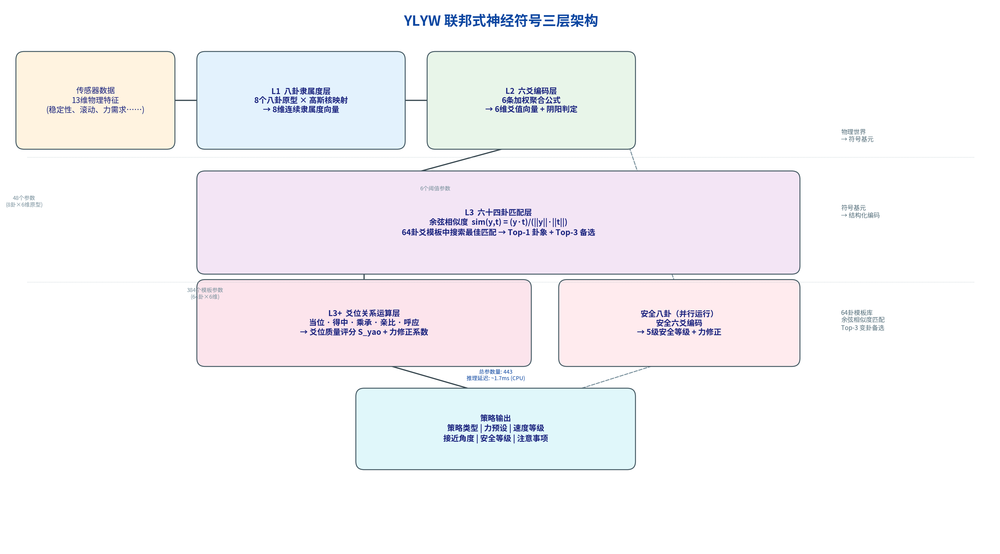

# 3.2 三层计算架构的完整定义

第3.1节阐述了联邦式架构的四条设计原则。本节将原则落实为精确的计算定义——展示从传感器输出的13维物理特征到最终抓取策略的完整数据流。这是全书最核心的技术章节——在此之后的所有内容（学习机制、安全约束、跨域迁移、层次化嵌套）都建立在读者对本节架构的精确理解之上。

---

## 3.2.1 架构总览

YLYW的完整数据流可以概括为：**13维物理特征 → L1：8维八卦隶属度 → L2：6维爻值向量 → L3：64卦匹配（最佳卦象+Top-3备选） → 策略输出。**

图3.1展示了系统的完整架构。数据流自顶向下：物理世界的13维特征经L1映射为8维隶属度，再经L2聚合为6维爻向量，L3在64卦模板空间中执行余弦相似度搜索以确定策略类型，爻位关系运算（L3+）分析六爻内部结构以修正执行参数。

**图3.1 YLYW联邦式神经符号三层架构图。** 从左至右依次为：传感器数据提取（13维物理特征）→ L1八卦隶属度层（8维连续隶属度向量）→ L2六爻编码层（6条加权聚合公式→6维爻值向量→阴阳判定）→ L3卦象匹配层（余弦相似度→64卦模板中搜索最佳匹配）→ L3+爻位关系运算层（五种关系评分→力修正系数）→ 策略输出（策略类型+力预设+速度等级+接近角度+注意事项）。

架构的关键特征在于**数据流是单向的**——从物理世界到符号策略的推理链没有反馈循环（自适应学习通过外部诊断→参数修正来实现，而非在线梯度传播）。每一步的输出都是确定性的、可检查的中间结果。任何一个中间步骤的异常都可以被精确定位。

表3.2给出了每层的输入/输出/参数量的完整规格。

**表3.2 三层架构的完整规格**

| 层 | 输入 | 输出 | 参数量 | 计算复杂度 | 关键算法 |
|:--:|------|------|:-----:|:---------:|---------|
| L1 八卦隶属度 | f∈[0,1]¹³ | μ∈[0,1]⁸ | 48（8卦×6维原型） | O(8×6) | 高斯核隶属度 |
| L2 六爻编码 | μ∈[0,1]⁸ | y∈[0,1]⁶ + 阴阳判定 | 6（阈值） | O(6) | 加权线性聚合 |
| L3 卦象匹配 | y∈[0,1]⁶ | 卦象ID+策略+Top-3 | 384（64卦×6维模板） | O(64×6) | 余弦相似度 |
| L3+ 爻位关系 | y∈[0,1]⁶ | S_yao+力修正系数 | 5（关系权重） | O(1) | 五子评分公式 |

总参数量：443个。单次推理的总计算复杂度：O(8×6 + 6 + 64×6 + 1) ≈ O(442)次浮点运算。在典型CPU上执行时间：~1.7ms。

---

## 3.2.2 L1层：八卦隶属度——连续特征的语义化

**目的。** 将13维物理特征翻译为8维"八卦语言"——每个维度表示物体在对应八卦原型上的隶属程度。

**输入。** 13维物理特征向量f ∈ [0,1]¹³，包含稳定性、滚动倾向、力需求、脆弱性、可达性、抓取表面质量、支撑面积、遮挡程度、障碍密度、任务优先级、重量比、可见性、变形能力。所有值归一化至[0,1]。

**处理。** 对每个八卦原型p_i（i ∈ {乾,坤,震,艮,离,坎,兑,巽}），计算隶属度：

μ_i(f) = (1/|A|)·Σ_{a∈A} max(0, 1 − |f_a − p_{i,a}| × 1.5)

其中A为共享属性集合（6个物理维度），λ=1.5为敏感度参数。max(0, ...)确保当特征与原型在某个维度上的距离超过1/λ≈0.67时，该维度对隶属度的贡献为零——物体至少需要在部分维度上与原型足够接近才会有非零隶属度。

**输出。** 8维隶属度向量μ ∈ [0,1]⁸。

**设计细节。** 关键的设计选择在于：隶属度计算不依赖13维物理特征的"全部"维度——仅使用6个维度（稳定性、力需求、变形性、滚动、可见性、脆弱性）。其余7维（可达性、表面质量、支撑面积、遮挡、障碍密度、优先级、重量比）不参与L1八卦隶属度计算。原因在于：八卦原型是"物体固有物理属性"的原型，而非"操作情境"的原型。遮挡程度和障碍密度是环境特征，不是物体特征——它们留给L2六爻编码的上爻（环境约束）来处理。这种"特征→层"的分配遵循"语义对应"原则：L1处理物体本身是什么，L2处理物体在当前操作情境中的状态。

---

## 3.2.3 L2层：六爻编码——物理属性的结构化重组

**目的。** 将"八卦语言"（8维隶属度）翻译为"六十四卦语言"（6维爻值向量）——每个爻值携带一个明确的物理语义，且爻位锚定于《周易》爻位学说。

**输入。** 8维八卦隶属度μ ∈ [0,1]⁸，加上6个可直接从原始物理特征获取的变量（由第2.3.2节表2.3定义）。

**处理。** 六条加权聚合公式，每条产生一个爻值y_j ∈ [0,1]：

- **初爻（基础稳定性）**：y₀ = 0.4·μ_乾 + 0.3·(1−μ_震) + 0.3·a （a=支撑面积，从原始特征直接获取）
  - 乾"健"→稳定的重要来源；震"动"→不稳定的来源。支撑面积大的物体（如盘子）即使隶属度谱系偏震，仍因物理约束拥有较高的初爻值。
- **二爻（可达性）**：y₁ = 0.5·r + 0.3·(1−o) + 0.2·q （r=可达性, o=遮挡程度, q=抓取表面质量）
  - 二爻反映"夹爪能否无碰撞地到达抓取点"。隶属度不直接参与此爻——它完全由操作情境变量决定。
- **三爻（力需求）**：y₂ = 0.6·f + 0.4·w （f=力需求, w=重量比）
  - 三爻反映"需要多大的力来抓取"。乾卦的高力需求（隶属度0.9→间接影响f值）通过特征变量而非隶属度进入此爻——这是L1/L2"分工"的直接体现。
- **四爻（脆弱性）**：y₃ = 1 − b （b=脆弱性，反向编码）
  - 四爻是唯一仅由单个特征变量决定的爻值。脆弱性越高→四爻越低→物体越需要小心。
- **五爻（任务优先级）**：y₄ = p （p=任务优先级）
  - 五爻直接取自任务规划层——它的语义不是"物体的物理属性"，而是"物体在当前任务中的重要性"。
- **上爻（环境约束）**：y₅ = 1 − min(1, d×1.5) （d=障碍密度）
  - 上爻反映"周围环境的宽松程度"。障碍密度高→上爻低→操作空间受限。

**阴阳判定。** 每爻计算完毕后，判定其阴阳：y_j ≥ 0.5 → 阳爻（—）；y_j < 0.5 → 阴爻（--）。这个判定是唯一将连续值转换为离散符号的步骤——但它在连续函数输出之后进行，而非在原始特征层面进行。

**输出。** 6维爻值向量y ∈ [0,1]⁶ + 6位阴阳向量{'阳','阴'}⁶。

**设计哲学。** 六爻编码公式的设计遵循"从具体到抽象、从下到上"的爻位递进逻辑——初爻最具体（物体的物理稳定性），上爻最抽象（操作环境的整体约束）。这与《周易》"初爻为始、上爻为终"的爻位定位完全一致。

---

## 3.2.4 L3层：卦象匹配——结构化模板搜索

**目的。** 在64卦的爻模板空间中，找出与当前6维爻向量最匹配的卦象，激活该卦象的预定义策略。

**输入。** 6维爻值向量y ∈ [0,1]⁶。

**处理。** 对64个卦象g（g ∈ {䷀,...,䷿}）中的每一个，计算爻向量与其理想爻模板t_g的余弦相似度：

sim(y, t_g) = (y · t_g) / (‖y‖ · ‖t_g‖)

余弦相似度而非欧氏距离的选择具有特定的优势：（1）对向量的模长不敏感——只关心"方向"而不关心"大小"，这与"物体像哪个卦"的语义一致；（2）输出范围[0,1]，天然适合作为"匹配度"的标量。

选定相似度最高的卦象g* = argmax_g sim(y, t_g)作为最佳匹配。同时保留Top-3卦象（相似度第二、第三高的卦象）作为"变卦"参考——供第4章的自适应学习机制和第5章的安全博弈使用。

在64卦×300物体的完整测试中，平均最佳匹配相似度为0.977（σ=0.041），表明爻向量与最佳卦象模板之间具有高度一致的"方向性"。

**输出。**
- 最佳匹配卦象：g*
- 策略类型 + 力预设 + 速度等级 + 接近角度 + 注意事项（来自g*的预定义映射）
- Top-3卦象列表（含相似度值），供变卦和策略融合使用

**爻模板的设计细节。** 每个卦象g的理想爻模板t_g ∈ [0,1]⁶不是简单的二值向量（阴=0/阳=1），而是一个连续向量。这使得匹配是基于"爻值的方向一致性"而非"爻值的二值匹配"。例如：乾卦的模板为[0.75, 0.61, 0.59, 0.76, 0.45, 0.65]（优化后），而非[1,1,1,1,1,1]。这允许即使在爻值不完全为1的情况下，仍能与乾卦产生高度匹配——因为余弦相似度测量的是向量的方向而非绝对值。

模板中九五爻（y₄）的权重在42个主要卦象中具有系统性的偏高趋势——反映了《周易》"九五，飞龙在天"的爻位传统。这种将古代经典的结构特征直接编码为现代计算的模板参数的做法，是YLYW"道器合一"设计哲学在工程细节层面的具体体现。

---

## 3.2.5 完整推理链示例：球体的端到端推理追踪

为建立从传感器到策略的完整直觉，本节以一个具体的球体为例，追踪其完整推理链的每一步。

**第一步：物理特征提取（传感→13维特征向量）。**

一个半径5cm的橡胶球被置于桌面上。视觉传感器提取以下13维物理特征（归一化至[0,1]）：

f = [stability=0.10, roll=0.92, force=0.35, fragility=0.72, reachability=0.80, surface=0.65, support=0.08, occlusion=0.05, obstacle=0.10, priority=0.50, weight=0.20, visibility=0.85, deformability=0.15]

语义解读：球体稳定性极低（0.10——放在平面上只有一个点接触），滚动倾向极高（0.92——几乎无法停止滚动），力需求中等（0.35——不重），脆弱性中等偏高（0.72——虽是橡胶但捏得过紧会变形弹出），可达性良好（0.80——暴露在桌面上），支撑面积极小（0.08——点接触），环境宽敞（障碍密度0.10）。

**第二步：L1八卦隶属度（13维→8维）。**

计算8个八卦原型与f的隶属度：

μ = [乾=0.25, 坤=0.28, 震=0.87, 艮=0.12, 离=0.62, 坎=0.48, 兑=0.52, 巽=0.41]

卦象解读：震卦0.87居首——球体滚动倾向极高（f_roll=0.92），震卦原型p_震,roll=0.9，两者距离仅为|0.92−0.9|×1.5=0.03→隶属度贡献0.97。在稳定性维度上f_stability=0.10，震卦p_震,stability=0.2，距离|0.1−0.2|×1.5=0.15→隶属度贡献0.85。震卦的高隶属度来自滚动和稳定性双维度的高度匹配。

离卦0.62次之——可见性f_visibility=0.85，离卦p_离,visibility=0.9，高度吻合。

艮卦0.12最低——艮卦p_艮,roll=0.1，与f_roll=0.92的距离为1.23>1→隶属度贡献为0。艮卦p_艮,stability=0.9，与f_stability=0.10的距离为1.2>1→贡献为0。

**第三步：L2六爻编码（8维隶属度→6维爻值向量）。**

y₀（初爻—稳定性）= 0.4×0.25 + 0.3×(1−0.87) + 0.3×0.08 = 0.100+0.039+0.024 = 0.163 → **阴爻**（<0.5）
y₁（二爻—可达性）= 0.5×0.80 + 0.3×(1−0.05) + 0.2×0.65 = 0.400+0.285+0.130 = 0.815 → **阳爻**（≥0.5）
y₂（三爻—力需求）= 0.6×0.35 + 0.4×0.20 = 0.210+0.080 = 0.290 → **阴爻**
y₃（四爻—脆弱性）= 1 − 0.72 = 0.280 → **阴爻**（反向编码：脆→阴）
y₄（五爻—优先级）= 0.50 → **阳爻**（恰好在阴阳边界上，略阳）
y₅（上爻—环境约束）= 1 − min(1, 0.10×1.5) = 1−0.150 = 0.850 → **阳爻**

六爻阴阳序列（初→上）：**阴阳阴阴阳阳**

**第四步：L3卦象匹配（6维爻向量→64卦余弦相似度搜索）。**

将y=[0.163, 0.815, 0.290, 0.280, 0.500, 0.850]与64个卦象的爻模板逐一计算余弦相似度。震为雷（䷲）的爻模板[0.25, 0.59, 0.43, 0.71, 0.50, 0.74]与y的余弦相似度为0.941——在64卦中排名第一。这也与物理直觉吻合：卦象阴阳结构为"阳阴阴阴阳阴"→震为雷是其中一例（上下皆为震）。

**第五步：策略输出。**

激活震为雷（䷲）的预定义策略映射：

- 策略类型：**dynamic_grasp**（动态抓取——适用于易滚动物体的自适应抓取策略）
- 力预设：0.50（归一化力）
- 接近角度：60°（适中的接近角度，为动态调整留空间）
- 速度等级：**medium**（中等速度）
- 注意事项："物体高滚动倾向，抓取后立即施加稳定力矩；监测滑脱风险"

**第六步：爻位关系运算（L3+层，第3.4节详细定义）。**

对y的六爻进行爻位关系分析：

- 当位分析：阳位（初/三/五）= {0,2,4}。y₀=0.163(阴，应在阳位)→不当位。y₁=0.815(阳，应在阴位)→不当位。y₂=0.290(阴，应在阳位)→不当位。y₃=0.280(阴，阴位)→当位。y₄=0.500(阳，阳位)→当位。y₅=0.850(阳，阴位)→不当位。当位数=2/6→S_dw=0.333。
- 得中分析：y₁(二爻)=0.815(阳→非阴)→减分。y₄(五爻)=0.500(阳→阳)→加分。S_dz=0.75。
- 乘承分析：5对相邻爻中，y₀-y₁:阴→阳=承(顺)；y₂-y₃:阴→阴=中性；...。无乘(阴乘阳=逆)。S_cc=1.0。
- 亲比分析：5对相邻爻中同性对数。S_bi=0.6。
- 呼应分析：三对相应位(初-四、二-五、三-上)。S_ying=0.33。
- 综合质量：S_yao=0.40×0.333+0.20×0.75+0.15×1.0+0.10×0.6+0.15×0.33=0.133+0.150+0.150+0.060+0.050=**0.543**。
- 谨慎级别：S_yao∈[0.50, 0.70) → **normal**（正常执行）。
- 力修正系数：S_dw≤0.33→modifier−0.10; cheng=0→不减。最终modifier=**0.90**。

**第七步：最终输出。**

将L3的策略输出与L3+的爻位关系修正合并：

- 最终策略类型：dynamic_grasp
- 最终力预设：0.50 × 0.90 = **0.45**
- 最终速度等级：medium
- 最终接近角度：60°
- 可解释推理摘要："球体似震（0.87），震动不安之物，以动态策略跟随抓取，爻位关系中2处不当位建议降力10%"

这七步追踪清晰地展示了YLYW从原始传感器数据到可执行策略的完整推理链。每一步的输出都是可检查的中间结果，每一个参数来源都可以追溯到明确的物理属性或易理概念。这种"透明推理"是联邦式架构相对于注入式架构的根本优势——**你不是在"打开黑箱"，而是"没有黑箱"。**

---

*本节完。下一节：3.3 六十四卦策略映射的工程转译。*
