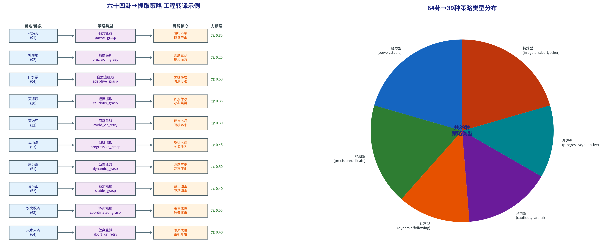

# 3.3 六十四卦策略映射的工程转译

第3.2节定义了从13维物理特征到64卦最佳匹配的完整计算流程。但有一个关键问题尚未回答：**匹配到卦象之后，系统如何从卦象中获得具体的抓取策略？**

这个问题的本质是：如何将数千年前用文言文写成的卦辞和爻辞，转译为现代机器人可以执行的工程参数——力预设、速度等级、接近角度？本节正是要回答这个问题。

这不是一个单纯的"翻译"问题。它涉及一个深层的工程决策：从卦辞到策略的映射应该是怎样的？是机械地"一字一译"（"健"="大力"），还是需要一套系统的转译方法论？

---

## 3.3.1 "卦名→策略语义、卦辞→核心原则、爻位关系→参数设定"的三层转译法

YLYW的策略映射遵循一套三级转译体系。这套体系的设计哲学是：**转译不是在单个层面完成的——每个卦的三个语义层面分别贡献不同类型的信息。**

**第一层：卦名 → 策略语义。** 卦名是对64种情境的压缩命名——一个字或一个词组。这些命名本质上是对情境的"模式识别标签"。"乾"意味着"健行不息"——持续有力。"坤"意味着"柔顺包容"——温和顺承。"震"意味着"震动不安"——动态多变。"渐"意味着"循序渐进"——不急于一时。"履"意味着"如履薄冰"——极度谨慎。

将卦名转译为策略类型的规则是：**卦名约定了策略的基本取向。** 表3.4给出了10个核心卦象的完整转译示例。

**表3.4 核心卦象→策略映射示例（10/64）**

| 卦序 | 卦名 | 卦德 | 卦辞核心 | 策略类型 | 力预设 | 速度 |
|:---:|------|------|----------|----------|:-----:|:----:|
| 01 | 乾为天 | 健行不息 | 刚健中正 | power_grasp | 0.85 | fast |
| 02 | 坤为地 | 柔顺包容 | 顺势而为 | precision_grasp | 0.25 | slow |
| 04 | 山水蒙 | 蒙昧待启 | 循序渐进 | adaptive_grasp | 0.50 | slow |
| 10 | 天泽履 | 如履薄冰 | 小心翼翼 | cautious_grasp | 0.35 | slow |
| 12 | 天地否 | 闭塞不通 | 否极泰来 | avoid_or_retry | 0.30 | — |
| 51 | 震为雷 | 震动不安 | 动态变化 | dynamic_grasp | 0.50 | medium |
| 52 | 艮为山 | 静止如山 | 不动如山 | stable_grasp | 0.40 | slow |
| 53 | 风山渐 | 渐进不躁 | 如风徐入 | progressive_grasp | 0.45 | slow |
| 63 | 水火既济 | 事已成也 | 完美收束 | coordinated_grasp | 0.55 | medium |
| 64 | 火水未济 | 事未成也 | 重新开始 | abort_or_retry | 0.40 | — |

**第二层：卦辞 → 核心原则。** 卦辞提供了比卦名更丰富的情境描述和行为指南。它是将策略类型细化到具体参数的依据。以天泽履为例：卦辞为"履虎尾，不咥人，亨"——踩到老虎尾巴了，但老虎没有咬人，亨通。这段卦辞传递的核心原则是"在极度危险的境地中，以极度谨慎的态度行事可以化险为夷"。所以天泽履的力预设从默认值大幅降至0.35，速度设为slow——不是因为物体脆弱（那是四爻的事情），而是因为卦辞建议以一种"如在虎口"的心态来执行。

以震为雷为例：卦辞为"震来虩虩，笑言哑哑，震惊百里"——雷声滚滚而来，但持有者却从容笑谈。这段卦辞传递的双重语义是：（1）震动是真实而剧烈的——力不能太小，预设0.50；（2）面对震动应保持灵活——速度设为medium。这与艮卦（静止如山，力0.40，慢速）形成了鲜明对比。

**第三层：爻位关系 → 参数设定。** 卦名和卦辞确定了策略的类型和基本参数，但精确的力/速度调整由爻位关系运算层（第3.4节详细定义）负责。同一卦象内，六爻的当位/得中/乘承/亲比/呼应分析会产生不同的力修正系数——这使得同一个"震为雷"策略在应用到不同的球体时，能根据每个球体的具体状态（非常滚动 vs 略微滚动）产生不同的最终力参数。

图3.2以流程图的形式展示了10个核心卦象从卦名到策略的完整转译链。

**图3.2 六十四卦→抓取策略工程转译示例。** 左图：10个核心卦象从卦名到策略的转译链——卦名→卦德→策略类型→卦辞核心→力预设。右图：64卦映射到的39种策略类型的分布饼图。

---

## 3.3.2 上经30卦策略映射

上经30卦（卦序01-30）以乾、坤为首，以离卦收束。在YLYW中，上经卦象的策略类型主要覆盖"基础操作"——抓取、释放、推、拉的核心原语。表3.5列出了上经30卦的完整策略映射。

**表3.5 上经30卦策略映射**

| 卦序 | 卦名 | 策略类型 | 力预设 | 核心语义 |
|:---:|------|----------|:-----:|------|
| 01 | 乾为天 | power_grasp | 0.85 | 全阳刚健，强力主导 |
| 02 | 坤为地 | precision_grasp | 0.25 | 全阴柔顺，精确轻拿 |
| 03 | 水雷屯 | irregular_grasp | 0.55 | 屯难之始，异形适配 |
| 04 | 山水蒙 | adaptive_grasp | 0.50 | 蒙昧，自适应探索 |
| 05 | 水天需 | waiting_grasp | 0.45 | 需待时机，延迟抓取 |
| 06 | 天水讼 | contested_grasp | 0.40 | 争讼，竞争性抓取 |
| 07 | 地水师 | coordinated_grasp | 0.55 | 师出以律，协调抓取 |
| 08 | 水地比 | following_grasp | 0.45 | 亲比依附，跟随抓取 |
| 09 | 风天小畜 | progressive_grasp | 0.40 | 小有积蓄，渐进式 |
| 10 | 天泽履 | cautious_grasp | 0.35 | 如履薄冰，极度谨慎 |
| 11 | 地天泰 | stable_grasp | 0.55 | 通泰，稳定抓取 |
| 12 | 天地否 | avoid_or_retry | 0.30 | 闭塞，回避重试 |
| 13 | 天火同人 | cooperative_grasp | 0.50 | 同人协同，合作抓取 |
| 14 | 火天大有 | confident_grasp | 0.70 | 大有收获，自信抓取 |
| 15 | 地山谦 | gentle_grasp | 0.35 | 谦逊，柔和抓取 |
| 16 | 雷地豫 | rhythmic_grasp | 0.50 | 豫乐，有节奏抓取 |
| 17 | 泽雷随 | following_grasp | 0.50 | 随从，顺随抓取 |
| 18 | 山风蛊 | corrective_grasp | 0.50 | 蛊坏，修正性抓取 |
| 19 | 地泽临 | top_down_grasp | 0.50 | 临下，俯视抓取 |
| 20 | 风地观 | observant_grasp | 0.40 | 观察，先看后抓 |
| 21 | 火雷噬嗑 | biting_grasp | 0.60 | 噬嗑咬合，强力咬合 |
| 22 | 山火贲 | surface_grasp | 0.40 | 贲饰，表面抓取 |
| 23 | 山地剥 | peeling_grasp | 0.35 | 剥落，层层剥离 |
| 24 | 地雷复 | recovery_grasp | 0.40 | 复归，恢复性重试 |
| 25 | 天雷无妄 | straightforward_grasp | 0.55 | 无妄真实，直接抓取 |
| 26 | 山天大畜 | endurance_grasp | 0.65 | 大蓄积，持续耐力 |
| 27 | 山雷颐 | supportive_grasp | 0.45 | 颐养，托举式抓取 |
| 28 | 泽风大过 | excessive_grasp | 0.30 | 大过，过度→减力 |
| 29 | 坎为水 | cautious_grasp | 0.40 | 险陷，小心抓取 |
| 30 | 离为火 | visible_grasp | 0.45 | 光明附丽，可见抓取 |

可以看到，上经卦象的策略类型集中于基础操作：power/precision/adaptive/cautious/stable/following/progressive/coordinated——这些都是机器人操作的核心原语。

---

## 3.3.3 下经34卦策略映射

下经34卦（卦序31-64）以咸、恒为首，以未济卦收束。在YLYW中，下经卦象的策略类型更多覆盖"高级操作"——组合动作、复杂协调、情境化适应。表3.6列出了下经34卦的策略映射。

**表3.6 下经34卦策略映射**

| 卦序 | 卦名 | 策略类型 | 力预设 | 核心语义 |
|:---:|------|----------|:-----:|------|
| 31 | 泽山咸 | perceptive_grasp | 0.45 | 感知交互，触觉优先 |
| 32 | 雷风恒 | endurance_grasp | 0.55 | 恒久持续，长期耐力 |
| 33 | 天山遁 | retracting_grasp | 0.30 | 遁退，撤退式收回 |
| 34 | 雷天大壮 | powerful_grasp | 0.80 | 大壮，强力量 |
| 35 | 火地晋 | progressive_grasp | 0.50 | 晋进，逐步推进 |
| 36 | 地火明夷 | low_visibility_grasp | 0.40 | 明夷，暗光低可见度 |
| 37 | 风火家人 | coordinated_grasp | 0.55 | 家人协调，多指协调 |
| 38 | 火泽睽 | irregular_grasp | 0.50 | 睽异，异形适配 |
| 39 | 水山蹇 | difficult_grasp | 0.40 | 蹇难，困难抓取 |
| 40 | 雷水解 | recovery_grasp | 0.45 | 解放，解除→恢复 |
| 41 | 山泽损 | reduced_grasp | 0.35 | 损减，减力抓取 |
| 42 | 风雷益 | enhanced_grasp | 0.60 | 增益，增强抓取 |
| 43 | 泽天夬 | decisive_grasp | 0.65 | 夬决，果断抓取 |
| 44 | 天风姤 | encounter_grasp | 0.45 | 姤遇，偶然接触→即时 |
| 45 | 泽地萃 | collective_grasp | 0.50 | 萃聚，集合式抓取 |
| 46 | 地风升 | lifting_grasp | 0.55 | 上升，提升式抓取 |
| 47 | 泽水困 | constrained_grasp | 0.40 | 困厄，受限抓取 |
| 48 | 水风井 | pouring_grasp | 0.50 | 井，倾倒/倒水 |
| 49 | 泽火革 | reforming_grasp | 0.55 | 变革，调整式抓取 |
| 50 | 火风鼎 | stable_grasp | 0.55 | 鼎立，稳固 |
| 51 | 震为雷 | dynamic_grasp | 0.50 | 震动，动态抓取 |
| 52 | 艮为山 | stable_grasp | 0.40 | 静止，稳定抓取 |
| 53 | 风山渐 | progressive_grasp | 0.45 | 渐进，缓慢推进 |
| 54 | 雷泽归妹 | pairing_grasp | 0.50 | 归妹，配对抓取 |
| 55 | 雷火丰 | fast_grasp | 0.60 | 丰盛，快速抓取 |
| 56 | 火山旅 | traveling_grasp | 0.45 | 旅，移动中抓取 |
| 57 | 巽为风 | flexible_grasp | 0.40 | 柔入，灵活适应 |
| 58 | 兑为泽 | smooth_grasp | 0.35 | 和悦，平滑抓取 |
| 59 | 风水涣 | dispersing_grasp | 0.40 | 涣散，分散式 |
| 60 | 水泽节 | restrained_grasp | 0.40 | 节制，约束抓取 |
| 61 | 风泽中孚 | balanced_grasp | 0.50 | 中孚诚信，平衡抓取 |
| 62 | 雷山小过 | slightly_excessive_grasp | 0.45 | 小过，微调 |
| 63 | 水火既济 | coordinated_grasp | 0.55 | 既济，完美协调 |
| 64 | 火水未济 | abort_or_retry | 0.40 | 未济，放弃重试 |

下经的策略类型更加多样：perceptive（感知）、retracting（撤退）、lifting（提升）、pouring（倒水）、pairing（配对）、dispersing（分散）——这些都是超越基础抓取的复杂操作。这说明下经卦象在《易经》原典中本就承载了更复杂的社会关系和动态情境，在YLYW中被自然地转译为更高级的机器人操作原语。

---

## 3.3.4 39种策略类型的覆盖分析

64卦的规则库覆盖了39种不同的策略类型。策略类型的分布不是均匀的——某些策略类型（如stable_grasp）被多个卦象覆盖，每个卦从不同的角度和不同的参数解读它。

**策略家族的聚类。** 这39种策略可以归入六大类：

1. **强力型**（power/stable/confident/endurance等——8卦）：高力预设（0.55-0.85），适用于稳定、重型、不易碎物体。代表卦：乾（0.85）、大壮（0.80）、大有（0.70）、大畜（0.65）。

2. **精细型**（precision/delicate/precision_grasp等——7卦）：低力预设（0.25-0.40），适用于易碎、精细、高价值物体。代表卦：坤（0.25）、谦（0.35）、贲（0.40）。

3. **动态型**（dynamic/following/fast等——5卦）：中等力预设（0.45-0.60），速度偏快，适用于滚动、滑动或移动中的物体。代表卦：震（0.50）、随（0.50）、丰（0.60）。

4. **谨慎型**（cautious/careful/waiting等——6卦）：低力预设（0.30-0.40），速度偏慢，适用于脆弱或高风险物体。代表卦：履（0.35）、坎（0.40）、大过（0.30）。

5. **渐进型**（progressive/adaptive/flexible等——5卦）：中等力预设且允许可调（0.40-0.50），适用于需要逐步判断和自适应调整的情况。代表卦：渐（0.45）、巽（0.40）、蒙（0.50）。

6. **特殊型**（irregular/abort/corrective/constrained等——8卦）：在特定场合使用——回避、重试、受限、修正。代表卦：否（0.30）、未济（0.40）、蛊（0.50）、困（0.40）。

这种聚类不是YLYW设计者刻意安排的——它是六十四卦自身的内部结构在工程领域中的自然映射。这恰恰验证了第1.1.4节的论断：《易经》的64卦分类学确实捕捉到了物理交互中的基本模式类型。数千年前对变化情境的分类，与数千年后对机器人操作类型的分类，在结构上具有显著的一致性。

---

## 3.3.5 策略映射的设计细则

**力预设的归一化。** 表中列出的力预设值全部归一化至[0,1]——不代表真实的牛顿值。在实际部署时，需根据夹爪规格（如Robotiq 2F-85的力范围3N-85N）进行线性映射（见第6.2.5节）。归一化值的重点是各策略之间的相对关系：乾（0.85）是天泽履（0.35）的2.4倍——"强力抓取"和"谨慎抓取"应该在物理上具有显著差异。

**速度等级的语义。** speed_fast（快速）不等于"尽可能快"——它是一个相对于设备和场景的设置。"快速"在G1机器人行走中约0.8m/s，在夹爪闭合中约50mm/s。在YLYW规则库中，速度等级是建议值——最终速度由安全八卦（第5章）根据安全等级进行修正。

**注意事项列表。** 每个卦象的策略还包含一个注意事项列表——这是卦辞和爻辞的直接工程转译。例如震为雷的注意事项包括"物体高滚动倾向，抓取后立即施加稳定力矩；监测滑脱风险"——这来自于震卦"震来虩虩"的警示。风山渐的注意事项是"不急于一次到位；分多个小步骤逐步收紧抓取；每步后检查传感器反馈"——这是渐卦"女归吉也，利贞"的渐进哲学的直接转译。

**策略之间的互补关系。** 当余弦相似度的Top-3卦象之间的相似度差距很小（<0.02）时，系统可以融合备选卦象的策略建议。例如：若球体的Top卦象是震（dynamic，力0.50），Top-2是随（following，力0.50），则系统可以融合两者——采用dynamic的策略类型（响应动态变化）但加入following的"顺随物体而动"的原则——这正是变卦机制在第4章中被形式化的工程基础。

---

## 3.3.6 转译方法论的学术意义

YLYW的"卦名→策略语义、卦辞→核心原则、爻位关系→参数设定"三级转译法具有超越YLYW本身的方法论意义。它展示了一种将古典知识体系转译为现代工程参数的通用方法论：

1. **结构保留**：古典文献的内在结构（卦名→卦辞→爻辞）被保留在工程转译中（策略类型→核心原则→参数设定），结构同构。
2. **语义锚定**：每一个参数的取值都有可以追溯的文本依据——不是"0.85是一个好数值"而是"0.85来自乾卦的'刚健中正'"。
3. **可争议性**：因为转译链是透明的，所以每个转译决策都可以被审议和修订。如果你认为乾卦的力预设应该是0.80而不是0.85——你可以查看乾卦的卦辞爻辞并形成你自己的论证。这正是可解释AI的核心价值。

---

*本节完。下一节：3.4 爻位关系运算——从《周易》到可计算算子。*
