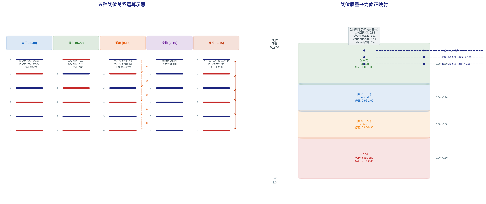

# 3.4 爻位关系运算：从《周易》到可计算算子

第3.2节和第3.3节定义了三层架构——从物理特征到卦象匹配的完整数据流。这个流程确定了"匹配哪个卦"——即**策略的类型**。但《易经》的推理不止于此。

在《周易》的经典诠释体系中，确定卦象之后还须分析六爻之间的**结构关系**，以判断策略执行的**质量与可信度**。《系辞传》云："爻者，言乎变者也"——爻是变化的体现，各爻之间的乘承比应关系反映了系统内部的动力结构。例如，同样匹配到"震为雷"，爻位结构的不同会导致截然不同的执行质量——一个爻位和谐（多数当位、乘承合理）的动态抓取可以放心执行，而一个爻位失序（多数不当位、阴乘阳多）的动态抓取需要降力修正。

本节引入爻位关系运算层（L3+），将《周易》中五种经典的爻位关系——当位、得中、乘承、亲比、呼应——形式化为可计算的评分与修正机制。这是本书的核心方法论贡献之一，也是当前学术文献中**首次**系统性地将爻位关系运算转化为可执行代码的工作。

---

## 3.4.1 五种爻位关系的形式化定义

《周易》经文和历代注疏（王弼《周易注》、孔颖达《周易正义》、程颐《程氏易传》、朱熹《周易本义》）中，爻位关系分析是卦象诠释的核心环节。每一卦的六爻并非六个独立的判断——它们之间通过多种结构关系耦合。YLYW提炼出五种最核心的爻位关系，并为每一种关系给出了易学出处、工程语义、形式化判据和权重。

**表3.7 五种爻位关系的形式化定义**

| 关系 | 易学定义 | 工程语义 | 权重 | 验证方式 |
|------|---------|---------|:---:|------|
| 当位 | 阳爻居阳位(初/三/五)，阴爻居阴位(二/四/上) | 系统各维度的内在合规度 | 0.40 | 统计当位数/6 |
| 得中 | 二爻宜阴(六二)与五爻宜阳(九五)居"中位" | 核心控制变量的中正度 | 0.20 | 判定二爻阴+五爻阳 |
| 乘承 | 阴在阳上为"乘"(逆)，阴在阳下为"承"(顺) | 动作执行中的阻力与助力 | 0.15 | 遍历5对相邻爻 |
| 亲比 | 相邻两爻同性为"亲比" | 相邻动作阶段的连贯性 | 0.10 | 统计相邻同性对数/5 |
| 呼应 | 初↔四、二↔五、三↔上，阴阳相反而呼应 | 上下层级之间的协调程度 | 0.15 | 统计呼应数/3 |

每种关系的形式化判据如下（完整伪代码见算法3.1）。

**当位（Proper Position）。** 阳位=初爻、三爻、五爻（从下往上，奇数爻位为阳位）。阴位=二爻、四爻、上爻（偶数爻位为阴位）。对六爻逐一判定：该爻的阴阳属性是否匹配爻位的期望。当位数除以6得到当位评分S_dw。0/6→S_dw=0（全不当位——极度失序），6/6→S_dw=1（全当位——完美和谐）。

**得中（Central Position）。** 二爻和五爻在全卦中位置最为特殊——二爻是下卦之中，五爻是上卦之中（"中"而非"正"）。判据：二爻为阴（y₁<0.5）且五爻为阳（y₄≥0.5）→S_dz=1.00（二五皆得中，完美）。仅五爻阳→S_dz=0.75（核心维度正常但内部条件不佳）。仅二爻阴→S_dz=0.50。都不满足→S_dz=0.25。

**乘承（Override & Support）。** 对5对相邻爻（初-二、二-三、三-四、四-五、五-上），判定上层爻与下层爻的阴阳关系。阴在阳上→"乘"（逆，阻力+1）。阴在阳下→"承"（顺，助力+1）。评分：S_cc = max(0, 1 − cheng×0.3 + cheng_hao×0.15)。强烈的阴乘阳（如多处阻力叠加）会显著降低评分。

**亲比（Adjacency Harmony）。** 5对相邻爻中，同性（同为阳或同为阴）的对数。同性→"亲比"（和谐/连贯）。S_bi = 亲比对数/5。

**呼应（Resonance）。** 三对相应位置：初爻↔四爻、二爻↔五爻、三爻↔上爻。每对中，阴阳相反→呼应（上下层互补）。S_ying = 呼应对数/3。

**综合质量评分。** 五种子评分的加权和：

**S_yao = 0.40 × S_dw + 0.20 × S_dz + 0.15 × S_cc + 0.10 × S_bi + 0.15 × S_ying**

权重来源：当位权重最高（0.40），对应《系辞》"天尊地卑，乾坤定矣"——天地设位是万物之基。得中次之（0.20），对应"二多誉，五多功"——二五爻为全卦核心。乘承和呼应各0.15——上下沟通的重要性。亲比0.10——相邻局部和谐最特定。

图3.3的左图以可视化方式展示了五种爻位关系在六爻结构中的运作方式。

---

## 3.4.2 算法3.1：爻位关系运算伪代码

```
Algorithm 3.1: Yao Relations Analysis
Input:  y ∈ [0,1]⁶    // 六爻值向量（初→上）
Output: S_yao, modifier, caution_level

1. 当位分析
   yang_positions ← {0, 2, 4}   // 阳位: 初/三/五（0-indexed）
   dangwei ← 0
   for i in 0..5:
     is_yang    ← y[i] ≥ 0.5
     should_yang ← i ∈ yang_positions
     if is_yang == should_yang: dangwei += 1
   S_dw ← dangwei / 6.0

2. 得中分析
   er_is_yin  ← y[1] < 0.5       // 二爻宜阴（六二）
   wu_is_yang ← y[4] ≥ 0.5       // 五爻宜阳（九五）
   if      er_is_yin ∧ wu_is_yang: S_dz ← 1.00
   else if wu_is_yang:              S_dz ← 0.75
   else if er_is_yin:               S_dz ← 0.50
   else:                            S_dz ← 0.25

3. 乘承分析（5对相邻爻）
   cheng ← 0;  cheng_hao ← 0
   for i in 0..4:
     lower_yang  ← y[i] ≥ 0.5
     upper_yang  ← y[i+1] ≥ 0.5
     if (not upper_yang) and lower_yang:      // 下阳上阴→乘(逆)
       cheng += 1
     elif (not lower_yang) and upper_yang:    // 下阴上阳→承(顺)
       cheng_hao += 1
   S_cc ← max(0, 1.0 − cheng×0.3 + cheng_hao×0.15)

4. 亲比分析
   harmony ← 0
   for i in 0..4:
     if (y[i] ≥ 0.5) == (y[i+1] ≥ 0.5):
       harmony += 1
   S_bi ← harmony / 5.0

5. 呼应分析
   ying_pairs ← [(0,3), (1,4), (2,5)]
   ying ← 0
   for (a,b) in ying_pairs:
     if (y[a] ≥ 0.5) ≠ (y[b] ≥ 0.5): ying += 1
   S_ying ← ying / 3.0

6. 综合爻位质量
   S_yao ← 0.40×S_dw + 0.20×S_dz + 0.15×S_cc + 0.10×S_bi + 0.15×S_ying

7. 力修正系数计算
   modifier ← 1.00
   if S_dw ≤ 0.33:   modifier −= 0.10    // 多爻不当位→降力10%
   elif S_dw ≥ 0.83: modifier += 0.05    // 多爻当位→增力5%
   if cheng ≥ 2:     modifier −= 0.10    // 多处阴乘阳→降力10%
   if cheng_hao ≥ 3: modifier += 0.05    // 多处阴承阳→增力5%
   if ying == 0:     modifier −= 0.05    // 全无呼应→降力5%
   elif ying == 3:   modifier += 0.05    // 三对应全→增力5%
   modifier ← clamp(modifier, 0.75, 1.05)

8. 谨慎级别判定
   if      S_yao ≥ 0.70: caution_level ← "relaxed"
   else if S_yao ≥ 0.50: caution_level ← "normal"
   else if S_yao ≥ 0.30: caution_level ← "cautious"
   else:                 caution_level ← "very_cautious"

return S_yao, modifier, caution_level
```

**算法设计的安全保守性原则。** 修正系数的分段设计具有明确的安全导向：系统倾向于保守地降力而非冒进地增力。当爻位质量差时（不当位多、多处阴乘阳），力修正主动下调可达25%（最低至0.75）。仅当爻位质量极优时（5/6以上当位、三对应齐全），力修正才略微上调（最高至1.05）。"宁可降力保全，不肯增力冒险"——这正是第1.3.4节阐述的"无咎"哲学在工程层面的直接体现。

---

## 3.4.3 爻位质量→谨慎级别→力修正映射

S_yao连续质量评分通过四级分段映射为谨慎级别和力修正系数。

**表3.8 爻位质量→谨慎级别→力修正系数**

| 爻位质量 S_yao | 谨慎级别 | 力修正系数 | 含义 |
|:-------------|:--------|:---------|:----|
| ≥ 0.70 | relaxed | 1.00–1.05 | 爻位优良，可按预设甚至略增力 |
| [0.50, 0.70) | normal | 0.95–1.00 | 爻位正常，标准执行 |
| [0.30, 0.50) | cautious | 0.85–0.95 | 爻位偏差，降低力预设 |
| < 0.30 | very_cautious | 0.75–0.85 | 爻位严重失序，大幅降力 |

图3.3的右图展示了这个四级映射，以及三个典型案例（石块、立方体、花瓶）在映射空间中的位置。



**图3.3 爻位关系运算体系。** 左图：五种爻位关系（当位/得中/乘承/亲比/呼应）在六爻结构中的可视化——每种关系以颜色编码的六爻列展示，权重标注在标题中。右图：爻位综合质量S_yao→四级谨慎级别的映射，标注了三个典型案例（石块very_cautious→0.85、花瓶cautious→0.90、立方体normal→0.95）以及300物体基线的全局统计。

---

## 3.4.4 爻位关系运算实验验证

在64卦×300物体的完整基线测试中，爻位关系运算层产生了以下全局统计数据。

**表3.9 爻位关系运算全局统计（300物体基线）**

| 指标 | 数值 |
|------|:----:|
| 力修正系数均值 | 0.94 |
| 爻位质量均值（S_yao） | 0.50 |
| cautious占比 | 52% |
| normal占比 | 47% |
| relaxed占比 | 1% |
| very_cautious占比 | <1% |

关键发现：

**适度谨慎是物理世界的常态。** 52%的情境被标记为cautious，平均力修正0.94——系统识别出物理世界中普遍存在的不完美状态。完全和谐的爻位结构是罕见的（relaxed仅1%）。在大多数真实的物理交互中，总有一些爻位不完美——稳定性不是最好的（初爻偏阴）、力需求与脆弱性存在冲突（三爻和四爻的阴阳对抗）、环境有一定约束（上爻受限制）。爻位关系运算忠实地反映了这种"普遍的次优性"，并自动给出了相应的保守力修正。这正是深度学习中无法获得的特性——它的内部表征不会自然地告诉你"当前状态是普遍不完美的，宜降低力预设"。

**安全保守性得到验证。** 力修正从不超过1.05——这意味着即使在最好情况下，系统也不会建议使用者"比策略预设值多用力超过5%"。这个上限来自爻位关系运算的安全保守性——当位满分（6/6）、五爻阳+二爻阴、三对应齐全的极端和谐的爻位结构在物理世界中几乎从不出现，而当它出现时（如一个完美稳定、完全不脆弱、完全无环境约束的立方体），系统也仅仅允许略微增力5%。

**表3.10 爻位关系典型案例**

| 案例 | 当位 | 得中 | 乘 | 承 | 呼应 | S_yao | modifier |
|------|:---:|:---:|:--:|:--:|:---:|:-----:|:-------:|
| 石块(irregular) | 0/6 | 0.25 | 2 | 0 | 1/3 | 0.15 | **0.85** |
| 立方体(stable) | 4/6 | 0.75 | 1 | 2 | 2/3 | 0.58 | **0.95** |
| 花瓶(fragile) | 2/6 | 0.50 | 1 | 1 | 1/3 | 0.42 | **0.90** |

**石块**的爻位极度失序——0/6当位（所有爻都处于"不应该在"的状态）+ 2处阴乘阳（力传递阻力大）→ S_yao仅0.15，very_cautious级别，力修正0.85（降力15%）。这说明系统已经"理解"：对不规则石块的抓取，你的执行质量不可能高——到处是阻力和不当位——因此要更加小心地降低力量。

**立方体**的爻位相当良好——4/6当位 + 二爻阴五爻阳 → 得中0.75 + 2处阴承阳（力传递顺畅）→ S_yao=0.58，normal级别，力修正0.95。系统没有建议降力——它判断这个抓取的内部结构是健康的。

**花瓶**处于中间——2/6当位 + 二爻阴（内部条件还好）+ 1处阴乘阳——S_yao=0.42，cautious级别，力修正0.90。这是合理的：花瓶的爻位与石块相比不那么极端（它至少是规则形状且直立），但其脆弱性（四爻极低）仍使系统倾向于保守。

---

## 3.4.5 爻位关系运算在不同域的表现

爻位关系运算在跨域迁移中展现出不同的特征，这反过来验证了其设计的针对性。

在**物理抓取域**中，爻位关系高度活跃——力修正均值0.94，52%为cautious。物理交互中的内部结构（力传递、稳定性、脆弱性、环境约束）天然具有丰富的六爻动态变化。每个抓取场景都有独特的爻位结构，爻位关系分析忠实地反映了这些差异。

在**运动控制域**中，爻位关系同样活跃——修正系数均值0.94，与抓取域接近。这说明运动控制的六爻（姿态/ZMP/力分布/扰动等）之间也存在丰富的动态关系。推搡恢复实验中，推搡瞬间的爻位从"阳阴阳阳阴阳"突变为"阴阴阴阴阴阳"，爻位关系检测到4处不当位和2处阴乘阳，力修正从0.60降至0.40——自动的、可解释的、安全的降力。

在**视觉分类域**中，爻位关系几乎不活跃——修正系数接近1.0。这是因为图像分类没有"内部结构动态"——一张图片的六爻特征之间不存在物理意义上的"乘承比应"关系。这恰恰验证了爻位关系运算**是为处理物理交互的动态约束而设计的**——它在没有物理动态的领域中自然地"自我静音"。

---

## 3.4.6 爻位关系运算的学术意义

爻位关系运算的价值超越了它的技术贡献。它证明了：**古典文献中的概念体系不仅仅可以被"翻译"为现代科学术语（停留在诠释层面），还可以被直接"编译"为可执行的算法（进入工程层面）。**

"乘承比应当位得中"这些概念在两千多年间一直是易学家用于诠释《周易》经文的诠释工具书术语。没有人尝试过把它们转化为计算机可以执行的代码。YLYW的爻位关系运算层证明：这些概念具有精确的、可计算的结构——给定6维爻值向量，你可以精确计算当位数、得中组合、乘承路径、亲比数和呼应数，并通过加权聚合得到一个单值的质量评分。

这种"编译"不是任意的——每一对关系的权重有易学出处，每一个判据有形式化逻辑，每一个修正系数都可以通过消融实验验证其独立贡献。这标志着从"诠释"到"计算"的关键范式跨越。

---

*本节完。下一节：3.5 与主流架构的系统对比。*
