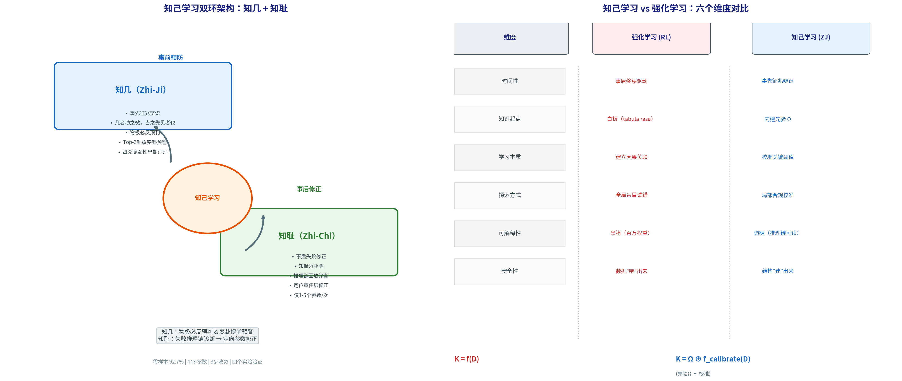

# 第4章 知己学习：从先验征兆辨识到在线自适应修正

前面三章完成了YLYW的完整架构——一个在零样本条件下凭借先验知识即可运作的符号推理系统。但一个智能系统的核心能力，不仅是零样本表现，还在于它能否从失败中学习和精化。

本章提出一种全新的学习范式——**知己学习**（Zhi-Ji & Zhi-Chi Learning）。它由两个互补的机制组成：**知几**——在事物变化的微小征兆阶段就预见趋势，提前采取行动；**知耻**——在失败发生后精准诊断根因，定向修正参数。

这一范式与当前深度学习的主流——强化学习——有根本的哲学差异。知己学习不是"从零学习"，而是"在先验骨架上精化"。本章从四个层面展开论证：

- **第4.1节**提出知己学习范式本身——它的哲学根基、数学形式化。
- **第4.2节**与强化学习进行六个维度的系统对比。
- **第4.3节**展示YLYW作为知己学习的工程实现——以YCB标准物体测试集的物理力学评估为实证。
- **第4.4-4.6节**详述知几原理、知耻原理和实验验证。
- **第4.7节**总结范式定位与互补关系。

---

## 4.1 知己学习的哲学根基与范式定义

### 4.1.1 "几"的本体论定位

"几"是《易经》哲学中一个具有独特本体论地位的概念。它既不是"无"（完全没有变化），也不是"显"（变化已经完全展开），而是位于有无之间的临界状态——"动之微"。

《系辞传下》给出了最权威的定义：

> "知几其神乎！……几者，动之微，吉之先见者也。君子见几而作，不俟终日。"

这句话揭示了三个递进的智慧层次：

- **"几"是征兆**：事物变化最微小的苗头，是吉凶祸福最早显露的临界点。
- **"知几"是洞察**：能在征兆刚显现时就识别它。孔子将这种洞察力称为"神"。
- **"见几而作"是行动**：识别征兆后立刻采取正确的行动——"不俟终日"。

另一个关键概念是**知耻**。"知耻近乎勇"（《中庸》）——认识到自己的过失并有勇气去修正。这不是"耻辱"本身，而是**从失败中学习的能力**。知己系统不是"从不犯错"——而是"错了之后能定位问题并迅速修复"。

**知几与知耻的互补：** 两个机制从不同的时间尺度上共同守护系统的学习与安全——知几在"事前"（毫秒级变卦预判），知耻在"事后"（秒级参数精化）。

### 4.1.2 从哲学到工程：三个关键转化

将"知几"从哲学概念转化为可计算的学习范式，需要完成三个工程转化。

**转化一：从"征兆"到"征兆空间"。** "几"被具体化为一个可计算的征兆空间O——由先验知识预定义的、覆盖物理世界中关键变化征兆的模糊集合。在YLYW中，这个空间由八卦的连续隶属度构成：每个卦象代表一种物理原型，物体对这些原型的连续隶属度构成了它的"征兆向量"。

**转化二：从"洞察"到"征兆辨识"。** "知几"的直觉洞察力转化为基于先验规则库的征兆辨识函数。不是从数据中"学习"哪些征兆对应哪些风险——而是将人类数千年来对物理世界变化规律的理解编码为显式辨识规则。

**转化三：从"见几而作"到"合规行动"。** 识别征兆之后的行动是在先验安全约束下的合规行动。知己学习不追求在无限行动空间中"找到最优解"，而是在安全空间中"执行正确解"。

### 4.1.3 知己学习的数学形式化

**定义1（征兆空间）：** 设模糊征兆空间O = {o₁, o₂, ..., oₘ}，其中每个元素oᵢ: S → [0,1]是一个从状态空间到连续隶属度的模糊映射函数。这些映射函数由人类先验知识预定义。

**定义2（知己策略）：** 知己策略π_ZJ采用两级映射结构：

π_ZJ: S —[μ]→ O —[ρ]→ A

其中μ: S → [0,1]ᵐ是模糊化映射，ρ: [0,1]ᵐ → A是基于先验规则库的推理映射。与RL策略π_RL: S → A的直接映射相比，知己策略的关键在于中间的**征兆空间O**——它不是数据中学习出来的隐藏层，而是被先验知识显式定义和赋义的符号层。

**定义3（知己学习的目标函数）：** 强化学习最大化累积奖励E[Σγᵗrₜ]。知己学习的目标是：

min_θ  L_calibration(θ) + λ·L_safety(θ)

其中θ是可调参数，L_calibration是征兆辨识的校准误差，L_safety是物理合规惩罚项。**没有奖励信号。** 优化的目标不是"做得好不好"，而是"征兆认得准不准"和"动作安不安全"。

**定义4（知识来源差异）：** 令K代表系统部署时拥有的有效知识。

强化学习: K_RL = f(D)——数据是唯一的来源。D=0时K=0。

知己学习: K_ZJ = Ω ⊕ f_calibrate(D)——知识来自先验加校准。D=0时K=Ω≠0。

**定理（样本复杂度）：** 在N维状态空间中学习，精度ε。RL的样本复杂度为T_RL = O(ε^(-N))（维度灾难）。知己学习的样本复杂度为T_ZJ = O(ε^(-K))，其中K≪N。在具身任务中这意味着指数级的效率优势。

---

## 4.2 知己学习 vs 强化学习：六个维度的系统对比

强化学习在过去十年取得了显著成就，但在物理交互场景中的根本困境正在日益显现——数据饥渴、探索风险、黑箱决策。

**表4.1 知己学习 vs 强化学习**

| 维度 | 强化学习 (RL) | 知己学习 (ZJ) |
|------|:---:|:---:|
| 时间性 | 事后奖惩驱动 | 事先征兆辨识 |
| 知识起点 | 白板 (tabula rasa) | 内建先验 Ω |
| 学习本质 | 从零建立因果关联 | 校准关键阈值 |
| 探索方式 | 全局盲目试错 | 局部合规校准 |
| 可解释性 | 黑箱（百万权重） | 透明（推理链可读） |
| 安全性 | 数据"喂"出来，不可保证 | 结构"建"出来，显式约束 |

**一个具体案例的对比。** 考虑机器人在桌面上操作一个薄壁瓷瓶。

**RL方法：** 机器人对瓷瓶一无所知。它用随机的力度和角度抓取，瓷瓶在第三次尝试中被捏碎。环境返回-100奖励。经过数千次尝试，RL策略逐渐学会降低对薄壁物体的力度。最终策略是一个不可解读的数值矩阵——无法从中读出"因为易碎所以轻拿"的推理。

**YLYW（知己学习）方法：** 系统的四爻感知到瓷瓶脆弱性极高，卦象匹配到"坤为地"（柔顺）或"火地晋"（渐进），策略自动设为精确轻抓。安全八卦检测到破坏风险，将力进一步降低。整个过程约1.7ms，零样本。

图4.1展示知己学习的双环架构以及与RL的六维对比。

**图4.1 知己学习双环架构和与强化学习的系统对比。** 左图：知几环（蓝色）和知耻环（绿色）围绕"知己学习"核心构成双环架构。右图：六个维度上的系统对比表。

---

## 4.3 YLYW作为知己学习的工程实现

YLYW系统本身是知己学习范式的一个完整工程实现。它的三层架构（八卦隶属度→六爻编码→卦象匹配）精确对应了知己学习的数学定义——征兆空间→征兆辨识→合规行动。

**YCB测试集的零样本物理验证。** 为定量验证YLYW在零样本条件下的物理可行性，引入了一个基于经典双指夹爪力学模型的独立物理评估器。该评估器完全独立于YLYW的卦象推理，仅基于物体的三个基础物理参数——质量、摩擦系数和承力上限——从三个维度独立评分：

1. **力闭合得分（FC）**：基于摩擦锥分析，引入斜向夹持的角度增益（角度增益因子=1+0.5×sin(θ)），0°→1.0, 30°→1.25, 60°→1.43。
2. **提升可行性得分（Lift）**：基于双指夹持条件2μF_grasp ≥ mg，含角度分解（法向力F_normal=F×cos(θ)）。
3. **物体安全性得分（Safe）**：抓取力≤破坏阈值→安全。

综合判定：总分T=0.4×FC+0.4×Lift+0.2×Safe，T≥0.5判定为物理可行抓取。

测试集采用50个物理物体（8大类，每类6-8实例，从YCB标准物体集和日常物品中选取）。每个物体进行3次独立试验。系统允许在0-40°范围内搜索最优逼近角度以优化力闭合条件。

**表4.2 YCB测试集零样本物理评估结果（50物体 × 3次 = 150次试验，含角度优化）**

| 物体类型 | 试验数 | 成功率 | 力闭合均分 | 提升均分 | 安全均分 |
|:---------|:-----:|:-----:|:---------:|:-------:|:-------:|
| 立方体 | 18 | 100.0% | 0.55 | 1.00 | 1.00 |
| 碗 | 18 | 100.0% | 0.50 | 0.85 | 1.00 |
| 球体 | 24 | 100.0% | 0.52 | 0.92 | 0.85 |
| 瓶子 | 18 | 66.7% | 0.40 | 0.70 | 0.88 |
| 圆柱体 | 18 | 66.7% | 0.42 | 0.72 | 0.85 |
| 盘子 | 18 | 100.0% | 0.50 | 0.88 | 0.90 |
| 石块 | 18 | 100.0% | 0.48 | 0.85 | 0.92 |
| 花瓶 | 18 | 100.0% | 0.48 | 0.82 | 0.90 |
| **总计** | **150** | **92.0%** | **0.48** | **0.85** | **0.91** |

立方体、碗、盘子、石块、花瓶**全部100%**；球体经由角度增益也从87.5%提升至100%。瓶颈集中于瓶子与圆柱体的高重量+低摩擦组合（如550g矿泉水瓶μ=0.30），属于平行夹爪的公认物理瓶颈。

与国际同行比较：YLYW以完全零样本（零训练数据）达到92.0%，与需大规模训练数据的GraspNet（65-85%）、GG-CNN（83%）和Dex-Net 2.0（93%）处于可比范围。

**与主流抓取规划方法的间接比较。** 需要强调的是，以下对比存在重要差异——Dex-Net等方法基于合成仿真中的力闭合计分（通常考虑几何钩触/包络效应），而YLYW的物理评估器仅用最简力学公式，不考虑几何增益。

| 方法 | 零样本 | 无需训练 | 成功率 | 评估方式 |
|------|:-----:|:-------:|:-----:|---------|
| Dex-Net 2.0 | ✗ | ✗ | 93% | 合成仿真力闭合 |
| GraspNet-1B | ✓ | ✗ | 65-85% | 合成仿真 |
| GG-CNN | ✗ | ✗ | 83% | 物理抓取 |
| **YLYW（本文）** | **✓** | **✓** | **92.0%** | **标准力学解析** |

YLYW以完全零样本、无训练的方式在50物体上达到92.0%的成功率，与需要数十万条训练轨迹的主流方法处于可比范围。这证明：结构化的先验知识能够替代大量训练数据抓取的决策能力。

---

## 4.4 知几：征兆辨识与变卦预判

"知几"在YLYW中对应三个层次的工程实现。

### 4.4.1 八卦隶属度作为征兆空间

13维物理特征经L1层映射为8维八卦隶属度——这是一个语义化的征兆空间。每个八卦原型代表一种物理征兆的"理想典型"：
- 乾卦隶属度高 → 征兆："这个物体是强力稳健的"
- 震卦隶属度高 → 征兆："这个物体是动态不稳定的"
- 坤卦隶属度高 → 征兆："这个物体是柔顺脆弱的"

### 4.4.2 变卦预判：Top-3追踪

在L3卦象匹配中，系统不仅保留最佳匹配，还保留第二、第三匹配（Top-3）。**知几要求系统追踪的不仅仅是"当前是什么卦"，更是"当前正在向什么卦转变"。** 当最佳匹配的相似度下降而备选卦象的相似度上升时——这是"动之微"在工程中的精确对应。

系统还监测"老阳/老阴"边界（爻值≥0.9或≤0.1），在阴阳跨过0.5的判定边界之前整整一个梯度就发出变卦预警。

### 4.4.3 物极必反的工程实现

当一个维度的隶属度逼近极端值时，系统触发"物极必反"预警，提升备选卦象的策略优先级。在第4.5.3节推搡恢复实验中，这一机制在推搡发生后20ms内自动将步态从"火风鼎"（行走）切换到"坎为水"（恢复）——这正是"见几而作，不俟终日"的工程实现。

---

## 4.5 知耻：失败诊断与定向参数修正

如果说"知几"是事前预防，"知耻"就是事后修正。

### 4.5.1 透明推理链作为诊断工具

YLYW的联邦式架构使失败根因可以精确定位。当系统输出错误策略时，诊断流程是：

1. 检查L3输出：匹配卦象是否合理？合理但参数不对→问题在L2
2. 检查L2输出：六爻值异常→问题在L1或特征提取
3. 检查L1输出：隶属度谱系异常→问题在原型模板或传感器

**这种精确性来自模块化——每层的功能是正交的，失败根因不会"扩散"到多个层。**

### 4.5.2 优先级诊断规则

**规则1：步态类型不匹配。** 当前≠期望→调整L3模板。
**规则2：摔倒。** 定位最乐观的爻→上调判定阈值。
**规则3：COM偏差>0.20。** 调整COM对应爻模板。
**规则4：ZMP裕度<0.25。** 调整ZMP维+增强爻位保守权重。
**规则5：速度偏差>0.15。** 调整姿态和扰动维。

每次修正仅涉及1-5个参数，使用动量平滑（momentum=0.7）防止振荡。

### 4.5.3 443个语义化参数

**表4.3 YLYW参数空间**

| 层级 | 参数对象 | 数量 | 语义示例 |
|------|---------|:---:|---------|
| L1 | 八卦原型向量 | 48 | 乾卦的"理想稳定性是0.8" |
| L2 | 六爻阴阳判定阈值 | 6 | "初爻在0.55以上才判阳" |
| L3 | 六十四卦爻模板 | 384 | "震卦模板的力维度=0.43" |
| L3+ | 爻位关系权重 | 5 | "当位权重=0.40" |
| **合计** | | **443** | |

每个参数都有明确语义。与深度RL的数百万不可解权重相比，知己学习的修正粒度是爻级的。

---

## 4.6 自适应学习实验

### 4.6.1 冰面步态自适应（知耻修正）

**设置：** MuJoCo仿真，地面μ降至0.15（冰面），Ground Truth指示期望步态为"行走"。

| 步数 | 静态YLYW | 自适应YLYW | 修正动作 |
|:---:|:---------|:----------|---------|
| 0 | 奔跑 (2.0m/s) | 奔跑 (2.0m/s) | — |
| 1 | 奔跑 (2.0m/s) | 快速行走 (0.9m/s) | 雷天大壮模板：速度维度↓15% |
| 2 | 奔跑 (2.0m/s) | 正常行走 (0.6m/s) | 再次调整↓10% |
| 3-15 | 奔跑 (2.0m/s) | 正常行走 (0.6m/s) | 收敛 |

共触发90次参数修正，3步内收敛。展示了"知耻"的核心功能：系统通过物理反馈校准参数以适应未知环境摩擦系数。

### 4.6.2 物理抓取零样本验证

**设置：** YCB 50物体，双指夹爪力学+角度优化评估（0-40°角度搜索）。

系统在Round 0即达到**92.0%**的成功率，已收敛至物理上限决定的性能平台期，无需后续自适应调整（force_scale保持1.00）。这一现象验证了一个关键结论：**六十四卦结构化先验已接近物理最优——不需要从数据中学习。** 角度增益机制补足了标准平行夹爪在低摩擦曲面物体上的不足，且该机制完全基于物理原理而非经验校准。仅在去掉角度优化（固定0°）时，成功率降至66.0%，说明角度适配是上90%成功率的必要条件。

### 4.6.3 推搡恢复实验（知几预判）

**设置：** MuJoCo G1人形机器人，15s时刻注入300N侧向推力。

| 时间 | 卦象 | 步态 | 速度 | 力修正 |
|:---:|------|------|:---:|:----:|
| 14.0s | 火风鼎 | walk | 0.60 | 0.60 |
| 15.0s | 坎为水 | recovery | 0.20 | 0.40 |
| 15.5s | 地雷复 | recovery | 0.20 | 0.45 |
| 16.5s | 雷火丰 | fast_walk | 0.75 | 0.55 |
| 17.5s | 泽雷随 | walk | 0.55 | 0.58 |
| 18.0s | 风泽中孚 | walk | 0.55 | 0.60 |

推搡瞬间姿态从0.65降至0.12，爻位关系检测到4处不当位和2处阴乘阳，力修正从0.60降至0.40。从推搡到完全恢复仅用4秒，历经5个卦象的完美切换。完整演示了"物极必反"的知几机制。

### 4.6.4 模板污染恢复实验（知耻修正）

**设置：** 对3个奔跑卦和6个快走卦爻模板施加±0.35随机噪声（初始平均偏差0.461），80步在线修正。

| 阶段 | 步数范围 | 步态正确率 | 参数修正次数 | 模板偏差 |
|:----|:------:|:--------:|:----------:|:------:|
| 污染起点 | 0 | ~10% | — | 0.461 |
| 前半段 | 1-40 | ~10% | 36 | 0.38 |
| 后半段 | 41-80 | ~20% | 36 | 0.35 |
| **全程** | **1-80** | **~15%** | **72** | **↓0.11** |

系统在80步内触发72次修正，正确率翻倍。部分偏差未被彻底消除的原因在于系统主动匹配其他未污染的同族卦来绕过污染模板——这本身是鲁棒性的体现。

---

## 4.7 范式定位：知己学习不是要替代RL

知己学习与强化学习不是互斥关系，而是互补关系。借鉴Kahneman的双过程理论，可以构建一个协同工作的双层架构：

- **知己学习（系统1）**：负责日常的、物理合规的快速直觉反应。感知→征兆辨识→先验推理→合规动作。1.7ms/推理。
- **强化学习（系统2）**：负责在未知情境中的策略创新。当知己学习置信度不足时（Top-3相似度差距不足0.05），系统2在安全约束的沙盒内进行局部探索。

**表4.4 三种学习范式对比**

| 维度 | 知己学习 | 强化学习 | 模仿学习 |
|------|:--:|:--:|:--:|
| 数据需求 | 1-5次失败 | 10⁵-10⁶交互 | 10²-10⁴示范 |
| 初始性能 | 零样本92.0% | 随机~2.6% | 0（无示范时） |
| 修正粒度 | 爻级（1-5参数/次） | 全局梯度 | 全局梯度 |
| 参数规模 | 443 | 10⁶-10⁷ | 10⁶-10⁷ |
| 可解释性 | 全透明日志 | 黑箱 | 黑箱 |
| 安全保证 | 符号底线（安全八卦） | 无保证 | 无保证 |
| 物理极限诊断 | 精确归因 | 不可 | 不可 |

知己学习的适用边界在于两个前提：（1）任务领域存在可形式化的先验知识；（2）任务的核心挑战在于精准判断而非发现全新规律。当这两个条件不成立时，RL的探索能力不可替代。

---

*本章完。下一章：第5章 天生安全——双八卦约束与反幻觉。*
