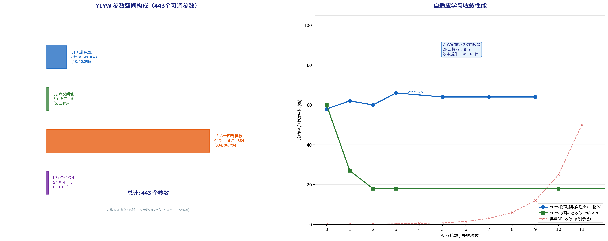

# 4.3 极致精简的参数空间

第4.2节论证了失败根因可以被精确定位——因为推理链的每一步是可检查的。但被定位之后，**可以修正的参数有多少？是哪些？**

YLYW的答案令人惊讶：整个系统的可调参数只有**443个**。这不到一个典型深度学习模型参数数量的百万分之一。本节详细分析这个参数空间的构成，并论证为什么这种极致精简不是偶然的——它是结构化先验的直接收益。

---

## 4.3.1 参数空间的构成

表4.2列出了YLYW全部443个可调参数的来源。

**表4.2 YLYW完整参数空间**

| 层级 | 参数对象 | 数量 | 公式 | 语义 |
|------|---------|:---:|------|------|
| L1 | 八卦原型向量 | 48 | 8卦 × 6维原型值 | 每个卦在6D物理空间中的"理想点" |
| L2 | 六爻阴阳判定阈值 | 6 | 每爻1个δ ∈ [0,1] | 判定阳/阴的连续边界 |
| L3 | 六十四卦爻模板 | 384 | 64卦 × 6维模板值 | 每个卦在6D爻空间中的"理想爻结构" |
| L3+ | 爻位关系权重 | 5 | 5个w_i ∈ [0,1] | 当位/得中/乘承/亲比/呼应的相对重要性 |
| **合计** | | **443** | | |

**L1的48个参数**是八卦原型的6维物理属性值。在第2章的工程重释中，这些值最初是从《周易》卦德描述转译而来（如:乾"健"→稳定性0.8）。但在实验中，它们可以通过数据驱动的方法进行精化。举例：如果碗类物体在实验中频繁被过度大力抓取（三爻力需求偏高），可以调整坤卦原型中的"力需求"维度——从0.3调整到0.25——使坤卦隶属度对低力需求的碗更敏感。

**L2的6个阈值参数**控制六爻的阴阳判定边界。默认所有阈值=0.5。如果某个维度（如四爻脆弱性）倾向于过于乐观（往往判定为阳，表示"不脆弱"，但实际脆弱的物体比例更高），可以上调该维度的阈值（如:0.5→0.55）使系统在该维度上更保守。

**L3的384个参数**是64个卦象的6维爻模板。这是整个系统最大的参数块，也是自适应学习修正最频繁的目标。爻模板优化的基本方法已在第2.3.3节详述——通过物体爻向量质心的数据驱动精化。但在在线学习场景中，修正更精细：只针对某个具体卦的某个具体爻维度。这384个参数的局部分布使系统的参数修正具有极高的选择性——修正"震为雷"的力预设不影响"泽雷随"的力预设，即使两者策略类型相同（均为dynamic族）。

**L3+的5个权重参数**控制五种爻位关系在综合质量评分中的贡献。这些参数在初始状态下由易学传统和消融实验共同标定（当位0.40，得中0.20，乘承0.15，亲比0.10，呼应0.15）。在特定的物理域中，这些权重可以根据反馈动态调整。例如:在运动控制域中，由于肢体协调的动态性高，"乘承"关系（力传递的顺逆）比在静态的抓取域更重要——可以将乘承权重从0.15上调到0.18，相应降低当位权重。

---

## 4.3.2 与DRL参数规模的量化对比

表4.3量化比较了YLYW与代表性深度强化学习方法的参数规模。

**表4.3 参数规模对比**

| 系统 | 参数量级 | 训练数据需求 | 硬件 |
|------|:------:|:----------:|------|
| PPO (Full-size) | ~10⁶-10⁷ | 10⁵-10⁶ 交互 | GPU |
| SAC | ~10⁶ | 10⁵-10⁶ 交互 | GPU |
| RT-2 (VLA) | ~10⁹ | 10⁵ 轨迹 + 互联网数据 | GPU集群 |
| **YLYW** | **4.4×10²** | **1-5 交互** | **CPU / 8051** |

差异因子：YLYW vs PPO/SAC ≈ 10³-10⁴ 倍。YLYW vs RT-2 ≈ 10⁶-10⁷ 倍。

超越"数量级差异"之外，更根本的差异在于：YLYW的443个参数是**语义锚定的**——每个参数有一个人类可理解的含义（"乾卦原型的稳定性维度的理想值"、"三爻力需求的判定阈值"）。而DRL的数百万参数是**语义不可解的**——它们是神经网络权重矩阵中的浮点数，其值本身不带任何可读的语义。

这种差异在工程中的后果是深刻的。当需要调整YLYW的策略时，开发者可以直接修改语义化的参数——"让坤卦更倾向于低力物体" = 调整坤卦原型的力需求维度从0.3到0.25。而在DRL中，同样的意图需要的操作是"重新定义奖励函数 + 重新训练"——因为无法直接修改不可解的权重值。

---

## 4.3.3 参数语义化的工程价值

表4.4展示了YLYW每个参数类别的语义化表达，以及这种语义化在工程中提供的具体操作能力。

**表4.4 参数语义化表**

| 参数类别 | 语义示例 | 工程操作 |
|---------|---------|---------|
| L1 八卦原型 | "乾卦的理想稳定性是0.8" | 调整对"稳定"物体的定义 |
| L2 爻阈值 | "初爻在0.55以上才判阳" | 提高稳定性判定的保守度 |
| L3 卦模板 | "震卦模板的力维度=0.43" | 调震动策略的力预设 |
| L3+ 权重 | "当位权重=0.40" | 调整"爻位和谐"的重要性 |

这种语义化带来的最终优势是：**YLYW的参数可以在完全不涉及代码修改的情况下由非编程人员进行调整。** 一个了解《周易》的易学专家可以审视卦象-策略映射表，判断"归妹卦的策略类型是否更应是pairing_grasp而非coordinated_grasp"——并直接修改规则表中的一行。这不需要重新训练任何模型。

一个了解物理学的机械工程师可以审视安全八卦的六爻公式，判断"穿透风险判定的sigmoid斜率是否太陡"——并调整编码公式中的敏感度参数。

一个了解机器人学的控制工程师可以审视冰面实验的诊断日志，判断"步态不匹配时调整姿态和扰动维度是否有更好的修正方向"——并修改诊断规则的修正目标。

这种"非AI专家的可介入性"在深度学习中完全不可想象——它需要数据科学家重新准备数据集、重新训练网络、重新验证性能。

图4.1以可视化方式对比了YLYW和DRL的参数空间。

**图4.1 YLYW参数空间构成与自适应学习收敛性能。** 左图：443个参数的四层分布——L3（64卦模板,384个）占据绝对主导。右图：自适应学习收敛曲线——YLYW抓取自适�应（蓝色）在3轮内收敛于66%，冰面步态收敛（绿色）在3步内从2.0m/s降至0.6m/s。与典型DRL收敛曲线（红色虚线,数万步交互）形成数量级对比。

---

*本节完。下一节：4.4 自适应学习实验。*
