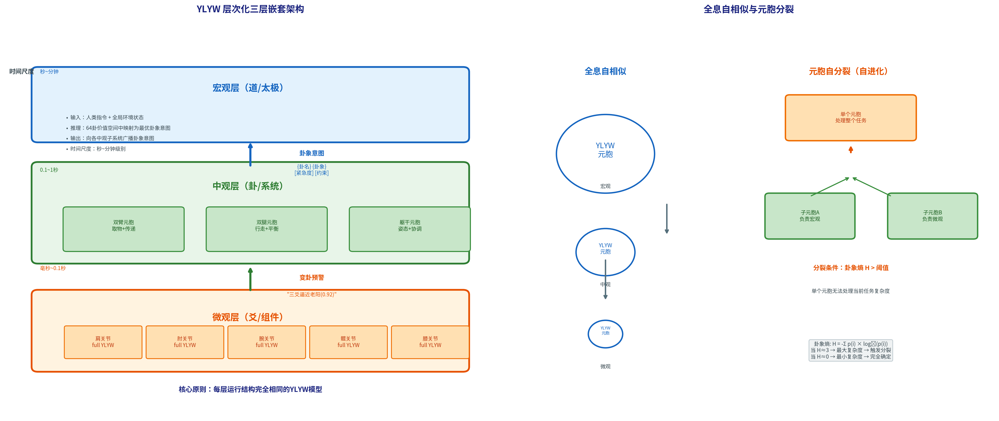

# 7.1 从单智能体到多智能体——架构的必由之路

在进入层次化嵌套的技术细节之前，必须回答一个前提问题：为什么单智能体架构是不够的？为什么YLYW需要从单层走向嵌套？

---

## 7.1.1 单智能体的能力边界

YLYW的单层架构（第3章）在三个域中表现出色——因为三个域的正确决策都落在**单一粒度的认知空间**中。物理抓取的决策空间是"用什么策略、多大的力"——一个标量策略类型+一个标量力参数。运动控制的决策空间是"用什么步态、多快的速度"——同样只有一个标量决策。ALFWorld导航的决策空间是"下一个动作是什么"——每一步选择一个离散动作。

但真实的物理世界任务不是单粒度的。想想一个完整的人形机器人任务——"去厨房拿杯子"：

- **宏观决策**：廚房在哪？先去厨房还是先去洗衣房？完成任务的全局顺序是什么？→ 秒到分钟级别
- **中观决策**：左腿迈步还是右腿迈步？手臂如何摆动以保持平衡？如何转向走向厨房门？→ 0.1到1秒级别
- **微观决策**：膝关节的角度、踝关节的力矩、躯干的姿态微调以保持ZMP在支撑域内→ 毫秒到0.1秒级别

一个单层YLYW不可能同时在这三个粒度上做出正确的决策。三个粒度的决策约束条件不同——宏观的"最优路径"和中观的"最优步态"可能冲突（最短路径可能经过崎岖地形，需要降低速度）。三个粒度的信息更新频率不同——宏观位置以秒为单位变化，微观关节角度以毫秒为单位变化。将这三个粒度的决策压入同一层推理链中，会导致认知带宽的分裂——系统要么跟不上宏观策略的变化（因为被微观细节拖累），要么跟不上微观物理的动态（因为被宏观策略的延迟阻塞）。

---

## 7.1.2 传统分布式系统的三个困境

层次化决策并非YLYW的首创——机器人学中早已有分层控制架构。但传统的分层系统存在三个结构性的困境，YLYW的层次化嵌套通过"卦象意图"通讯协议给出了三个相应的解决方案。

**困境一：层间通讯的语义鸿沟。** 在传统的分层规划中，高层（如任务规划器）输出数值指令——目标关节角度、目标末端执行器位姿。低层（如MPC控制器）接收这些数值，执行轨迹追踪。问题是：从"目标位姿"到"关节力矩"的翻译是一个独立的、与高层推理无关的数值优化问题。高层"不知道"低层在执行中遇到了什么困难（电机过热、关节限位），低层"不知道"高层为什么要去这个位姿（拿杯子还是推门）。层间的语义鸿沟使得两者之间无法进行有意义的"协商"。

YLYW的解决方案：高层不发送数值指令，而是发送**卦象意图**——一个卦名+卦象+紧急度+约束范围的抽象消息。中观层不是追踪一个数值目标，而是理解一个卦象语义，然后自主拆解为适合自己粒度的控制序列。当低层遇到困难时，它不会报告"关节角度超限"这个数字，而是报告一个变卦预警——"初爻逼近老阴（0.08）"——高层理解这个卦象的含义（稳定性即将崩溃），并据此调整策略。

**困境二：安全约束的外挂性。** 在传统分层系统中，安全通常是一个独立于所有层的外部模块——在发生危险时"断电"。这种外挂式安全的问题在于：它不知道哪个层导致了危险（无法定位根因），只能在事后被动响应（无法主动预防），无法在不同层级间协调安全策略（高层可能已经感知到危险正在逼近，但低层的安全模块还不知道）。

YLYW的解决方案：**每层内建安全八卦**。宏观层、中观层、微观层各自部署一个与策略八卦并行的安全八卦模型。微观层安全八卦在关节层面检测过载→向上报告变卦预警。中观层安全八卦在系统层面分析综合安全状态→统筹响应。宏观层安全八卦在任务层面判断全局风险→调整任务优先级或中断任务。三个安全八卦独立运行但通过卦象通讯协议共享信息——安全是内建在每一层的结构，而非外挂在系统上的附加模块。

**困境三：价值对齐的脆弱性。** 传统系统中，价值判断（"什么更重要"——安全、效率、成本、速度）通常只存在于最高层决策者中。低层执行者只关心"如何完成指令"，不关心"这个指令是否合理"。当高层指令与物理安全冲突时（"全速前进！"但前方有障碍），低层仍然会尝试执行——因为低层没有自己的价值判断。

YLYW的解决方案：每层都是**完整的YLYW元胞**——包含完整的八卦→六爻→六十四卦推理链，包含自己的安全八卦和吉凶价值体系。微观层元胞在收到高层的"全速前进"卦象意图时，用自己的安全八卦检查关节负荷和稳定性——如果检测到"老阳之极"（关节温度接近极限），它会**拒绝执行**并向上发送变卦预警，而不是机械地跟随指令。这种"每层都有自己的价值观"的设计与分布式人类组织的决策逻辑一致——前线的士兵在收到"冲锋"的指令时，如果发现前方是雷区，他有权暂停并报告，而不是盲目执行。

---

## 7.1.3 《易经》全息原理的工程启示

层次化嵌套架构的设计灵感来自《易经》的一个核心特征——**全息自相似性**。

《周易·系辞传》中有两个标识性命题：

> "易有太极，是生两仪，两仪生四象，四象生八卦。"

> "其大无外，其小无内。"

前一句描述了《易经》符号系统的递归生成逻辑：每一步都在原有的基础上应用相同的规则向上构建。后一句描述了这套逻辑的适用尺度——它在任何尺度上都同样有效。

这一思想的工程含义是深远的。如果YLYW的推理架构（八卦→六爻→六十四卦）在单一尺度上有效，那么——如果《易经》的全息自相似性确实成立——它在任何尺度上都应该同样有效。宏观层的YLYW元胞处理"去厨房拿杯子"的任务，中观层的YLYW元胞处理"左腿迈步"的任务，微观层的YLYW元胞处理"膝关节力矩控制"的任务——它们都使用相同的L1→L2→L3推理架构，只是每层的输入空间和动作空间的内容不同。

这对应了自然界中的分形结构——树的每一级枝杈的分形结构与整棵树的形状相似，血管的末端分支与主干的分支结构相似。YLYW的层次化嵌套是将这种自然界的递归模式工程化的结果。

图7.1展示了YLYW层次化嵌套架构的全貌。

**图7.1 YLYW层次化三层嵌套架构（左）与全息自相似/元胞分裂（右）。** 左图：宏观层（道/太极）通过卦象意图向下层广播；中观层（卦/系统）包含多个独立YLYW元胞（双臂元胞、双腿元胞、躯干元胞），它们自行拆解卦象意图；微观层（爻/组件）在关节级运行完整YLYW推理。层级间向上传递变卦预警。右图：全息自相似——同一架构在不同粒度上完全一致；元胞分裂——当卦象熵H超阈值时，一个YLYW元胞自动分裂为两个子元胞，各自负责不同粒度的子任务。

*本节完。下一节：7.2 三层递归嵌套架构。*
