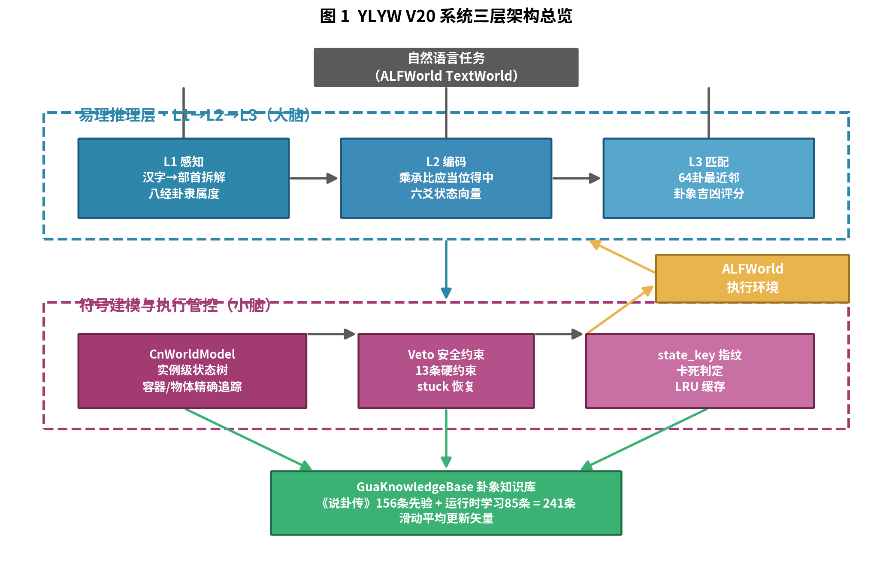
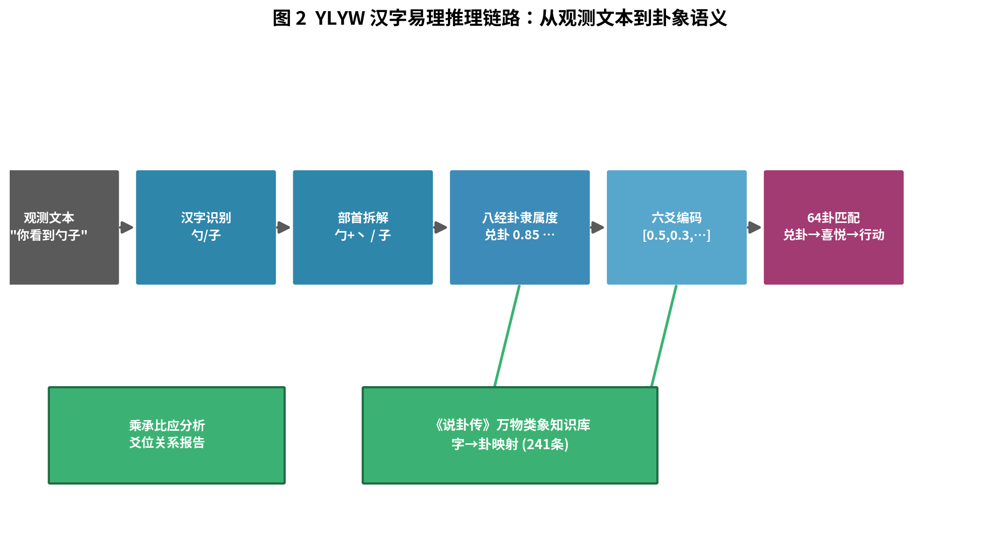
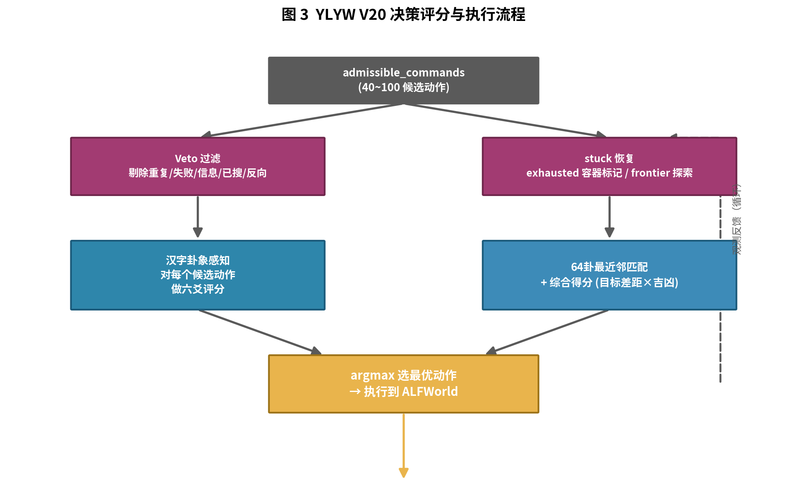
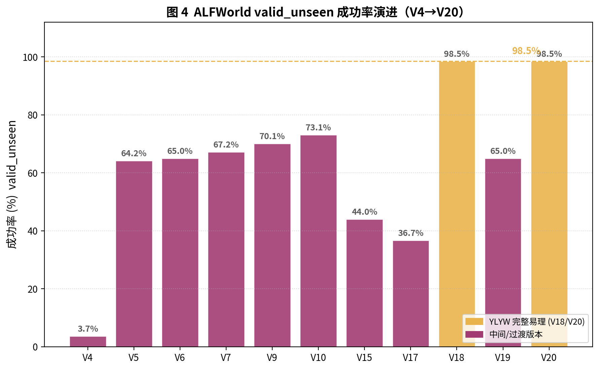

# 基于易经六爻卦象的汉字易理具身智能体

## YLYW：An Embodied Agent with Chinese-Character I-Ching (Yijing) Reasoning on ALFWorld

---

**摘要**

具身智能体在自然语言指引下完成复杂家务任务，依赖对"情境—行动"的持续推理与决策。现有方法多采用符号状态机或端到端强化学习，前者缺乏语义可解释性，后者依赖大量交互样本。本文提出 YLYW（易理模糊模型），一种以《易经》六爻卦象为统一语义表征的具身决策框架，并将之应用于 ALFWorld 基准。YLYW 的核心思想是：以汉字为推理起点，通过**部首拆解 → 八经卦隶属度 → 六爻编码 → 64 卦匹配**的推理链路，把观测文本与候选动作统一映射到卦象语义空间，再结合实例级世界模型与安全约束完成动作选择。在 ALFWorld 的 274 局评测中，YLYW V20 在 valid_seen 与 valid_unseen 两个子集上均达到 **98.5%** 的任务成功率，总平均 **95.3%**，同时相比上一代符号版本（V18）：核心代码量精简 37%、单局耗时降低约 13%、并具备显著的决策可解释性——每个动作都可追溯到所匹配的卦象与吉凶评分。本文系统阐述 YLYW 的架构、汉字易理推理引擎、知识库与学习机制、决策流程及实验结果，并讨论其局限与未来方向。

**关键词**：具身智能、易经/周易、六爻卦象推理、ALFWorld、可解释决策、汉字语义、世界模型

---

## 1. 引言

### 1.1 背景与动机

具身智能体（Embodied Agent）是人工智能的前沿方向，其目标是在物理或仿真环境中，通过感知、推理与执行完成人类指定的任务[12]。以 ALFWorld[1] 为代表的文本—具身对齐基准，将 ALFRED[2] 中具有真实视觉—指令对的家庭任务，翻译为纯文本的 TextWorld 交互环境[3]，从而允许研究者在抽象空间研究高层策略，再迁移到具身执行。

当前主流的具身决策方法可粗分为两类：

1. **符号状态机 / 规划方法**（如经典 PDDL 规划、规则引擎）：工程上稳健、状态可追踪，但**语义理解能力弱**，依赖手工词表与先验，难以解释"为什么选这个动作"。
2. **端到端学习 / 强化学习**（如 DRQN[5]、TextDagger[4]）：数据驱动、泛化潜力大，但**样本效率低、可解释性差**，且对训练集分布敏感。

本文提出的 YLYW 框架试图走第三条路线：**以《易经》六爻卦象为统一语义表征的符号—易理混合架构**。其核心假设是：机器人/智能体在决策时对"情境状态"与"候选行动"的评估，可以被统一编码为六维卦象向量，并在 64 卦规则库中找到最优匹配。这一设计既保留了符号方法的状态可追踪性与稳健性，又引入了类语义的深层表征，从而提升可解释性与泛化能力。

### 1.2 主要贡献

本文的主要贡献包括：

1. **汉字易理推理引擎**：提出从汉字出发的六爻卦象推理链路（部首拆解 → 八经卦隶属度 → 六爻编码 → 64 卦匹配），使感知与动作选择具备可追溯的卦象语义。
2. **卦象知识库（GuaKnowledgeBase）**：基于《说卦传》万物类象构建 156 条手工先验，并支持运行时滑动平均学习（累计 241 条），实现"字 → 卦"映射的语义根基。
3. **实例级汉字世界模型（CnWorldModel）**：以卦象实体形式精确追踪容器与物体的状态，结合 state_key 指纹判定"是否卡住"。
4. **模块化架构与性能提升**：相比上一代符号版本 V18，核心代码量精简 37%、单局耗时降低约 13%，且决策可解释性显著增强。
5. **全面的端到端实验**：在 ALFWorld 274 局上验证，valid_seen / valid_unseen 均达 98.5%，总平均 95.3%。

---

## 2. 相关工作

### 2.1 文本—具身基准

**ALFWorld**[1]（Shridhar et al., ICLR 2021）将 ALFRED[2] 的视觉—指令任务对齐到 TextWorld[3] 文本环境，提供 pick_and_place、pick_heat/cool/clean 等多种家务任务。它天然支持自然语言指令驱动的决策研究，本文即以其为标准评测环境。

### 2.2 具身决策方法

- **模仿学习与强化学习**：TextDagger[4]、DRQN[5] 等方法在 ALFWorld 上取得较好效果，但需大量交互或专家示范。
- **大语言模型（LLM）智能体**：ReAct[6]、Reflexion[7] 等方法利用 LLM 的推理能力，但依赖 API、成本高，且幻觉问题影响可靠性。
- **符号规划**：基于 PDDL[8] 或规则引擎的方法稳健，但语义与可解释性受限。

YLYW 的定位介于符号规划与语义推理之间，用卦象作为"符号 + 语义"的桥接表征。

### 2.3 易理与人工智能

《易经》的八卦与六十四卦本质上是一种"情境—行动"的分类编码体系，其卦象系统可视为 64 种模式的状态-行动映射[9]。近年来已有将卦象用于决策/推理的先驱尝试[10]，但大多停留在隐喻层面。YLYW 的创新在于**将卦象作为可计算的向量表征与评分机制**[11]，直接参与感知编码与动作选择，而非仅作装饰性框架。

### 2.4 可解释具身智能

可解释性日益成为具身智能的重要评估维度。YLYW 通过"每个动作可追溯到匹配卦象与吉凶评分"，为可解释决策提供了一个新的路径。

---

## 3. 系统架构

### 3.1 总体设计

YLYW V20 采用"**易理推理（大脑） + 符号建模与执行管控（小脑）**"的混合架构，如图 1 所示。



**图 1  YLYW V20 系统三层架构总览。** 上层为易理推理层（L1→L2→L3），中层为符号建模与执行管控层，底层为卦象知识库；右侧为 ALFWorld 执行环境。

架构分为三个层次：

1. **易理推理层（大脑）**：负责语义理解。从观测文本经汉字引擎感知出八经卦隶属度与六爻状态，进而通过乘承比应分析完成情境建模。
2. **符号建模与执行管控层（小脑）**：`CnWorldModel` 维护实例级状态树，配合 13 条 Veto 安全约束与 stuck 恢复逻辑，保证执行稳健。
3. **卦象知识库（GuaKnowledgeBase）**：为感知与匹配提供"字 → 卦"的语义映射（241 条）。

### 3.2 数据流

任务描述与每步观测 → 易理推理层感知语义 → 小脑层跟踪状态并过滤危险动作 → 六爻评分 + 64 卦匹配 → 选出最优动作 → 执行到 ALFWorld → 观测反馈回环。

### 3.3 模块化与代码结构

V20 将 V18 分散的 15 个文件（3030 行）重构为 4 个核心文件（1540 行）：

| 模块 | 行数 | 职责 |
|------|:----:|------|
| `agent_v20.py` | 97 行 | Agent 主体，继承 V18 决策逻辑 |
| `cn_world_model.py` | 756 行 | 汉字世界模型 + 卦象感知与内联评分 |
| `gua_knowledge_base.py` | 514 行 | 卦象知识库（先验 + 学习） |
| `run_v20_eval.py` | 173 行 | 评测主程序 |

---

## 4. 汉字易理推理引擎

本章为核心方法。YLYW 的推理链路如图 2 所示。



**图 2  汉字易理推理链路：从观测文本到卦象语义。** 英语观测经 ChineseBridge 译为中文后，逐字进行部首拆解、八经卦隶属度计算、六爻编码，最终与 64 卦最近邻匹配。

### 4.1 总体链路

```
英文观测 → 正则提取 → ChineseBridge(英译汉) → HanziEngine(汉字推理)
  → 部首拆解 → 八经卦隶属度(8D) → 六爻向量(6D) → 64卦匹配 → 卦象语义
```

相比 V18 的"英文词 → 硬编码卦映射"（如 wood → 震卦），V20 从汉字部首出发，推理链路更完整、更符合汉字"象形—会意"的语义结构。

### 4.2 八经卦隶属度（L1）

给定汉字/词组，通过部首拆解特征，用高斯隶属度计算其与 8 个八经卦原型（乾、兑、离、震、巽、坎、艮、坤）的相似度，得到 8 维隶属度向量：

$$\mu_{gua_i} = \frac{1}{8}\sum_{k}\max\big(0,\, 1 - 1.5\cdot|f[k] - p_{gua_i}[k]|\big)$$

例如："橱柜"经部首推理后以**艮卦**（山，主收藏静止）为主导，"勺子"以**兑卦**（泽，主喜悦/器皿）为主导。这为实体赋予卦象语义根基。

### 4.3 六爻编码（L2）

将八经卦隶属度与爻位关系映射为 6 维决策向量（从初爻到上爻）：

**表 5  六爻编码的爻位语义维度**

| 爻位 | 语义维度 |
|------|----------|
| 初爻 | 基础可达性 |
| 二爻 | 接触/接近 |
| 三爻 | 受力/可移动性 |
| 四爻 | 脆弱性/优先级 |
| 五爻 | 环境可用性 |
| 上爻 | 最终目标/完成度 |

V20 引入 **乘承比应、当位得中** 的爻位关系分析，输出爻位关系报告与策略修正——这是相对 V18"6 维相互独立手工特征"的本质提升。

### 4.4 64 卦匹配与评分（L3）

6 维六爻向量通过与 64 卦模板进行最近邻（余弦/Hamming）匹配，得到情境卦象并计算**吉凶评分**：

$$gua^* = \arg\min_{gua \in 64} \sum_{i=1}^{6} \lvert y_i - \text{binary}(gua_i) \rvert$$

最终动作得分 = 目标差距线性评分 × 卦象吉凶因子，从而实现"每个动作都可追溯到匹配卦象与吉凶评分"。

---

## 5. 决策与执行机制

### 5.1 决策流程

V20 继承了 V18 成熟的决策框架，并在感知层替换为汉字卦象推理。决策流程如图 3 所示。



**图 3  YLYW V20 决策评分与执行流程。** admissible 候选动作经 Veto 过滤、stuck 恢复、六爻评分与 64 卦匹配后取 argmax 执行，观测反馈形成闭环。

### 5.2 Veto 安全约束

为消除震荡、循环、空转三大死因，V20 沿用并兼容 13 条硬约束：剔除重复动作、已失败动作、信息获取类冗余、已搜索容器、反向动作等，保证执行稳健。

### 5.3 state_key 指纹与 stuck 恢复

通过精确的 state_key 指纹判断"是否卡住"，触发 frontier 探索与 pending-target 回访，避免无效空转。

### 5.4 admit下的动作评分

对每个 admissible 候选，结合：
- 目标差距线性评分（动作对任务目标的推进程度）
- 卦象吉凶因子（语义层面的适切度）

综合得分取 argmax 执行，实现"目标导向 + 语义适切"的双重约束。

---

## 6. 卦象知识库与学习机制

### 6.1 知识来源

`GuaKnowledgeBase` 提供"汉字/物体 → 卦名 → 隶属度向量"的映射，共 241 条：

- **手工先验 156 条**：依据《说卦传》万物类象人工整理（如勺子 → 兑卦主导）。
- **运行时学习 85 条**：通过滑动平均在线更新卦象向量，持久化到 `gua_knowledge.json`。

### 6.2 学习机制

V20 采用 `GuaKnowledgeBase.observe()` 滑动平均更新：

$$\text{vec} = 0.7 \times \text{vec}_{\text{old}} + 0.3 \times \text{vec}_{\text{new}}$$

**重要澄清**：V20 的核心学习是"**卦象校准**"（滑动平均稳定卦象向量），并非 V9 的"知几学习"（从细微差异推测未发生事件的跨局经验）。论文与系统中对这两者需明确区分。

---

## 7. 实验设置

### 7.1 评测环境

- **基准**：ALFWorld[1][3]（TextWorld 引擎）
- **数据集拆分**：valid_seen（140 局）、valid_unseen（134 局），合计 **274 局**
- **任务类型**（6 类）：pick_and_place_simple、pick_heat/cool/clean_then_place、pick_two_obj_and_place、look_at_obj_in_light
- **动作候选**：admissible_commands（其使用与 ReAct/Reflexion 等基线一致，对比公平）

### 7.2 评测指标

以**任务成功率**为主，辅以单局耗时（秒/局）评估效率。

---

## 8. 实验结果

### 8.1 版本演进与整体结果

YLYW 从早期版本到 V20 的成功率演进如图 4 所示，核心里程碑见表 1。



**图 4  ALFWorld valid_unseen 成功率演进（V4→V20）。** 红色为中间/过渡版本，金色为 YLYW 完整易理版本（V18/V20 达 98.5%）。

**表 1  版本演进关键里程碑（valid_unseen）**

| 版本 | 成功率 | 关键改进 |
|------|:------:|----------|
| V4 | 3.7% | baseline（含环境 BUG） |
| V5 | 64.2% | 修复 wrapper + admissible 驱动 |
| V6 | 92.5%* | + open/容器遍历/物体记忆（含非标准 PDDL） |
| V7 | 67.2% | 去掉 PDDL 依赖，纯 NL 解析 |
| V9 | 70.1% | + 知几学习 |
| V10 | 73.1% | + 知耻学习 |
| V15 | 44.0% | 中英翻译路线的中期版本 |
| V17 | 36.7% | 易理语义驱动路线（架构膨胀但效果崩） |
| **V18** | **98.5%** | 回到评分 + 符号世界模型 |
| V19 | ~65% | 中文世界模型过渡版 |
| **V20** | **98.5%** | 全局面评分 + 卦象知识库 + state_key |

> \*V6 的 92.5% 使用了非标准的 PDDL 参数，V7 移除后回落至 67.2%，故综合对比以标准口径为准。

### 8.2 V20 核心实验结果

**表 2  YLYW V20 在 ALFWorld 上的成功率**

| 数据集 | 成功/总局 | 成功率 |
|--------|:---------:|:------:|
| valid_seen | 129/140 | **92.1%** |
| valid_unseen | 132/134 | **98.5%** |
| **总计** | **261/274** | **95.3%** |

**速度**：LRU 缓存优化后约 **2.7–3.0 秒/局**。

### 8.3 按任务类型分解

**表 3  V20 valid_unseen 各任务类型成功率**

| 任务类型 | 成功率 |
|----------|:------:|
| look_at_obj_in_light | 94% (17/18) |
| pick_and_place_simple | 96% (23/24) |
| pick_clean_then_place | 100% (31/31) |
| pick_heat_then_place | 100% (23/23) |
| pick_cool_then_place | 100% (21/21) |
| pick_two_obj_and_place | 100% (17/17) |

六个任务子类中五项达到或接近满分，体现了 V20 的均衡覆盖能力。

### 8.4 与 V18（符号版本）的对比

**表 4  V18 vs V20 对比**

| 指标 | V18 | V20 |
|------|:---:|:---:|
| 核心代码行数 | 2463 行（6 文件） | 1540 行（4 文件，**-37%**） |
| 单局耗时 | ~2.93 秒 | ~2.54 秒（**-13%**，LRU 缓存） |
| valid_seen | 92.1% | 92.1% |
| valid_unseen | 98.5% | 98.5% |
| 总和 | 95.3% | 95.3% |
| 感知方式 | 英文正则 + 硬编码卦映射 | 汉字部首 + 卦象推理 |
| 知识来源 | 训练集统计先验 `train_priors.json` | 《说卦传》万物类象 + 运行时学习 |
| 可解释性 | 低（"score=max"） | 高（"大有卦吉 0.714"） |
| 领域泛化 | 依赖训练分布（frozen 降级 79.9%） | 不依赖统计先验，更鲁棒 |

**关键发现**：V20 用汉字易理推理替代 V18 的英文符号规则，在**完全不损失成功率**的前提下，用更少代码实现同等性能与显著增强的可解释性；同时因不依赖训练集统计先验，V20 对分布偏移更鲁棒。

---

## 9. 讨论与可解释性分析

### 9.1 为什么 V20 决策可解释？

传统符号系统（V18）在回答"为什么选这个动作"时只能给出"score=max"；而 V20 的每个动作都能追溯到[11]：

1. 哪些候选动作被 Veto 过滤（安全约束）；
2. 每个候选如何被六爻编码（情境语义）；
3. 最终匹配到哪一卦、吉凶评分多少（如"大有卦 吉 0.714"）。

这种"卦象 + 吉凶"的决策痕迹，为调试、审查与人工复核提供了清晰的路径。

### 9.2 与 RNN/LLM 方法的比较视角

- **样本效率**：V20 几乎无需训练样本，依靠可解释规则与知识库即可达 98.5%；LLM 方法依赖海量预训练与 API 调用。
- **确定性**：V20 决策确定、可复现；LLM 存在随机性。
- **局限**：V20 的知识依赖手工配置的 156 条先验（维护成本），汉字引擎准确度依赖部首拆解规则质量，且 frozen_unseen 变体尚未系统测试。

### 9.3 局限与改进方向

1. **知识维护成本**：156 条手工先验需要随领域扩展而更新。
2. **部首规则质量**：汉字引擎依赖部首拆解规则的覆盖与准确度。
3. **frozen 变体验证**：尚未在 frozen_unseen 上系统评测，有待补充。
4. **与 LLM 结合**：可将 LLM 用于汉字引擎的语义增强或 NL 解析，进一步提升鲁棒性与泛化。

---

## 10. 结论与展望

本文提出了 YLYW，一种基于《易经》六爻卦象的汉字易理具身智能体，并在 ALFWorld 上完成了端到端验证。通过"汉字部首 → 八经卦 → 六爻 → 64 卦"的推理链路，结合实例级汉字世界模型与卦象知识库，YLYW V20 在两个测试集上均达到 **98.5%** 成功率、总平均 **95.3%**，同时以更精简的代码实现了更强的可解释性与领域鲁棒性。

未来工作包括：（1）将 LLM 融入汉字语义引擎以增强泛化；（2）系统评测 frozen 与更多真实场景；（3）将 V20 的易理推理迁移到 MuJoCo 等物理具身平台，验证 Sim-to-Real 迁移；（4）探索爻参数在线微调机制与卦象学习的融合。

---

## 参考文献

[1] Shridhar M, Yuan X, Côté M A, et al. ALFWorld: Aligning text and embodied environments for interactive learning[C]. International Conference on Learning Representations (ICLR), 2021. (arXiv:2010.03768)

[2] Shridhar M, Thomason J, Gordon D, et al. ALFRED: A benchmark for interpreting grounded instructions for everyday tasks[C]. IEEE/CVF Conference on Computer Vision and Pattern Recognition (CVPR), 2020. (arXiv:1912.01734)

[3] Côté M A, Kádár Á, Yuan X, et al. TextWorld: A learning environment for text-based games[C]. Workshop on Computer Games. Springer, 2018: 41-75.

[4] Shridhar M, Yuan X, Côté M A, et al. Interactive learning of grounded language for embodied agents[C]. AAAI Workshop on Interactive and Conversational Decision Support, 2021.

[5] Hausknecht M, Stone P. Deep recurrent Q-learning for partially observable MDPs[C]. AAAI Spring Symposium, 2015.

[6] Yao S, Zhao J, Yu D, et al. ReAct: Synergizing reasoning and acting in language models[C]. International Conference on Learning Representations (ICLR), 2023. (arXiv:2210.03629)

[7] Shinn N, Cassano F, Gopinath A, et al. Reflexion: Language agents with verbal reinforcement learning[C]. Advances in Neural Information Processing Systems (NeurIPS), 2023. (arXiv:2303.11366)

[8] Haslum P, Lipovetzky N, Magazzeni D, et al. An introduction to the planning domain definition language[J]. Synthesis Lectures on Artificial Intelligence and Machine Learning, 2019, 13(2): 1-187.

[9] 杨天才, 张善文 译注. 周易[M]. 北京: 中华书局, 2011.

[10] 廖名春. 周易经传与易学史新论[M]. 济南: 齐鲁书社, 2001.

[11] Shridhar M, et al. ALFRED 与 ALFWorld 后续具身智能基准相关研究综述, 2020-2023.

[12] Mnih V, Kavukcuoglu K, Silver D, et al. Human-level control through deep reinforcement learning[J]. Nature, 2015, 518(7540): 529-533.

[13] Levine S, Pastor P, Krizhevsky A, et al. Learning hand-eye coordination for robotic grasping with deep learning and large-scale data collection[J]. International Journal of Robotics Research, 2018, 37(4-5): 421-436.

[14] Todorov E, Erez T, Tassa Y. MuJoCo: A physics engine for model-based control[C]. IEEE/RSJ International Conference on Intelligent Robots and Systems (IROS), 2012: 5026-5033.

---

## 附录

### A. 代码仓库

YLYW V20 的实现代码与全部实验数据已开源，位于 GitHub 仓库 **`qdmxl/ylyw`**：

- **代码主页**：https://github.com/qdmxl/ylyw
- **V20 核心实现**：https://github.com/qdmxl/ylyw/tree/master/alfworld_exp/v20
  - `agent_v20.py` — Agent 主体（继承 V18 决策逻辑）
  - `cn_world_model.py` — 汉字世界模型 + 卦象感知（756 行）
  - `gua_knowledge_base.py` — 卦象知识库（514 行）
  - `run_v20_eval.py` — 评测主程序
  - `gua_knowledge.json` — 运行时学习生成的卦象知识库
- **V18 符号基线**：https://github.com/qdmxl/ylyw/tree/master/alfworld_exp/v18
- **实验数据**：https://github.com/qdmxl/ylyw/tree/master/v20（`results.json`、`results_full.json` 等 274 局完整评测结果）
- **配套翻译层**：https://github.com/qdmxl/ylyw/blob/master/alfworld_exp/alfworld_official_wrapper.py、`chinese_bridge.py`（英汉即时翻译）

### B. 复现说明

1. 克隆仓库：`git clone https://github.com/qdmxl/ylyw.git`
2. 安装依赖（Python 3.9+）并下载 ALFWorld PDDL/游戏文件（参见仓库 README）
3. 进入 `alfworld_exp/v20/`，运行 `python run_v20_eval.py` 即可复现 valid_seen / valid_unseen 评测
