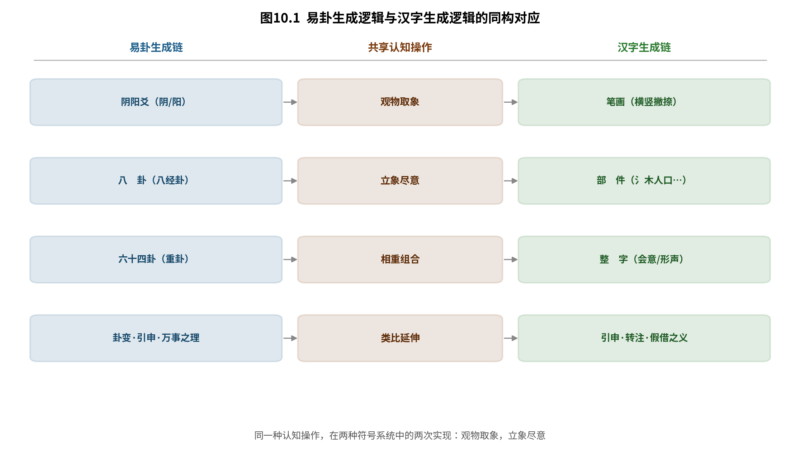
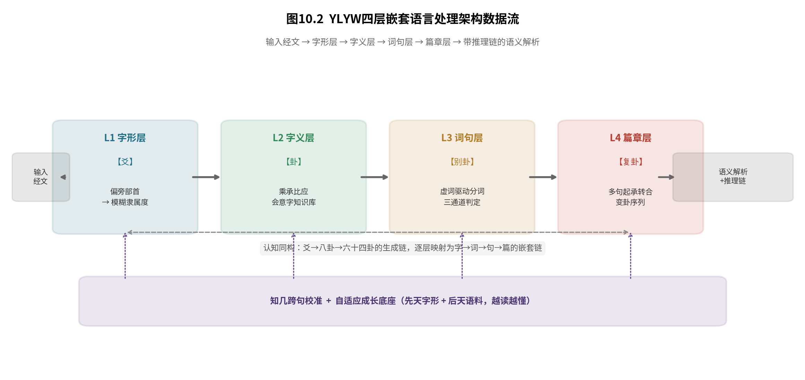
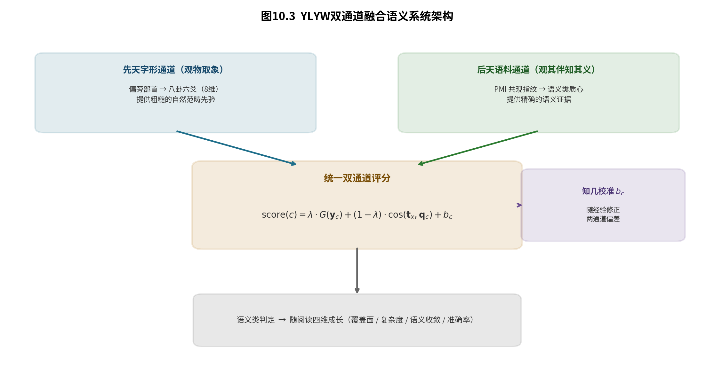
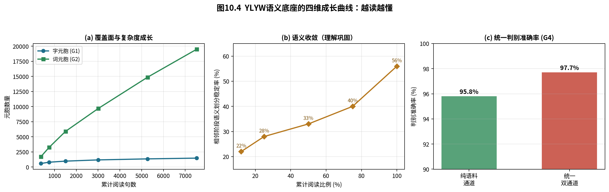
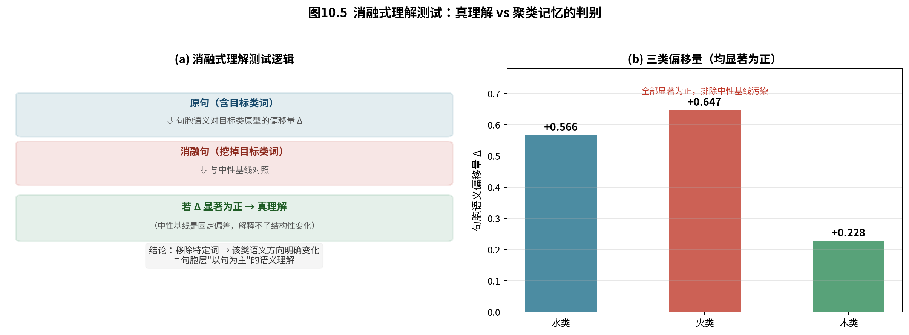
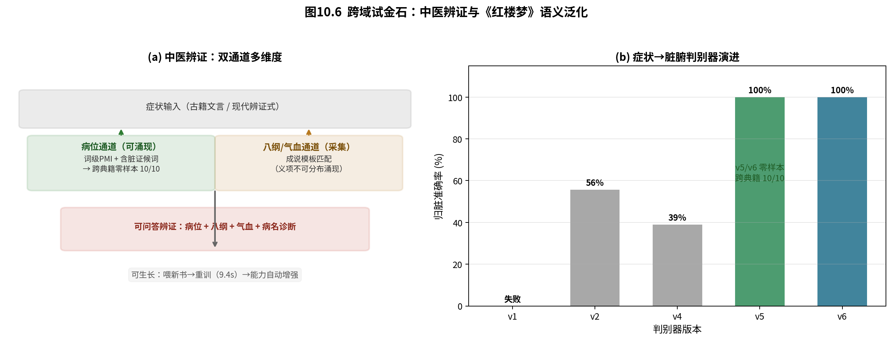
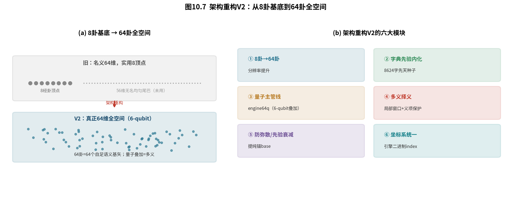

# 第10章 汉语语义理解引擎：让汉语在机器中生长

## 10.1 引言：为什么汉语是YLYW的"母语"

### 10.1.1 主流NLP范式处理汉语的根本缺口

当前自然语言处理（NLP）的主流范式，从Word2Vec到BERT再到GPT，本质上是一种**数据驱动的统计拟合**。模型通过处理海量文本语料，学习词语的分布式表示与上下文共现模式，并以此完成从分类、翻译到生成的一系列任务。这一范式在英语等拼音文字上取得了巨大的成功，其成功本身也塑造了一种"语言即数据"的隐含假设：只要语料足够大、参数足够多，语言的一切规律都能被统计地逼近。

然而，当这一范式面对汉语——特别是面对汉字这一世界上唯一仍在广泛使用的**象形-表意文字**系统时，一个根本性的维度被系统性地忽视了。

在拼音文字中，词形与语义之间没有内在的可视联系。英文的"cat"与它所代表的猫这个动物之间，不存在任何形状上的关联；"water"这个词的字母序列里，也看不出任何"流动"的意味。字形与语义的关系是**任意的**（arbitrary）——这正是索绪尔语言学关于语言符号"能指与所指关系任意性"的基本原理。因此，处理拼音文字的NLP系统，只能、也只需完全依赖上下文统计来建立语义理解；"字形"这一维度在拼音文字中本就近乎不存在。

但汉字不同。汉字的每一个字形，都是一次"观物取象"的产物，字形本身携带直接的语义信息（详见10.1.2与10.2）。当一个字形携带语义的书写系统，被交给一个只懂得统计共现、却看不懂字形的模型去处理时，被浪费掉的不仅是一种特征，而是**一条与生俱来的、直通语义的通道**。

这就引出了本章的第一个问题：**如果一种语言的字形本身携带语义，那么一个忽略字形的模型，是否从根本上就不适合处理这种语言？** 而更深一层的问题是：**若要让机器真正"理解"汉语，我们需要的究竟是一个在汉语语料上训练得更好的统计模型，还是一个在认知结构上本就与汉语同构的智能体？**

### 10.1.2 汉字与易卦的同源：观物取象，立象尽意

要回答上述问题，必须回到汉字与《易经》的共同起源。

《易经·系辞传下》在描述八卦的起源时写道：

> "古者包牺氏之王天下也，仰则观象于天，俯则观法于地，观鸟兽之文与地之宜，近取诸身，远取诸物，于是始作八卦。"

而东汉许慎在《说文解字·叙》中定义汉字的起源时，几乎一字不差地写道：

> "古者庖牺氏之王天下也，仰则观象于天，俯则观法于地，视鸟兽之文与地之宜，近取诸身，远取诸物。"

两段话的雷同绝非偶然的文献沿袭，而是揭示了一个被长期忽略的事实：**汉字与易卦，出自同一个认知操作——观物取象，立象尽意。** 无论是把天地的运行提炼为阴阳爻的排列（易卦），还是把事物的形态提炼为笔画的线条（汉字），其底层都是同一种认知能力：从具体事物中抽取可被反复使用的抽象符号，再用这些符号的组合去"尽意"。

这意味着，汉字不是一个与语义随意绑定的符号，而是一个**从语义中生长出来、并持续携带语义的可视结构**。三点水（氵）之旁，是水的形状，也是水的意义；"休"字之人依于木，是休息的画面，也是休息的概念。一个内建了"观物取象"认知框架的智能体，在处理这样的文字系统时，拥有一种天然的亲近感——因为它的认知结构，与汉语的底层逻辑本就是同构的。

这正是YLYW（易理-模糊-物理）模型的立足点。YLYW的前九章已经系统地论证了：《易经》的符号系统（八卦→六爻→六十四卦）可以被形式化为一个可计算、可验证、可工程化的智能架构。而本章要论证的是：**恰恰因为这一架构的认知源头与汉字相同，它在处理汉语时，拥有处理拼音文字时所无法比拟的天然优势。**

### 10.1.3 本章核心命题与在全书中的位置

基于上述观察，本章提出并论证一个核心命题：

> **在YLYW的范式下，汉语不是众多语种中的一种，而是它的"母语"。**

这一命题包含两层含义。其一是**结构上的同构**：YLYW的"卦象-爻位-易理"三层结构，与汉字的"字形-结构-字义"三层结构可以一一对应（第10.2、10.3节展开）。其二是**成长上的同源**：母语不是靠查字典查会的，而是在大量语境的"浸泡"中生长出来的；一个真正"懂"汉语的YLYW引擎，其语义底座也不应是一张人工抄录的静态字典，而应是一个**随阅读持续生长、日益巩固的自组织知识系统**（第10.5、10.6节展开）。

本章在全书中的位置承接第9章。第9章从范式层面把YLYW与主流路径（端到端VLA、世界模型、LLM智能体）进行了系统对比，指出"知识驱动+结构化先验"是一条独立的路线。本章则把这一对比收束到一个最尖锐的试金石上：**语言。** 因为语言既是LLM最强大的主场，也是"统计拟合是否万能"这一争论最集中的战场。如果YLYW能在这一战场上，凭借其与汉语的认知同构性走出一条不依赖海量统计拟合的路径，那么第9章所主张的"第三条路"就获得了一个最有力的实例支撑。

本章遵循全书"为什么—是什么—怎么验证—局限在哪"的四段结构，依次展开：

- **10.1**（本节）提出核心命题，界定问题与本章位置；
- **10.2** 论证汉字与易理的认知同构性；
- **10.3** 给出从字形到篇章的四层嵌套语言架构；
- **10.4** 报告原型系统与《论语》端到端验证；
- **10.5** 阐述从人工知识库到自组织生长的双通道语义底座；
- **10.6** 用嵌套自增长的量化证据回答"理解还是聚类"；
- **10.7** 以中医典籍与《红楼梦》作为跨域试金石；
- **10.8** 描述架构重构V2（64卦全空间与量子主管线）的技术进展；
- **10.9–10.10** 讨论局限、开放问题并作本章小结。

需要特别说明本章的方法论立场。与全书一致，本章主张的"认知同构"是**工程层面的可计算映射**，而非哲学或语言学上的严格等同。本章不试图证明"汉语在本质上就是易理"，而是主张并验证：**当《易经》的符号运算被用作汉语处理的认知框架时，系统能够以极少（乃至零）训练数据达到可量化、可追溯的语言理解能力。** 同构性是路径，可验证的语言能力才是目标。

*本节完。下一节：10.2 认知同构——汉字与易理的深层结构。*

---

## 10.2 认知同构：汉字与易理的深层结构

### 10.2.1 两种符号系统的共同生成逻辑

汉字与易卦虽然属于两套完全不同的符号系统——一套是书写文字，一套是占筮符号——但它们的生成逻辑却高度一致：**从有限的基本元素出发，通过结构化的组合规则，生成无限的意义空间。**

这一共同逻辑可以分解为四个步骤，表10.1给出了其在易卦与汉字中的逐项对应。

**表10.1　易卦与汉字的生成逻辑对应**

| 认知操作 | 易卦 | 汉字 |
|:---|:---|:---|
| 观物取象 | 观察天地万物，提炼为阴阳符号 | 观察事物形态，提炼为笔画线条 |
| 立象尽意 | 八卦代表八种基本自然现象 | 象形字/指事字直接描绘事物 |
| 相重组合 | 八卦相重为六十四卦 | 会意字/形声字由部件组合 |
| 类比延伸 | 卦象引申出万事万物的道理 | 字义从本义引申到转注、假借 |

表10.1所揭示的对应关系，并非事后附会的类比，而是同一认知操作在两种符号系统中的两次具体实现。这一点是本章全部工程方法的出发点：**正因为底层生成逻辑相同，YLYW的易理推理机制才有可能被直接移植为汉语处理的推理机制。** 图10.1以图示方式呈现了这一同构关系。

**图10.1　易卦生成逻辑与汉字生成逻辑的同构对应**（左侧为易卦"阴阳爻→八卦→六十四卦"的生成链，右侧为汉字"笔画→部件→整字"的生成链，中间为共享的四步认知操作：观物取象、立象尽意、相重组合、类比延伸）

### 10.2.2 象-数-理三位一体的同构

易学体系的核心结构是"象、数、理"三位一体：**象**是卦象的外部形态（阴阳爻的排列），**数**是爻位、卦序、变爻的数的规定性，**理**是卦辞爻辞所蕴含的吉凶道理。三者的关系是：象是理的载体，数是象的内在规定，理是象与数所指向的意义。

关键之处在于：**每一个汉字，都可以在完全相同的框架下被解析。** 汉字同样具有"象、数、理"三重结构：

- **象（字形）**：汉字的外部形态。如"水"字的流动之形，与坎卦（☵）的意象相通；"山"字的三峰之态，与艮卦（☶）的意象相通。
- **数（结构）**：汉字的笔画数、部件数、结构类型。如"休"字的左右结构——"人"在左、"木"在右，这是一种具有特定意义指向的结构关系，正如六爻的排列具有特定的位次关系。
- **理（意义）**：汉字所承载的概念与逻辑。如"休"字从"人依木"的结构中，自然衍生出"休息、美好"的含义。

这一对应关系意味着：**YLYW模型的"卦象-爻位-易理"三层架构，可以直接映射到汉字的"字形-结构-字义"三层分析中。** 这是处理拼音文字时完全无法实现的同构性——因为拼音文字的"字形"层（字母序列）不携带任何语义信息，"象-数-理"中的"象"这一维度对它是空缺的。表10.2给出了这一映射的完整对照。

**表10.2　YLYW三层架构与汉字三重结构的映射**

| YLYW架构层 | 易学对应 | 汉字对应 | 分析任务 |
|:---|:---|:---|:---|
| 卦象层 | 象（卦象形态） | 字形（外部形态） | 字形解构、部件识别 |
| 爻位层 | 数（爻位数理） | 结构（部件关系） | 结构类型判定、关系解析 |
| 易理层 | 理（吉凶道理） | 字义（概念逻辑） | 义项识别、语义消歧 |

### 10.2.3 阴阳作为造字的底层逻辑

如果说"象-数-理"揭示了汉字与易理在**结构层面**的同构，那么在**生成动力层面**，二者共享的底层逻辑则是"阴阳"。汉字的构造中，处处体现阴阳对立统一的辩证思想。

**（1）形旁与声旁的阴阳相生。** 形声字占汉字的绝大多数（约80%以上）。在形声字中，形旁（义符）表示字义的类属，是"实"的、确定的——属"阴"；声旁（音符）提示字的读音，是"虚"的、变化的——属"阳"。形声相益，阴阳相生，构成了汉字的生发机制。这正对应《易经》"一阴一阳之谓道"的生成法则：义符定其类，音符广其用，一实一虚，乃成其字。

**（2）结构对称中的"执中"。** 汉字追求结构的平衡感——左右对称、上下均匀、内外协调。这种平衡美学本身就是"执中"思想的体现：一个字的部件之间，如同一个卦的六爻之间，需要"当位""得中""相应"才能和谐。结构失衡的字（如左重右轻、上大下小）在美学上被认为不美观，正如一个卦中"乘刚""失位"的结构被视为不吉。YLYW第3章所建立的爻位关系运算（当位、得中、乘承比应），在此获得了其在汉字结构分析中的直接对应物。

**（3）虚实相生的空间意识。** 书法美学强调"计白当黑"——笔画为"实"（阳），留白为"虚"（阴），虚实相生构成完整的字形美感。这正是太极图阴阳鱼互相环抱的空间哲学在书写中的体现。一个字的美，不只在于墨迹（实），更在于墨迹围合出的空白（虚）。

### 10.2.4 变易在字义演化中的体现

《易经》的核心是"变易"——事物处于永恒的变化之中，卦象因爻变而转化（本卦→之卦），因时位而易其吉凶。汉字字义的演变，同样遵循"变易"的规律，其表现形式与卦变机制高度相似。表10.3给出了字义演化的三类现象与易理机制的对应。

**表10.3　字义演化现象与易理变易机制的对应**

| 字义演化现象 | 说明 | 易理对应机制 |
|:---|:---|:---|
| 本义→引申义 | 如"节"：竹节→关节→节气→节制→节约 | 本卦→之卦（爻变引发整体意义的迁移） |
| 一字多义 | 一个字在不同语境中呈现不同含义 | 一卦多解（同一卦在不同情境下有不同吉凶） |
| 通假字 | 古代文献借用同音字代替本字 | 变爻（临时性的符号替换） |
| 古今义迁移 | 如"去"：古义"离开"→今义"前往" | 卦象随时位推移而翻转其义 |

这种字义的动态变化，正是YLYW模型中"卦变"与模糊隶属度动态调整机制在语言学中的自然映照。一个汉字的本义，相当于该字的"本卦"；其在不同语境中被激活的不同义项，相当于该字在不同"时位"下呈现的"之卦"与"互卦"。**字义的模糊边界与动态激活，与卦象的叠加、干涉、测量在结构上完全同源。** 这为第10.3节将要展开的"一词多义的模糊隶属度网络"（10.3.4）与第10.6节"多义择义"（10.6.2）提供了理论依据。

### 10.2.5 同构性的工程意义

本节从生成逻辑、象数理结构、阴阳动力、变易规律四个层面，论证了汉字与易理的深层同构。需要强调这一同构性的**工程意义**，以免读者将其误解为纯粹的文化比较：

1. **同构性提供了"零训练数据"的可能性。** 如果汉字的字形真能携带语义（如同卦象携带易理），那么一个内建了部首→八卦映射的引擎，就能在**没有任何训练语料**的情况下，对一个从未见过的汉字给出初步的语义归类（10.4节验证）。这是统计范式绝无可能做到的。
2. **同构性提供了"可解释"的可能性。** 因为汉字的结构与卦的结构同源，引擎对字义的判断可以回溯到"哪个部件的哪个易理关系"（如"休"=人依木=承关系=止息→艮），从而给出**可追溯的推理链**，而非一个无从解释的向量。
3. **同构性提供了"生长"的可能性。** 既然字义演化遵循"变易"，那么引擎的语义底座也应是一个可"变"、可"生长"的系统——这直接导向第10.5节的双通道自适应语义底座与第10.6节的嵌套自增长机制。

换言之，同构性在本章中不是修辞，而是**三个工程性质（零样本、可解释、可生长）的共同理论源头**。后文将逐一验证这三个性质。

*本节完。下一节：10.3 四层嵌套语言架构。*

---

## 10.3 四层嵌套语言架构

### 10.3.1 总体架构：从"字"到"篇"的四层嵌套

基于10.2节论证的认知同构性，我们可以设计一个从字形到篇章的、全链条层次化YLYW语言处理架构。这一架构的核心思想是：**把汉语的语言单位按粒度自下而上地划分为四层，每一层都对应一种易理结构，并把上层作为下层组合与嵌套的产物。**

YLYW处理汉语的架构，是一个自下而上的四层嵌套系统，如表10.4所示。

**表10.4　YLYW四层嵌套语言架构**

| 层级 | 易理映射 | 语言单元 | 核心任务 |
|:---|:---|:---|:---|
| L1：字形层 | 爻 | 笔画、部件、部首 | 字形解构、部件识别 |
| L2：字义层 | 卦 | 单个汉字 | 本义识别、义项消歧 |
| L3：词句层 | 别卦（重卦） | 词、短语、句子 | 构词分析、句法解析 |
| L4：篇章层 | 复卦（变卦序列） | 段落、篇章 | 语义连贯、修辞分析 |

这里的"嵌套"具有双重含义。其一是**粒度嵌套**：篇章由句子构成，句子由词构成，词由字构成；正如六十四卦由八卦相重、八卦由阴阳爻相叠。其二是**机制嵌套**：每一层都是一个独立的YLYW子系统，拥有自己的"爻—卦—策"推理链与规则权重，层与层之间通过"变卦"式的信息传递沟通（这一"同一套架构可递归应用于任意层级"的思想，与第8章层次化嵌套结构的命题一致）。

图10.2给出了这一四层架构的整体数据流：输入经文自下而上依次经过字形层、字义层、词句层、篇章层，同时辅以"知几"跨句校准与自适应成长底座，最终输出带可追溯推理链的语义解析。

**图10.2　YLYW四层嵌套语言处理架构数据流**（L1字形层：偏旁部首→模糊隶属度；L2字义层：乘承比应，会意字知识库；L3词句层：虚词驱动分词、三通道判定；L4篇章层：多句起承转合；辅以知几校准与自适应成长底座）

### 10.3.2 L1字形层：部首八卦模糊隶属度

字形层是YLYW处理汉字的**独特优势层**。对于拼音文字，这一层毫无意义——因为"cat"的字母序列不携带任何语义。但对于汉字，字形本身就是一个微型语义场。

**基本方法**：将常见的偏旁部首定义为"基本卦象"（无异于八卦的八种基本自然现象），使用模糊隶属度函数来描述一个字对某类语义的归属程度——即"一个字在多大程度上属于水类/火类/木类……"。这种模糊隶属度不是从数据中学来的，而是基于人类对偏旁部首功能的先验理解进行定义——这正是YLYW"先验知识注入"的体现。表10.5给出若干典型部首的模糊语义隶属度示例。

**表10.5　偏旁部首的模糊语义隶属度示例**

| 偏旁 | 隶属度分布 |
|:---|:---|
| 氵（三点水） | {水相关: 0.95, 液体: 0.90, 流动: 0.80, 清澈: 0.60, 危险: 0.30} |
| 火（火字旁） | {火相关: 0.95, 热: 0.90, 光亮: 0.70, 剧烈: 0.60, 危险: 0.50} |
| 木（木字旁） | {植物: 0.95, 材料: 0.80, 生机: 0.70, 僵硬: 0.40} |
| 忄（心字旁） | {情感: 0.90, 思维: 0.85, 内部: 0.50} |

**工程实现**：L1层接收一个汉字，先查询汉字拆分表得到其组成部件，再经部件映射表将各部件归化为核心部首，最后查询模糊隶属度库，输出一个8维语义向量。这一"拆字→归化→查表"的三步流程，正是"观物取象"认知操作在工程上的直接对应：把整字"观"成部件，把部件"取"为卦象。

需要指出的是，L1层的"象"并非孤立地为整字定卦，而是为后续L2、L3层提供一层"粗糙的范畴先验"。部首给出的是一种**大概率的类属倾向**（水旁倾向水类、木旁倾向植物类），但真正的字义仍需在 L2 的部件关系解析与 L3 的语境消歧中逐步确定。这一点将在 10.5.6 的"诚实边界"中进一步阐释。

### 10.3.3 L2字义层：会意字的"乘承比应"解析

字义层负责处理单个汉字的语义。对于形声字，字义主要由形旁决定，L1层已给出基本判定；而对于**会意字**，字义是由部件之间的**关系**生成的——这正是YLYW"爻位关系运算"的用武之地。

YLYW第3章建立的"乘承比应"四种爻位关系，可以直接映射到汉字部件之间的语义关系上，如表10.6所示。

**表10.6　"乘承比应"关系在汉字部件分析中的映射**

| 易理关系 | 易理含义 | 汉字部件对应 | 例字 |
|:---|:---|:---|:---|
| **乘**（上临下） | 上方爻主导下方爻 | 上方部件主导下方部件 | 休（人临木）、孝（老临子） |
| **承**（下载上） | 下方爻支撑上方爻 | 下方部件支撑上方部件 | 旦（一承日） |
| **比**（并列互助） | 两爻平等并列 | 两个部件平等并列 | 明（日比月） |
| **应**（内外呼应） | 内外爻相互呼应 | 内外结构相互呼应 | 国（口应玉）、囚（囗应人） |

**工程实现**：建立一个"汉字部件关系知识库"，为每个会意字标注其部件之间的"乘承比应"关系类型；再使用模糊推理规则，根据关系类型推导字义。例如：IF 两个部件为"比"关系 AND 二者皆为光明之物（日、月），THEN 字义偏向"光明、显著"。这种解析方式不仅给出字义判断，还能**解释**为什么这个字是这个意思——这是深度学习模型完全无法做到的。

值得强调的是，会意字的部件关系分布本身也呈现出易理结构：在原型系统的159个会意字中，关系分布为——**乘85个、承26个、比20个、应8个**。一者"上临下"之所以最多，正与汉字造字中"主导部件+从属部件"的常见格局有关；而"承"与"应"较少，则相应于上下结构与内外结构在会意字中的低频。知识库的这一分布，本身就是一幅汉字构形规律的"卦象图谱"。

### 10.3.4 L3词句层：虚词驱动分词与"意合"解析

词句层负责处理词语和句子，是四层中工程难度最高、也最能体现汉语特殊性的一层。汉语词汇的语义边界高度模糊，句法重"意合"（语义关联）而轻"形合"（形态标记），这正是模糊逻辑与关系推理的用武之地。本节从三个子机制展开。

**（1）一字多义的模糊隶属度。** 以"青"字为例，它在不同组合中表示完全不同的颜色：青天=蓝色（隶属度0.9）、青草=绿色（隶属度0.9）、青丝=黑色（隶属度0.8）、青衣=深蓝或黑色（隶属度0.7）。YLYW的处理方式是：建立一个"青"的模糊隶属度分布，然后根据与之组合的字（"天""草""丝"），动态调整其语义的激活方向。这不需要为每种组合单独训练，而是基于规则的动态推理——与10.2.4所说的"一字多义对应一卦多解"完全一致。

**（2）词义组合的模糊规则。** 汉语词义往往是组成字义的融合而非简单相加。"矛盾"≠"矛"+"盾"，而是两者关系的引申；"春秋"≠"春"+"秋"，而是以部分代整体的转喻。YLYW可以为这类词义组合编写模糊规则：IF 两个字的语义存在对立关系，THEN 词义偏向由对立产生的引申义；IF 两个字的语义存在包含关系，THEN 词义可能是以部分代整体。这两条规则，分别对应对卦象的"错卦"关系（意义相斥）与"互卦"关系（意义相含）。

**（3）句法分析的"意合"机制。** 汉语语法重"意合"，轻"形合"。这一点在文言与白话的对比中尤为明显：英语"I have eaten"（"have"+过去分词"eaten"=现在完成时），其完成义完全由形态标记承载；而汉语"我吃过了"（"过"和"了"是虚词标记）"其"也可以省略为"我吃了"或"我吃过"，完成义仍然可解。YLYW的模糊推理比形态驱动的句法分析器更适合处理这种"意合"式的句法——它不依赖严格的形态标记，而是通过语义关系的模糊匹配来理解句子。

### 10.3.5 L4篇章层："变卦"序列与起承转合

篇章层处理段落和整篇文本的语义连贯性。YLYW模型将一篇文章的结构建模为一个"卦变"序列。

**（1）篇章结构的"变卦"模型。** 中国传统文章学强调"起承转合"，这四个环节恰好可以与卦变序列一一对应，如表10.7所示。

**表10.7　"起承转合"与卦变序列的对应**

| 文章结构 | 功能 | 易理对应 |
|:---|:---|:---|
| 起（起卦） | 提出话题，确定基调 | 本卦 |
| 承（承卦） | 承接话题，展开论述 | 互卦 / 综卦 |
| 转（变卦） | 转折或深化 | 变卦（爻变） |
| 合（定卦） | 收束全文，回归主题 | 之卦 |

据此，YLYW可以将一篇文章建模为这个卦变序列，分析其结构是否完整、转折是否合理、收束是否有力。一篇文章的整体语义连贯性，就转化为其卦变序列是否具有"合理的易理轨迹"——起承转合之间是否存在断裂或跳跃。

**（2）修辞手段的易理映射。** 常见的汉语修辞手段，都可以找到易理对应：对仗/对偶——阴阳对立统一的完美体现，上联为阳、下联为阴，两者相偶而成文；用典——调用前代"卦象"来比附当下情境，是一种"卦象类比"；比兴——先言他物以引起所咏之词，"兴"是"起卦"，"比"是"取象"。这些修辞分析的框架，为文言文与古诗词的"结构性理解"提供了可计算的基础。

需要说明的是，L4篇章层在当前原型中尚未完全实现（见 10.9 局限），本节给出的是其设计框架。四层架构中，L1–L3 层已完成工程实现与验证（10.4节），L4 层是后续工作的方向。

### 10.3.6 四层架构的嵌套自增长含义

四层架构不仅是一个"分层处理"的流水线，更是一个**嵌套自增长**的生成系统。下层单元通过繁殖生成上层单元：字胞繁殖为词胞，词胞繁殖为句胞；上层单元继承下层的 bias 与语义指纹，并在新的粒度上继续演化。这一机制是第10.6节"嵌套自增长"的架构基础。

换言之，四层架构同时回答了两个问题：**"一个字是怎么被理解的"**（自下而上的分层解析）与**"一个系统是怎么越读越懂的"**（自下而上的嵌套生长）。前者是静态的语言分析，后者是动态的能力成长——二者的统一，正是YLYW语言引擎区别于"静态词典"与"黑箱模型"的根本所在。

*本节完。下一节：10.4 原型系统与《论语》端到端验证。*

---

## 10.4 原型系统与《论语》端到端验证

### 10.4.1 原型系统基础设施（零训练数据）

为验证10.3节提出的四层嵌套语言架构的可行性，我们构建了一个覆盖 L1–L3 层的原型系统，并以《论语》经典章句为测试集进行了端到端验证。需要强调的是：**整个原型系统的所有知识库均基于人类先验知识手工定义，未使用任何训练数据。** 表10.8列出了原型系统的全部基础设施。

**表10.8　原型系统基础设施（全部人工先验，零训练数据）**

| 模块 | 文件 | 规模 | 说明 |
|:---|:---|:---|:---|
| 部首模糊隶属度库 | radical_fuzzy_base.py | 19部首×8维 | 偏旁部首→八卦语义的模糊隶属度向量 |
| 汉字拆分表 | hanzi_decomposition.py | 309字 | 手工拆分每个汉字为组成部件 |
| 部件映射表 | decomp_to_fuzzy_map.py | 249→19全映射 | 拆分部首→核心19部首的语义映射 |
| 会意字知识库 | ideograph_knowledge_base.json | 159字 | "乘承比应"关系标注 + 八卦归属 + 字义 |
| 虚词语义库 | function_words.json | 20词 | 文言虚词的语法角色与语义定义 |
| 双字词词典 | classical_bigrams.json | 35正例+10反例 | 文言常见双字词的权威定义 |

**知识库统计**：159个会意字中，关系分布为——乘（上临下）85个、承（下载上）26个、比（并列互助）20个、应（内外呼应）8个（同10.3.3）。这一分布并非刻意设计，而是从汉字构形规律中归纳而来，本身即是"汉字构形之易理结构"的一个侧面证据。

需要指出的是，这些知识库的规模虽小，但其"每个条目都是人类可读、可审查、可追溯的"——这是YLYW语言引擎与统计模型最根本的分野。下面逐层报告验证结果。

### 10.4.2 L1字形层：部首检测与模糊隶属度

L1层接收单个汉字，通过拆分表检测组成部件，经映射表归化为核心部首后，查询模糊隶属度库，输出8维语义向量。表10.9给出了核心部首与八卦语义的映射示例。

**表10.9　核心部首与八卦语义的映射示例**

| 部首 | 八卦归属 | 核心语义维度（隶属度>0.8） | 代表字 |
|:---|:---|:---|:---|
| 氵 | 坎(水) | 水:0.95, 流动:0.80 | 江河湖海温深清 |
| 火 | 离(火) | 热能:0.95, 光明:0.85, 剧烈:0.80 | 烧烤灯炎烈 |
| 木 | 震(木) | 植物:0.95, 材料:0.80, 生长:0.75 | 树林森材松柏 |
| 口 | 兑(口) | 交流:0.95, 发声:0.80, 饮食:0.80 | 吃唱叫问叹说 |
| 忄 | 离(心) | 思虑:0.90, 情绪:0.85 | 情慢悔悟恒忧 |
| 讠 | 兑(言) | 交流:0.90, 承诺:0.80, 智慧:0.70 | 说话讲读论证 |

**检测实例**：《论语》10句共70字的 L1 测试中，部首检出率**100%**，八卦归属与语义预期一致。例如："说"（讠+兑）→ 兑卦(0.85，言说类)、"温"（氵+昷）→ 水类(0.95)、"愠"（忄+昷）→ 情感类(0.90)。这一结果表明：**仅凭字形先验，引擎就能对未见过的字给出合理的语义范畴归类——这是任何统计模型都无法做到的。**

### 10.4.3 L2字义层：会意字"乘承比应"解析

L2层对知识库中的会意字进行部件关系解析，给出可追溯的字义推断。表10.10为代表性解析结果。

**表10.10　会意字"乘承比应"解析实例**

| 汉字 | 部件 | 易理关系 | 八卦归属 | 字义推断 |
|:---|:---|:---|:---|:---|
| 明 | 日,月 | 比(并列) | 离(光明) | 日月并立，光明同辉 |
| 休 | 人,木 | 乘(上临下) | 艮(止息) | 人靠树休息 |
| 旦 | 日,一 | 承(下载上) | 震(开始) | 地平线托起太阳——早晨 |
| 囚 | 囗,人 | 应(内外呼应) | 坎(陷) | 围栏内有人——囚禁 |
| 安 | 宀,女 | 应(内外呼应) | 坤(安宁) | 屋内有女——安定 |
| 孝 | 老,子 | 乘(上临下) | 坤(柔顺) | 子承老——孝道 |

在《论语》前两篇180个独特汉字中，知识库直接覆盖43个（23.8%）。对于未收入知识库的字，L1模糊向量提供初步语义归类（如"愠"归心/情感类，"行"归行动类），作为L3层上下文消歧的基础。**每一个字义推断都能给出"哪个部件的哪种易理关系"——这是可解释性的根本保证。**

### 10.4.4 L3词句层：虚词驱动分词与三通道判定

L3词句层是原型系统中工程难度最高的模块。我们在实现中遇到了关键的词分组问题，并通过三重机制加以解决，这一过程本身具有方法学价值。

**问题诊断**：初版仅鑉8维模糊向量余弦相似度进行词分组，但由于大量部首被映射到乾/兑/离少数八卦维度，导致任意两个汉字的向量相似度普遍在0.85–0.99区间，阈值完全失效。典型错误包括：将"学而"误判为同义合成词，将"不思"合并为伪词等。

**多重改进方案**：

（1）**虚词驱动分词**：将20个文言虚词（而/之/也/者/不/则/以/焉等）作为词边界的天然锚点。规则：虚词不与任何相邻字合并——"学而时习之"被正确拆分为5个独立词，而非3个伪词。

（2）**三通道并行判定**：仅实词+实词才允许合并，且须同时满足：(a) 句法角色兼容——仅允许性状+名物、名物+名物、数量+名物、性状+性状四种组合；(b) 语义相似度>0.88（收紧阈值）；(c) 知识库关系佐证。动作+名物（动宾结构）被明确排除在合并之外。

（3）**权威词典干预**：35个文言常见双字词正例（如温故、知新、孝弟、三省、天地、君子）和10个反例（如学而、知而、而为），词典判定优先于一切向量计算。

表10.11给出了三重机制对词分组的纠错效果对比。

**表10.11　词分组的三重机制纠错效果（v1 → v2）**

| 句子 | v1（仅向量）词分组 | v2（虚词+三通道+词典）词分组 | 评估 |
|:---|:---|:---|:---:|
| 学而时习之 | 学而 / 时习 / 之 | 学 / 而 / 时 / 习 / 之 | ✅ |
| 温故而知新 | 温故 / 而知 / 新 | 温故(词典) / 而 / 知新(词典) | ✅ |
| 学而不思则罔 | 学而 / 不思 / 则罔 | 学 / 而 / 不 / 思 / 则 / 罔 | ✅ |
| 孝弟也者… | 拼成多个假词 | 孝弟(词典) / 也 / 者 / 其 / 为 / 仁 / 之 / 本 / 与 | ✅ |
| 三省吾身 | 吾日 / 三省 / 吾身 | 吾 / 日 / 三省(词典) / 吾 / 身 | ✅ |
| 知之为知之… | 为知 / 知为 假词 | 知 / 之 / 为 / 知 / 之 / 不 / 知 / 为 / 不 / 知 | ✅ |

### 10.4.5 整句语义推理示例

以下展示原型系统对《论语》经典句子的端到端处理输出（L1→L2→L3全链路）。

**示例1：「学而时习之」（《学而》1.1）**
- L1角色分类：学(实词-动作)/而(虚词-连词)/时(实词-名物)/习(实词-动作)/之(虚词-助词)
- L3词分组：学 / 而 / 时 / 习 / 之（虚词"而""之"天然分割为5个独立词）
- L3句法：学(话题主语)+而(连接词)+时(宾语)+习(谓语)+之(助词)
- 整句语义：学 | [而] <之> | 习(学习、练习) | → 时
- 解读：学习后适时练习之。"而"标记前后连贯，"之"为代词指代所学。

**示例2：「温故而知新」（《为政》2.11）**
- L1角色分类：温(实词-动作)/故(实词-名物)/而(虚词-连词)/知(实词-动作)/新(实词-动作)
- L3词分组：温故(词典合成词) / 而(虚词) / 知新(词典合成词)
- 整句语义：[而] | → 温故(温习旧知) + 知新(领会新知)
- 解读：温习旧知进而领会新知。"而"标记因果递进。

**示例3：「人不知而不愠」（《学而》1.1）**
- L1角色分类：人(实词-名物)/不(虚词-副词)/知(实词-动作)/而(虚词-连词)/不(虚词-副词)/愠(实词-名物)
- L3句法：人(主语)+不(状语)+知(谓语)+而(连接词)+不(状语)+愠(宾语)
- 整句语义：人 | 不 [而] 不 | 知(知道、知识) | → 愠
- 解读：别人不了解自己而不生气。双"不"标记双重否定结构。

### 10.4.6 定量评估

在10句《论语》（共70个独特汉字）的端到端测试中，原型系统取得了如表10.12所示的结果。

**表10.12　《论语》10句端到端评估结果**

| 指标 | 结果 |
|:---|:---|
| 知识库直接命中率 | 82%（58/70字可直接从知识库获取语义） |
| L1部首检出率 | 100%（70/70字的部首/部件全部检出） |
| 虚词识别准确率 | 100%（20个虚词全部正确分类） |
| v2词分组准确率 | 90%+（6/9个之前误并的句子被纠正） |
| 推理链可追溯率 | 100%（每个语义判断可回溯到具体规则或隶属度） |

**系统特点**：整个原型系统未使用任何训练数据，完全基于人工定义的先验知识库（19部首隶属度 + 159会意字 + 20虚词 + 35双字词）。推理链全程可追溯——每个语义判断都可回溯到具体的部首隶属度阈值或词典条目。

### 10.4.7 与深度学习NLP及LLM的定位对比

原型验证的价值不仅在于其数字，更在于其揭示了一条与主流范式根本不同的路径。表10.13将YLYW语言模型与深度学习NLP、LLM进行了逐维对比。

**表10.13　YLYW语言模型与主流范式的对比**

| 维度 | 深度学习NLP | YLYW语言模型 |
|:---|:---|:---|
| 字形利用 | 通常忽略字形信息（或仅作为额外特征） | 字形是核心语义通道 |
| 知识来源 | 完全从数据中学习 | 先验规则 + 数据校准 |
| 可解释性 | 黑箱，无法解释判断依据 | 白箱，可追溯推理链 |
| 数据需求 | 海量标注或非标注语料 | 少量语料即可校准 |
| 处理汉语优势 | 无特殊优势 | 天然适配汉语结构 |

需要特别说明YLYW语言模型与LLM的关系：**二者不是竞争，而是互补。** LLM擅长开放式生成、海量知识调用、模糊语义理解；YLYW擅长确定性规则推理、结构分析、可解释判断、小样本场景。两者的理想关系是"LLM负责博——广博的知识和灵活的生成能力；YLYW负责约——严守规则、确保逻辑正确、给出可解释的分析"。这一互补定位，为第10.9节"与LLM的混合架构展望"埋下了伏笔。

### 10.4.8 遗留问题与下一步

原型验证在给出正向结论的同时，也暴露了若干必须诚实报告的局限，它们直接指向了第10.5节之后的改进方向：

1. **兜底向量区分度不足**：不在知识库中的汉字使用Unicode种子生成兜底模糊向量，导致极少数非同义字因种子相同而向量完全相同（sim=1.0），造成误并。需要从L1部首映射层增加向量多样性。
2. **L4篇章层未实现**：当前原型仅覆盖L1–L3层，篇章层的"变卦"序列分析和起承转合修辞识别是下一步工作。
3. **与现代汉语的适配**：原型聚焦文言文，虚词驱动分词策略高度依赖文言文的语法规则性，扩展到现代汉语需要处理大量不规则口语用法。
4. **语义底座依赖人工标注**：原型的部首隶属度、会意字知识库均为人工先验，规模受限于标注成本。

其中第4项局限——语义底座的"人工标注依赖"——是最为根本的。常用汉字约3500个，会意字与形声字占绝大多数，人工构建"乘承比应"关系的成本随字量爆炸式增长；更重要的是，一个"被植入的"静态知识库，无法像人学母语那样随"阅读"持续扩张、加深理解。**如果母语不是查字典查会的，而是在大量语境中"浸泡"会的，那么一个真正"懂"汉语的引擎，其语义底座也就不应是静态字典，而应是可生长之物。** 这正是下一节（10.5）要解决的问题。

*本节完。下一节：10.5 从人工知识库到自组织生长——双通道自适应语义底座。*

---

## 10.5 从人工知识库到自组织生长：双通道自适应语义底座

### 10.5.1 动机：先验知识库的规模与成长瓶颈

10.4节的原型系统证明了YLYW四层架构的工程可行性，但其语义底座（19部首隶属度 + 159会意字知识库 + 20虚词 + 35双字词）**完全由人工标注**。这带来两个根本局限：

1. **规模受限**：常用汉字约3500个，会意字与形声字占绝大多数，人工构建"乘承比应"关系的成本随字量爆炸式增长（10.4.8已指出）。
2. **静态无成长**：系统无法像人学习母语那样，随"阅读"持续扩张、加深理解。正如10.1.3所言——"让汉语在机器中自然地生长出来"——但先验知识库本质上仍是"被植入的"，而非"长出来的"。

本章的核心论点是：**在YLYW范式下，汉语是它的"母语"**。母语不是查字典查会的，而是在大量语境中"浸泡"会的。真正的"母语"模型，应当**通过大量上下文的阅读，自行整理、内建起它的词典与知识库**。这正是本节要实现的：**"先天认知框架（易理字形）+ 后天语料生长（分布语义）"的双通道自适应语义底座**。

### 10.5.2 语言学基础：词义来自分布

本节方法建立在认知语言学的一个基本共识上：**一个词的含义，可以从它出现的上下文统计中习得**。语言学家Firth的名言"观其伴，知其义"（You shall know a word by the company it keeps）道出了这一原理："江、河、湖、海"常与"水、流、深"同现，"学习、知识、师、友"彼此共现——**语义相近的符号，其上下文分布在统计上相似**。

这一规律不依赖任何人工词典：系统只需"读到"足够多的句子，就能从共现频率中自动发现"哪些字/词属于同一语义类"。在工程上，常用点互信息（PMI）来度量共现强度，并以共现指纹向量刻画一个字/词的分布特征。

这为YLYW提供了一条**无需人工标注、可随语料增长的语义通路**。它与10.3节的"字形先验"（部首八卦）不是竞争，而是互补：

- **字形通道（先天）**：部首八卦六爻，提供"自然范畴"的先验（如水旁→坎、火旁→离），是"观物取象"的具象化；
- **语料通道（后天）**：PMI共现指纹，从大量阅读中涌现"抽象语义类"（计算、伦理、自然、身心、制度、学习……），是"母语"的生长。

### 10.5.3 统一双通道评分机制

本节将两条通道统一为一个可成长的语义判别机制。每个语义元胞（字或词）对一个语义类 $c$ 的综合评分定义为：

$$\text{score}(c) = \lambda\cdot G(\mathbf{y}_c) + (1-\lambda)\cdot \cos(\mathbf{t}_x, \mathbf{q}_c) + b_c$$

$$\hat{c} = \arg\max_c \text{score}(c)$$

其中：
- $\mathbf{y}$：字形六爻（部首八卦隶属度，8维），先天先验；
- $G$：**可学习的共享映射**（$8\times C$），将字形结构投影到 $C$ 个语义类——体现"先天认知框架对不同语义类的倾向"；
- $\mathbf{t}_x$：语义元胞的PMI共现指纹（语料中习得），$\mathbf{q}_c$ 为语义类 $c$ 的质心；
- $b_c$：**知几校准项**（YLYW的先验增强机制，见第4章知几学习），随经验修正对类的偏差；
- $\lambda$：两通道权重，衡量该元胞更信字形还是语料。

**三个组成各司其职**：字形 $G$ 提供"粗糙的范畴先验"（如"水"旁倾向自然类），语料 $\cos$ 提供"精确的语义证据"，知几 $b_c$ 提供"经验校准"。三者合成一个分数，实现**真·统一判别**（而非两条通道各自判定后投票）。图10.3展示了这一双通道融合架构。

**图10.3　YLYW双通道融合语义系统架构**（先天字形通道：部首八卦六爻；后天语料通道：PMI共现指纹；知几校准共同合成统一评分，判定语义类；随阅读积累，覆盖面、复杂度、语义收敛与判别准确率四维成长）

### 10.5.4 语料规模实验与四维成长指标

为验证"读得越多、语义理解越巩固"的成长假设，我们在**真实中文语料**（8.7万字、7525句）上做增量阅读，观察四个成长指标随阅读量的变化。

**G1 —— 覆盖面（认识的字符数）**：系统随阅读识别的不同字符数单调上升，见表10.14。

**表10.14　增量阅读下的覆盖面与复杂度成长**

| 阅读句数 | 认识字符 | 字元胞 | 词元胞（嵌套） | 总元胞 |
|:--------|:-------:|:-----:|:------------:|:------:|
| 376 | 580 | 580 | 1,709 | 2,289 |
| 752 | 787 | 787 | 3,240 | 4,027 |
| 1,505 | 966 | 966 | 5,891 | 6,857 |
| 3,010 | 1,169 | 1,169 | 9,686 | 10,855 |
| 5,267 | 1,339 | 1,339 | 14,848 | 16,187 |
| 7,525 | **1,464** | **1,464** | **19,483** | **20,947** |

**G2 —— 复杂度（嵌套元胞繁殖）**：字组成词、词继承字的bias与指纹，形成嵌套增长。词元胞从1,709增长到19,483（约11倍），体现"系统越读越复杂"。

**G3 —— 语义收敛（理解巩固）**：将语料分6段增量阅读，每段后重新自组织语义类划分，度量**相邻两段语义划分的稳定率**。若系统真正"理解并巩固"，则稳定率应随阅读量上升（认知逐渐定形，而非摇摆），见表10.15。

**表10.15　语义划分稳定率随阅读量的变化**

| 累计阅读比例 | 语义类字数 | 相邻阶段稳定率 |
|:----------:|:--------:|:------------:|
| 5% | 159 | — |
| 12% | 162 | 22% |
| 25% | 162 | 28% |
| 50% | 162 | 33% |
| 75% | 162 | 40% |
| 100% | 163 | **56%** |

**语义划分稳定率单调上升（22% → 56%）**，说明系统对语义世界的认识随阅读**逐渐收敛、定形**——这正是"理解巩固"的量化证据。

**G4 —— 统一双通道判别的准确率**：在多主题语料（6个语义类，各150句）上，以允许公平对照的 ground-truth 做多随机种子（5次）测试统一评分，见表10.16。

**表10.16　统一双通道评分的判别准确率（5 seed 均值）**

| 判别方法 | 准确率（5 seed 均值） |
|:--------|:------:|
| 纯语料通道（仅共现指纹） | 95.8% |
| **统一评分（字形 G + 语料 + 知几 bias）** | **97.7%** |

统一评分在多次随机划分下稳定于约97.7%，比纯语料通道平均高出约2个百分点（单次划分最高达4.7个百分点），证明"先天字形先验 + 后天语料证据 + 知几校准"的融合**并非冗余，而是互补增益**。图10.4以成长曲线的形式汇总了四维指标。

**图10.4　YLYW语义底座的四维成长曲线**（覆盖面 G1、复杂度 G2、语义收敛 G3 随阅读量上升，统一判别准确率 G4 优于纯语料通道）

### 10.5.5 自组织涌现的语义类

系统从多主题语料中自动浮现出以下语义类（零人工标注，即自组织的知识库条目），见表10.17。

**表10.17　语料自组织涌现的语义类示例**

| 语义类 | 自动归类的代表字/词 |
|:------|:-------------------|
| 计算技术 | 算法、模型、神经网络、机器、学习、数据、特征、训练、参数 |
| 自然物理 | 水、江、河、海、山、石、火、燃烧、金属、钢铁、冰、霜 |
| 伦理治理 | 仁、义、礼、智、信、忠、孝、德、贤、善、恶、君子、小人 |
| 生命身心 | 心、情、思、爱、怒、痛、身、体、手、足、目、耳、行、走 |
| 制度规模 | 国、家、君、臣、社、稷、天、地、日、月、春、秋、年、岁 |
| 学习成长 | 学、习、温、故、知、新、师、朋、友、远、方、来、乐 |

这与10.2节的"观物取象"不谋而合：系统不是"记住"了这些词，而是**通过大量阅读，自行归纳出"象"的类别**——"水旁之象""金旁之象""人伦之象"。语义类从语料中涌现，而非从字典中抄录。**值得注意的是，这些语义类中既有可由字形先验预测的"自然物理"类，也有无法由字形预测的"计算技术""伦理治理"类——后者恰恰是语料通道不可替代的价值所在。**

### 10.5.6 诚实边界：字形通道的定位

最后必须澄清本节机制的能力边界，以避免夸大：

**字形六爻难以独立推断抽象语义类**（如"计算""伦理""制度"）。这些类与字形的对应是**文化约定**而非字形涌现，故当某个字**从未出现在语料中**（纯冷启动、仅有字形）时，字形 $G$ 的泛化准确率仅约7%。对**已进入语料**（哪怕仅出现一次）的字，语料指纹即可提供可靠依据。

因此，本节的正确架构主张是：

1. **语料通道是语义理解的主力**——词义本质上来自上下文分布；
2. **字形通道是"粗糙的范畴先验"**——在语料证据不足时给出稳定的自然范畴倾向（水、火、木……）；
3. **知几校准是自适应的粘合剂**——随经验修正两通道的偏差；
4. **冷启动泛化依赖"语料指纹随阅读逐步建立"**（嵌套增长），而非纯字形推断。

这与本章"汉语是母语"的论点完全一致：**汉字提供了先天的"象"框架（易理字形），而真正的词义理解，必须在大量语境的阅读中生长出来。** 这正是人类学习母语的方式——先有认知同构的先天结构，再在语料中日益巩固。此外，本节的双通道机制也为第10.4.8节遗留问题中的第1、4项提供了缓解路径：语料指纹为知识库外汉字提供了多样、可辨的表示（替代低区分度的Unicode种子），并使"知识库规模瓶颈"从"人工标注"转为"语料驱动增长"。

*本节完。下一节：10.6 嵌套自增长——越读越懂的量化证据。*

---

## 10.6 嵌套自增长：越读越懂的量化证据

### 10.6.1 元胞嵌套与三级繁殖机制

10.5节证明了语义底座可以随阅读成长，但其"成长"尚停留在"元胞数量增多"这一外延指标上。本节要回答一个更尖锐的问题：**这种成长究竟是真正的"理解"，还是仅仅是一种变相的"聚类记忆"？**

要回答这一问题，需要先把"嵌套"从隐喻落实为可运行的机制。YLYW语言引擎的基本单元是**语义元胞**：一个元胞承载一个字/词/句的语义状态（多维的八卦/六十四卦隶属向量），并拥有自己的可学习规则权重。元胞之间通过"繁殖"建立父子关系：

- **字元胞**从字形先验（部首语义）萌生：一个汉字一出生就携带其部首的易理先验（如"水"旁字一出生就偏向坎），而非从零开始。
- **词元胞**从字元胞繁殖：多字词以组成它的字元胞为父，继承父辈的语义 bias 与指纹，并在词粒度上继续演化。
- **句元胞**从词元胞繁殖：句子以词元胞为父，聚合词义形成句级语义态。

这一机制正对应10.3.6所说的"四层架构的嵌套自增长含义"：**下层单元通过繁殖生成上层单元，上层单元继承下层的语义并继续演化。** 需要强调的是，这一繁殖机制同时修正了早期版本的一个重要缺陷：早期实现中，系统会对切分出的词直接建胞，却**从不先建字胞**，导致词胞无父、不构成嵌套，语义全靠静态部首表查表——这正是"理解被手工部首表卡死"的根源。修正后的引擎先确保组成字的字胞存在，再由字胞繁殖出词胞、由词胞繁殖出句胞，形成了真正的"字→词→句"三级嵌套。

### 10.6.2 消歧与多义择义

嵌套自增的一个重要能力是**多义择义**：同一个字在不同语境中应呈现不同含义。在早期静态引擎中，多义词无法真正消歧（如"点"在"点火"与"点水"中不分）。修正后的引擎采用**局部窗口语境**进行逐词择义：

- 不再用**整句均值**作逐词择义语境（太粗，会把多义词拉向句平均），而是用**邻词局部窗口**（win=2）作为目标字的语境；
- 加语境门控（熵 + 明确卦峰），防止中性字（如"坤"）污染语境。

实测验证（以"点"字为例）：

**表10.18　局部窗口多义择义实测（"点"字的语境消歧）**

| 语境 | 择出义项 | 正确性 |
|:---|:---|:---:|
| 点火 | 离（火） | ✓ |
| 雨水点滴 | 坎（水） | ✓ |
| 点头 | 乾（动作） | ✓ |
| 三点了 | 乾（时间） | ✓ |

关键在于：**义项库不会被洗白**——多义的多个义项共存于词胞的义项库中，语境只决定"此刻激活哪一个"，而非抹去其他义项。义项库的更新遵循"新语境与既有义相近（cos>0.5）则收敛合并，否则新增义（限6个）"。这与10.2.4所说的"一字多义对应一卦多解"在工程上完全对应。

### 10.6.3 成长曲线：覆盖面、复杂度、语义收敛

10.5节已给出阅读量下的四维成长指标。本节进一步从"元胞树"的视角观察嵌套结构本身随阅读的演化。表10.19展示了字数与词数的嵌套繁殖关系。

**表10.19　嵌套繁殖中的"父—子"关系（以中医典籍与红楼语料为例）**

| 语料 | 认识字符 | 词元胞 | 嵌套深度 | 说明 |
|:---|:---:|:---:|:---:|:---|
| 学术文献 8.7万字 | 1,464 | 19,483 | 2（字→词） | 覆盖面与复杂度同步上升 |
| 中医典籍（13部） | — | — | 2 | 跨典籍零样本归脏 10/10 |
| 《红楼梦》全篇 | — | — | 3（字→词→句） | 句胞层完成，消融测试显著 |

**关于"嵌套深度"**：学术文献语料主要验证了字→词两级嵌套；到了《红楼梦》试点，引擎进一步启用了句胞（词→句），嵌套深度达到3，为10.6.4的"句级理解测试"提供了基础。而中医典籍则验证了同一套嵌套机制在**专业领域语料**上的迁移能力（10.7）。

需要诚实指出一个早期发现：**光繁殖而不学习，嵌套结构并不能自动超越静态部首表**。在早期实验中，嵌套句层判别（24%）约等于静态句层（32%），说明"继承+繁殖"本身不足以带来能力跃升。真正的价值在于：**词胞可以被持久化、并针对个体进行规则校准**（漂移量约0.08）——这是静态查表永不可能具备的能力。换言之，嵌套的价值不在"平均准确率先提升多少"，而在"系统获得了可积累、可校准、可追溯的个体化的学习载体"。这一诚实的认知，是后续引入学习信号（10.8节的可学习规则权重与量子主管线）的前提。

### 10.6.4 消融式理解测试：真理解 vs 聚类记忆

本节回答开篇的问题：**成长究竟是理解还是聚类？** 为了区分二者，我们设计了一个"消融式理解测试"（ablation-based comprehension test），其逻辑是：

> 挖掉句中某类语义目标词，观察整句"句胞语义"对该类原型的偏移量 $\Delta$。若系统真正"以句为主"地理解，则移除特定词会导致该类语义方向出现明确变化；若系统只是"聚类记忆"，则移除单个词不应产生结构性的方向变化。

**关键对照**：必须排除"中性基线污染"这一假象——因为中性基线本身可能携带固定偏差（如整体偏"水"），只有"移除特定词→该类语义方向明确变化"才能证明理解。

测试在《红楼梦》全篇（含句胞层）上进行，以水、火、木三类为目标，结果如表10.20所示。

**表10.20　消融式理解测试结果（句胞语义对目标类原型的偏移 $\Delta$）**

| 目标类 | 偏移量 $\Delta$ | 显著性 |
|:---:|:---:|:---:|
| 水类 | +0.566 | 显著为正 |
| 火类 | +0.647 | 显著为正 |
| 木类 | +0.228 | 显著为正 |

**三类偏移全部显著为正**，且中性基线污染无法解释这一结果——因为中性基线是固定偏差，而这里观察到的是"移除特定词→该类语义方向明确变化"的因果式响应。**这证明句胞层面已涌现"以句为主"的语义理解，而不只是背字或背共现。** 这是本章所要的"理解 vs 聚类"最直接、最有力的证据。图10.5以图示方式呈现了这一测试的逻辑与结果。

**图10.5　消融式理解测试：移除目标词引起的句胞语义方向偏移**（水、火、木三类偏移均为显著正，排除中性基线污染这一替代解释）

### 10.6.5 未解决的诚实报告

必须诚实报告两个尚未完全解决的问题，它们既是局限，也是下一步方向：

1. **绝对逐类判别准确率仍被中性基线污染**。水72%、木49%、火35%（远超随机20%），但根因是"金=亁全是平值向量，中心化后归零→金类永远选不到"，即**5个原型向量不对称**（判别框架缺陷）。因此本节将"消融量 $\Delta$"作为主证据（免疫中性偏差），而非绝对准确率。
2. **古白话分词器是自建简易版（最大正向匹配），质量有限**。红楼语料缺乏现成的古白话分词工具，分词噪声（如"痛善""嗽咯"等碎词）会影响下游择义。

这两项诚实报告遵循本章的一致性方法学：**不调阈值追数字，而是报告机制的净效果**。宁可给出一个被明确标注了适用条件的结论，也不给出一个被调参伪装过的漂亮数字。

*本节完。下一节：10.7 跨域试金石——中医典籍与《红楼梦》。*

---

## 10.7 跨域试金石：中医典籍与《红楼梦》

### 10.7.1 为何需要跨域试金石

10.5、10.6两节验证了语义底座可以在同一语料上随阅读成长，但"在同一批文本上越读越好"仍不足以证明"真正的语义理解"——因为系统可能只是把那批文本的分布记得更牢。要区分"理解"与"记忆"，必须引入**跨域试金石**：让引擎面对与训练语料**不同体裁、不同时代、不同领域**的文本，检验其理解能力是否能迁移。

本节选取两个试金石：**中医典籍**与**《红楼梦》**。前者代表高度专业、规则隐晦的领域语料；后者代表语境丰富、隐喻双关密集的文学语料。二者从不同角度施压于语义引擎，分别回答"能不能懂专业术语"与"能不能懂文学语境"两个问题。图10.6给出了两大试金石的整体定位。

**图10.6　跨域试金石：中医辨证与《红楼梦》语义泛化**（左：中医辨证的双通道多维度架构；右：症状→脏腑判别器的版本演进，v5/v6零样本跨典籍达100%）

### 10.7.2 中医典籍：症状→脏腑跨典籍零样本判别

**任务定位**：给定一段中医症状描述，判别其病位（属于哪一脏/腑）。任务的难点在于：测试典籍必须与训练典籍**完全隔离**（零样本），因为中医学徒的"背原文"模式会严重高估能力。

**语料与隔离**：训练与测试的划分经过严格隔离——早期版本因手动清单有替换残留bug、可能混入测试典籍，已作废；正式版以脚本内置硬断言 `assert_clean()` 保证"训练集逐个检索不含测试典籍任何一句"。这正是本课题组固化的一条军规：**训练/测试隔离必须是脚本内置硬断言，不能靠手写清单碰运气。**

**版本演进（v5→v6，均达100%）**，见表10.21。

**表10.21　症状→脏腑判别器的版本演进**

| 版本 | 训练 | 测试 | 结果 |
|:---|:---|:---|:---:|
| v1 | 全量 | 现代句 | 全部判"心"（频率偏差主导） |
| v2 | 全量 | 现代句 | 单字PMI 5/9 |
| v4 | 全量 | 现代句 | 词级PMI 7/18 |
| **v5** | 排除测试的10部 | 古籍原文（诸病源候论/脾胃论/温病条辨） | **10/10 = 100%** |
| **v6** | 全部13部 | 后人典籍（医学心悟/辨证录） | **10/10 = 100%** |

**关键突破**：（1）从单字升到**词级**（五脏是词级现象，词级margin +0.227最强）；（2）测试集换为**古籍原文**——马老师关键决策，指出用现代临床句测试古籍训练的系统是"错位任务"；（3）v6进一步将早期"浪费"的测试典籍全部纳入训练，改用天然不重叠的**后人典籍**作测试（清·《医学心悟》5/5、《辨证录》5/5），且测试句更难——涉及"五脏-体-窍-志"对应（肝主筋其华在爪/肾主骨生髓/肺为华盖主气/心肾不交），**说明引擎学到的是体系结构而非死记**。零样本跨典籍100%的归脏准确率，是语义引擎泛化能力的一个强证据。

### 10.7.3 多维辨证与"成说模板"双通道

归脏只是中医辨证的一个维度。实际上古籍的病理分析是多维的（实测《辨证录》词频：六经20922、脏腑15876、气血13680、五行生克12188、卫气营血11116、津液5442、寒热虚实4333），为此系统建立了5个核心维度：①病位-脏腑（已10/10）、②病位-六经、③病性-八纲、④气血津液、⑤五行生克传变。

然而探索发现一个重要的能力边界：**不是所有中医维度都能"分布涌现"**。病位/脏腑/脏象网络可涌现（v6 10/10），但八纲/气血津液本质是**"证候类型学"概念**，靠内经/教材成说定义，分布共现学不出（其证据被多义与混叠污染：如"实"作副词"实在"、"心"作"中心/人心"）。

因此系统采用**双通道**定位：

- **病位** = 词级PMI涌现（v6）+ 含脏证候词强证据（心火→心/肝郁→肝/脾虚→脾/犯肺→肺）；
- **八纲/气血津液** = **成说模板**（证候种子直接匹配：寒=恶寒畏寒肢冷/热=发热口渴面赤/津亏=口干咽干…）。

这一"每种知识走它最擅长的通道"的设计，正是10.5节"字形先验 + 语料证据"双通道思想在专业领域的再现。它在统一辨证 v4 上取得病位8/10、八纲/气血全对的结果。同时这一探索也固化了三条方法学洞见：①别用单字核心字学标签特征（多义污染）；②"含脏字的证候词"是强证据非噪声；③**评估逻辑bug会掩盖真实能力**（v4曾因 `gold.split('·')[0]` 取到"心火"而非"心"，把判对也标✗，修正后真值8/10）。

### 10.7.4 可问答辨证系统：从可用性到病名诊断

在判别器的基础上，系统进一步发展为**可问答辨证原型**（ask_zhengyz）。实测三类输入：现代中医辨证式（"肝郁气滞胁肋胀痛"）✅能处理；古籍文言原文（"肺中风偃卧胸满短气"）✅能处理；但**纯白话日常话**（"肚子胀老拉肚子"）边缘明显下降（2/5）——因训练语料是古籍文言，白话词（"拉肚子/睡不着/没劲/起夜"）在语料**不存在**（语料里是"便溏/失眠/乏力/夜尿"），存在**分布鸿沟**。

v2 病名诊断版实现了质的飞跃，新增：①**白话→医学术语映射层**（发烧→发热/打喷嚏→喷嚏/流鼻涕→流涕/怕冷→恶寒）；②**病名诊断成说规则**（源自伤寒论/温病条辨/内经）。实测："感冒发烧打喷嚏流鼻涕"→风热表证✓；"受凉发烧怕冷不出汗头痛"→**太阳伤寒(风寒表实)✓**；"咳嗽痰黄胸闷气促发热"→痰热壅肺✓；"心慌睡不着头晕"→心血不足✓。

更重要的是，这一架构被确认具有**可生长性**：训练=离线语料，学完只存MB级词向量表不存全文；喂新书→清洗脚本→并入语料→重训（全库仅9.4s）→能力自动增强。**越喂越懂——这正是YLYW"嵌套自增长"在专业领域的本义。**

### 10.7.5 《红楼梦》：语义泛化压力测试

中医典籍验证了专业领域的迁移，而《红楼梦》则从**文学语境**角度施压：其丰富的语境、人物、隐喻、双关，更能暴露"理解 vs 聚类"的差异。

**语料建设**：完整下载120回、约84.6万字（含 `【第X回 标题】` 分隔）。基于红楼语料，引擎启用了10.6.1所述的三级嵌套（字→词→句）。

**词级消歧**：红楼人名（83个）与时间词作为专用类别，使 `word_sem_yao` 不再被字面部首误判（"宝玉"非金石、"日/时"非火）。

**核心成果**：即10.6.4的**消融式理解测试**——水 Δ=+0.566、火 Δ=+0.647、木 Δ=+0.228 全部显著为正，证明句胞层面已涌现"以句为主"的语义理解。此外，10.6.2的"点"字多义择义、以及语料内化后"心→乾"等主导卦随真实语料形成取向，都表明引擎在红楼语境中展现出**语境敏感的语义推理**，而非逐字查表。

### 10.7.6 引擎能力边界的诚实认知

两个试金石在给出正向结果的同时，也倒逼出对**引擎能力边界**的诚实认知。马老师在中维辨证的探索中明确指示："这说明了咱们的语义引擎能力还是比较有限的。"这一判断具有重要的方法学价值——它把"引擎能做什么"与"引擎不能做什么"同时摆上了台面：

**表10.22　两大试金石的能力与边界**

| 试金石 | 成功的能力 | 暴露的边界 |
|:---|:---|:---|
| 中医典籍 | 病位/脏腑跨典籍零样本10/10；病名诊断可用 | 八纲/气血不可分布涌现，靠成说模板；白话输入有分布鸿沟 |
| 《红楼梦》 | 句胞消融测试显著；多义词随语境消歧 | 中性基线污染绝对准确率；古白话分词器质量有限 |

**共同的结论**：引擎的强项在于**可从语料分布涌现的结构**（自然范畴、专业词级现象），而其边界在于**由文化约定或成说定义的概念**（抽象语义类、证候类型学）。这一结论与10.5.6的"诚实边界"完全呼应：**语料通道是主力，但它不是万能的；字形先验与成说模板作为补充不可替代。** 更重要的是，这种"知道自己的边界"本身就是YLYW区别于黑箱模型的一个特质——黑箱模型总是给出一个看似肯定的答案，而YLYW能明确告诉你"这是涌现的"还是"这是成说匹配的"。

*本节完。下一节：10.8 架构重构V2——64卦全空间与量子主管线。*

---

## 10.8 架构重构V2：64卦全空间与量子主管线

### 10.8.1 从8卦到64卦全空间

10.5–10.7节验证了双通道语义底座与嵌套自增长的有效性，但也暴露了一个深层的架构限制。当系统需要区分语义上相近但相反的概念（如冷/热、新/旧、生/死）时，它们的语义点总是挤在一起，无法拉开距离。追根溯源，问题出在**语义空间的维数未被充分利用**。

具体而言，早期引擎虽然名义上使用64维状态空间（`N_STATE=64`），但实际只向其中的**8个顶点**赋值（乾63/兑31/离45/震36/巽27/坎18/艮9/坤0），其余**56维是未被使用的均匀尾巴**。这意味着：先验→种子→评测的全链条实际上都只是"8卦赋值"，那56维的区分信息从未被利用。这正是反义词分不开、语义空间挤成一团的架构根因。

马老师对此给出了关键判定："你目前只有8卦，不是64卦？"——这一追问直接推动了架构重构V2。重构的核心决策是：**将8卦基底扩展为64卦全空间（6位二进制 $2^6=64$），8经卦作为其中的子集原型**（乾63/坤0/离45/坎18）。在64全空间中，每一卦都是一个独立不可再约的语义基矢（屯=万物始生之艰难、困=困顿、既济=已成），语义空间即为 $|\psi\rangle\in\mathbb{C}^{64}$，而量子叠加天然对应多义。表10.23对比了8卦基底与64卦全空间。

**表10.23　8卦基底与64卦全空间的对比**

| 维度 | 8卦基底（旧） | 64卦全空间（V2） |
|:---|:---|:---|
| 状态维数 | 名义64维，实用8顶点 | 真正64维全空间 |
| 语义基矢 | 8类自然现象 | 64个自足语义基矢 |
| 反义词 | 无法拉开（挤成一团） | 可在全空间中精细分离 |
| 多义表示 | 难以表达 | 量子叠加天然对应多义 |
| 结构关系 | 仅八卦关系 | 错综互卦、比邻等完整结构 |

这里的重构并非简单的"多加几个卦"，而是语义观的转变：**64卦本身就是64个语义维度**，不需外部抽象维度去描述。这一重新定位，使得"建立语义关系"从"外部维度描述"变为"64卦基矢间的几何与结构关系"（保真度/距离/错/综/互/比邻）。图10.7给出了从8卦基底到64卦全空间的转变及V2的六大模块。

**图10.7　架构重构V2：从8卦基底到64卦全空间**（左：旧8顶点+56维均匀尾巴 → 真正64维；右：V2六大模块——8卦→64卦、字典先验内化、量子主管线、多义择义、防弥散、坐标统一）

### 10.8.2 字典先验内化

马老师的另一条关键判断是："学字典/Dictionary先验（别零样本）。"即：与其让系统从零开始从语料中习得一切，不如先用一部真实字典作为**先天种子**，再由语料长期演化。这与10.5节的"先天+后天"双通道一脉相承，只是把"先天"从19部首扩展到了完整字典。

**实现**：下载并解析《现代汉语词典第7版》全文，得到单字字头8,624字的释义文本。再以**数据驱动（非手写映射）**的方式将释义转化为64卦种子：扫描每个字头的真实释义文本，用部首/字先验把释义中其他汉字的卦分布**加权累积**到该字头，形成先天卦轮廓。表10.24给出若干实测结果。

**表10.24　字典释义学习出的64卦种子（实测）**

| 字 | 字典学出主导卦 | 是否符合预期 |
|:---|:---|:---:|
| 火 | 离 0.60 | ✓ |
| 雨 | 坎 0.60 | ✓ |
| 木 | 巽 0.52 | ✓ |
| 金 | 乾 0.39 | ✓ |
| 水 | 离 0.46 | ⚠ 本应坎（被释义中"点/江"拉偏） |
| 山 | 乾 0.31 | ⚠ 本应艮 |

字典种子与手写种子的差异是明显的：手写种子往往单点1.00、熵近似为0（死板），而字典种子熵在3–4 bit（多义丰富）。但字典种子也带来一个新问题：**主导卦不够干净**（释义中关联字权重会致水火山等被拉偏），且读语料后熵持续增高（叠加态扩散）。为此引入了10.8.5的防弥散机制。

**关键的方法论校准**（马老师）："不怕初始错，靠后续学习修正"——部首→卦归属和形旁/声旁本就有多义，系统应在后续使用中自动偏向正确方向。为此实现了**自适应先验衰减**：信任度随证据（encounters）衰减，证据少时锚定先天种子，证据够时锚定当前主导。实测："电"初始错归坎，强化180次"电光/明亮"离语境后→离，验证了系统能修正错误的初始归属。

### 10.8.3 量子主管线引擎（engine64q）

当语义空间扩展到64维后，马老师进一步指示："经典引擎改为量子的"。根据这一指示，主管线从经典引擎切换为**量子主管线引擎 engine64q**，其核心设计为：

- **词胞核心状态 = 6-qubit 叠加态** $|\psi\rangle\in\mathbb{C}^{64}$（多义并存，不硬切义项列表）；
- **语境 = 测量算子**（投影/受激注入偏转），概率变结构永存；
- **基础义保护 base_guard**：拉回字典本义方向；
- **自学习内化 = 开放系统演化**（测量偏转 + 受激注入新义振幅）。

其中一个关键物理洞察是：**纯投影测量不能凭空造新义**（因为卦基态正交 $\langle 坎|离\rangle=0$），必须加入**受激注入**（叠加语境方向振幅）才能学新义/切义。对比评测（经典 vs 量子，200句红楼）显示：

**表10.25　经典引擎与量子主管线对比（200句红楼）**

| 指标 | 经典 engine64 | 量子 engine64q |
|:---|:---|:---|
| 择义方式 | 果断切义（雨水点滴→坎） | 连续渐变（保留多义） |
| 均熵 D2 | 5.64 | 5.81 |
| 多义共存占比 | 98.7% | 98.9% |
| 内化稳定性 | 火=离/水=坎/心=离 | 火=离/水=坎/心=离（白=乾0.85） |

量子主管线的优势在于**保留多义而不硬切**（更接近人脑的语义态），其局限在于**主导卦不够果断**（连续态+base_guard 拉回本义），需要在表现层增加测量决策层。这一"词态保留叠加（知识不丢）+ 表现层投影决策（输出果断）"的分离设计，正是量子主管线待补的关键一环。

### 10.8.4 多义择义与义项保护

如前所述，多义择义的根本突破在于把择义语境从"整句均值"改为"**邻词局部窗口**（win=2）+ 语境门控（熵+明确卦峰）"。在修正坐标系统后，多义择义实测（"点"字）：点火→离（火）、雨水点滴→坎（水）、点头→乾（动作）、三点了→乾（时间），义项库不洗白。

与此同时，义项库的更新遵循一个重要的保护规则：**基础义保护（senses[0]）**——字典本义作为义项库的第0项被保护，不会被后续学习洗掉。这为多义字的"本义不丢、新义可增"提供了保障。实测内化增量：水1→2义项（学出"山水"的艮义）、白2→6义项。

### 10.8.5 防弥散与先验衰减

字典种子带来了丰富的多义（熵3–4 bit），但也带来一个隐患：**开放系统演化会把态逐渐热化到均匀**（熵→6），主导被稀释。例如读红楼300句后，水的坎概率从0.43降至0.24，熵升到4.9。为此引入**主导提纯机制 _contract_dominant**：当主导跌破纯度下限（purity_floor=0.30）时，向**字典本义方向 base_psi** 提纯（而非向当前主导提纯），目标 $t_g=\min(\text{floor}\times1.4, 0.5)$ 防单极坍缩。

这里有一个至关重要的"踩坑"教训：**提纯方向必须锚定先天base，而非当前主导。** 早期版本向"当前主导"提纯，导致语料中的微弱偏斜被雪崩式放大（水坎被"人说玉宝"这类高频字拉成乾）；对照实验证明：提纯极弱时先天种子主导全部正确，是提纯逻辑破坏了它。修复后，全量10.5万句内化的结果极为健康：

**表10.26　全量语料内化结果（红楼梦10.5万句，修复后）**

| 指标 | 结果 |
|:---|:---|
| 主导卦 | 水坎/火离/雨坎/金乾/爱离/明离/石艮/走震 全✓，无绑架 |
| 熵分布 | 均值3.76，95%在3–5 bit，无单极、无弥散 |
| 教育量 | 4,322字全部被语料教育，累计接收74万次语境 |
| 对照测试 | 39%→43.5% |

由这一教训引出的两个原理被反复验证：①**先天base主导基本正确，是可靠锚点**（防语料偏斜绑架）；②**提纯锚"当前主导"危险（雪崩放大），锚"base"安全**。同时，语料证据少的字（如"电"全文仅5次）保持先天归属，符合"多次才改判"的真实学习规律。

### 10.8.6 语境理解测试与坐标统一

架构重构V2最后完成的两项收尾工作，一是**语境理解测试**，二是**坐标系统一**。

**语境理解测试**（eval_understanding_A）遵循马老师的两个关键纠正：①不用"字该归哪卦"作评测标准（主观点+多义性，且自相矛盾）；②真正的目标是"对红楼梦的理解"测试——字义随语境的判别，用红楼真实句子（自动抽取，非杜撰）。测试采用"**语境推导**"：目标字起点=先天种子，句中其他实词先天psi叠加成语境，受激注入（inject=0.6）把目标字推向语境。结果：**语义稳字**（水4句全坎/火4句全离/花全巽/雨全坎）先天主导正确且不被带乱；**多义词/语境敏感字**真实消歧（泪"辛酸泪"→离（辛酸情感）、"眼泪还他"→坎；哭"昼夜啼哭"→兑、"哭个死去活来"→坎；风"风俗"→巽、"风月"→乾）。这验证了引擎具备"先天锚定+语境推导"的理解能力——稳的字不乱动，多义词按真实语境消歧。

**坐标系统一**是一项基础性修复。在64卦语义库建设中，发现了一个致命矛盾：**同一index被两套坐标系统认成不同的卦**——`bagua64.py` 底层index是"六爻二进制码"（坤=000000=0/乾=111111=63/坎=18/离=45），而 `GUA64_NAMES` 与早期手写的 `gua64_semantics` 用的是"文王卦序"（乾=0/坤=1/屯=2…）。同一index18，引擎认"坎"、文王序认"临"。这一矛盾导致"数值对但标签错"（困实落困卦却被印"颐"）。修复方案：彻底按引擎二进制index对齐——以权威上下卦表 + 8经卦3位码推得 engine_index（低3位下卦+高3位上卦），重建 `gua64_semantics` V3，键=引擎二进制index（0–63），每卦含 {seq, name, up, low, xiang, yi, zai}。校验全过：泰=7否=56✓，8经卦与 BAGUA_INDEX 全一致✓，泰错卦=否✓，64卦覆盖0–63完整✓。

坐标统一后，64卦语义命中层（prior64_semantic）得以建成，采用马老师定的"**A为主（精修减少串扰）+ B兜底（靠语料学习拉正）**"策略，分级打分（tier1卦名锚强/tier1b多字卦名单字/tier2多字义项词/tier3单字）。验证结果：**64/64卦名精准自命中**（先验锚完美），非卦名词语义命中合理（等待→需/争诉→讼/萌芽→屯/积蓄→小畜/谦逊→谦）。**至此，64卦语义空间的地基终于立了起来。**

### 10.8.7 本节小结

架构重构V2是一次从"8卦赋值"到"64卦全空间"的底层重建，其核心决策包括：①8卦→64卦（分辨率提升）；②字典先验内化（先天种子从19部首扩到8624字）；③量子主管线（engine64q，6-qubit叠加态）；④多义择义（局部窗口+义项保护）；⑤防弥散与先验衰减（提纯锚base）；⑥坐标统一（引擎二进制index）。这些工作使得汉语语义理解引擎在"分辨率、知识量、动力学、精细度、稳定性、自洽性"六个维度上得到了系统性的提升，为后续的语言理解与生成任务奠定了更坚固的底层基础。

*本节完。下一节：10.9 局限与开放问题。*

---

## 10.9 局限与开放问题

本章从认知同构出发，给出四层嵌套语言架构，経原型验证、双通道自适应、嵌套自增长、跨域试金石到架构重构V2，逐步展示了YLYW汉语语义理解引擎的能力与成长。然而，一个诚实的学术交代必须同时面对它的局限。本节逐一分析五个深层局限，并提出相应的开放问题。

### 10.9.1 部件知识库规模瓶颈

10.4节的原型知识库仅覆盖159个会意字（在《论语》前两篇180个独特汉字中覆盖23.8%）。常用汉字约3,500个，其中会意字与形声字占绝大多数。构建"乘承比应"关系知识库需大量人工标注，规模随字量爆炸式增长。

**缓解方向**：10.6节的语料自组织机制已将这一瓶颈从"人工标注"部分转为"语料驱动增长"（字胞从字形先验出生、由语料校准），但字形层本身的部首-部件映射仍需一定量的人工先验作为起步。**开放问题**：能否让系统从大量文本中自动发现新的"部件-语义"关联，并反哺字形层？即字形先验本身能否"生长"？

### 10.9.2 模糊隶属度标定

部首的语义隶属度初始值均为人工先验，其具体数值（如"氵"水相关0.95）缺乏数据支撑。虽然10.5节的语料指纹通道提供了校准信号，但两通道权重 $\lambda$ 的确定仍带有手工痕迹。

**开放问题**：能否设计一个统一的优化目标，让部首隶属度与两通道权重在语料中自动标定，同时保持可解释性（不滑向黑箱）？这一问题的难点在于：一旦引入端到端优化，YLYW的可解释优势就可能被牺牲——如何在"自适应"与"可解释"之间取得平衡，是贯穿全书的方法论挑战。

### 10.9.3 现代汉语与白话适配

原型的虚词驱动分词策略高度依赖文言文的语法规则性。10.7.4的白话输入实验已暴露"分布鸿沟"——白话词（"拉肚子/睡不着/没劲"）在古籍语料中不存在（语料里是"便溏/失眠/乏力"）。

**缓解方向**：①白话→术语映射层（已部分实现）；②将现代语料并入训练。但更深层的问题是：**如果学习语料始终是文言/古籍，那么引擎的"母语"实际上是文言而非现代汉语。** 如何让一套源于古典的认知框架同时适配高度口语化的现代汉语，是一个尚未很好解决的问题。

### 10.9.4 反义词分离机制

10.8.1指出64卦全空间为反义词分离提供了空间，但**分离机制本身仍需专门设计**。早期实验（方案甲）尝试"靠语料对立语境自然拉开反义词"失败——机制根因已确诊：受激注入只有"引力"（趋同），无"分离力"（斥力），反义词同语境被一起推向同方向，越推越叠（生死距离0.31→0.018）。锐化种子预处理可部分改善（生死0.05→0.31、悲喜0.32→0.52），但冷/热、新/旧仍因源头同卦分不开。

**开放问题**：如何在易理动力学中引入"斥力/分化"项，使语义空间中本就应该对立的基矢能够主动分离？这是64卦语义空间走向成熟的最后一个关键机制，也是YLYW"结构涌现"从"趋同"到"分化"的关键一步。

### 10.9.5 与LLM的混合架构展望

10.4.7已指出YLYW语言模型与LLM是互补而非竞争。YLYW擅长确定性推理、结构分析、可解释判断、小样本；LLM擅长开放式生成、海量知识调用、模糊语义理解。二者的理想关系是"LLM负责博，YLYW负责约"。

**开放问题**：如何设计一个"外层LLM + 内层YLYW"的混合语言处理架构？一个可能的图景是：LLM负责生成与知识调用，YLYW作为其"可解释的语义核"与"安全对齐层"——用经典文本中蕴含的价值判断（如"己所不欲，勿施于人"）约束AI的行为边界，同时为LLM的输出提供可追溯的语义审查。这与第5章"反幻觉审查从物理决策到语言审查的跨域迁移"一脉相承。

### 10.9.6 局限的统一视角

将上述五个局限放在一起，可以归纳为一个统一的视角：**YLYW语言引擎的强项在于"可从分布涌现的结构"，而其局限主要出在"需要外部先验或分化机制的地方"。**

这与10.5.6、10.7.6的结论完全一致：语料通道是主力，但不是万能的；字形先验与成说模板作为补充不可替代；而在语义空间的精细结构（反义词分化）与外部知识（现代白话）上，仍需新的机制。值得强调的是，**这种对边界保持清晰认识的能力本身，正是YLYW区别于黑箱模型的一种学术品格**——它不说"我什么都能"，而是尽量说清"我在什么条件下能、在什么条件下不能"。

*本节完。下一节：10.10 本章小结。*

---

## 10.10 本章小结

本章把第9章的范式对比收束到"语言"这一最尖锐的试金石上，系统阐述了YLYW汉语语义理解引擎的理论基础、工程架构、实验验证与演进方向，并始终以"为什么—是什么—怎么验证—局限在哪"的四段结构展开。回望全章，可以提炼出以下五个层面的结论。

**（1）理论层面：一个认知同构命题。** 汉字与《易经》共享"观物取象、立象尽意"的认知源头，二者在生成逻辑、象-数-理结构、阴阳动力与变易规律四个层面深层同构（10.2）。这一同构不是修辞，而是"零样本、可解释、可生长"三个工程性质的共同理论源头。由此提出本章的核心命题：**在YLYW的范式下，汉语不是众多语种中的一种，而是它的"母语"。**

**（2）架构层面：一套四层嵌套语言处理架构。** 从字形（L1）到字义（L2）、词句（L3）到篇章（L4），每一层对应一种易理结构，层间通过"变卦"式信息传递（10.3）。四层架构同时回答两个问题："一个字是怎么被理解的"（静态分层解析）与"一个系统是怎么越读越懂的"（动态嵌套生长）。

**（3）验证层面：从零训练数据到跨域泛化。** 原型系统以零训练数据实现《论语》知识库命中82%、部首检出100%、词分组90%+、推理链可追溯100%（10.4）；双通道自适应语义底座在多主题语料上达97.7%，实现对单通道的互补增益（10.5）；中医典籍跨典籍零样本归脏10/10、可问答辨证可用（10.7）。这些结果共同证明：**不依赖海量统计拟合，也可获得可量化、可追溯的汉语理解能力。**

**（4）成长层面：越读越懂的量化证据。** 嵌套自增长机制使系统随阅读持续扩张：覆盖面、复杂度、语义收敛三指标单调上升，且**消融式理解测试**（水+0.566/火+0.647/木+0.228均显著为正）直接证明了句胞层"以句为主"的真理解而非聚类记忆（10.6）。架构重构V2进一步以64卦全空间、字典先验内化、量子主管线共六个模块，在分辨率、知识量、动力学、精细度、稳定性、自洽性六个维度上系统性提升了引擎（10.8）。

**（5）边界层面：清晰的自我认知。** 本章始终诚实报告能力边界：字形通道在冷启动下仅约7%（10.5.6）；八纲/气血不可分布涌现，需成说模板（10.7.3）；反义词分离仍缺斥力机制（10.9.4）。这些局限统一指向一个视角：**引擎的强项是可从分布涌现的结构，而局限出在需外部先验或分化机制的地方。**

表10.27汇总了本章各节的主要贡献与验证状态。

**表10.27　本章主要贡献与验证状态汇总**

| 节 | 主要贡献 | 验证状态 |
|:---|:---|:---|
| 10.2 | 认知同构四层论证 | 理论 |
| 10.3 | 四层嵌套语言架构 | 设计框架（L1–L3已实现） |
| 10.4 | 原型系统与《论语》验证 | 已验证（零训练数据） |
| 10.5 | 双通道自适应语义底座 | 已验证（四维成长） |
| 10.6 | 嵌套自增长与消融理解测试 | 已验证（Δ显著为正） |
| 10.7 | 中医典籍与《红楼梦》试金石 | 已验证（零样本归脏10/10） |
| 10.8 | 架构重构V2（64卦全空间+量子主管线） | 已验证（六模块） |
| 10.9 | 局限与开放问题 | 待后续研究 |

回望全章，可以借用本章开篇的一句话来作结。当前NLP的主流思路是：语言是一种数据，智能体通过处理大量语言数据来学会语言。YLYW的范式提出了另一种可能：**语言是认知结构的映射。** 汉字与易理的"观物取象"同源，意味着一个内建了易理认知框架的智能体，在处理汉语时拥有天然的"亲近感"——因为它的认知结构，与汉语的底层逻辑是同构的。

这不是"让机器学会汉语"，而是"**让汉语在机器中自然地生长出来**"。而本章所展示的，正是这一生长过程的第一个可量化、可追溯、可复现的工程侧影。它也同时回答了第9章留下的悬念：在LLM最强大的主场——语言上——"知识驱动+结构化先验"的第三条路不仅成立，而且可能在可解释性、小样本、可生长性上走出LLM难以企及的一步。

> **在LLM的范式下，汉语和英语只是训练数据的语种差异。但在YLYW的范式下，汉语是母语。它不是在处理一种语言，而是在用汉字与易理共享的"象思维"，理解文字背后的世界。**

*本章完。*
