# 第7章 量子易理：从"计算易理"到"涌现易理"

## 7.1 引言：为什么要量子化

### 7.1.1 从玻尔到卡普拉：量子力学与易理的两个千年共鸣

量子力学自诞生之日起，其反直觉的理论结构便持续挑战着经典物理的因果论与实在论世界观。而在这一挑战的早期，东西方思想的碰撞就已经发生。

1937年，尼尔斯·玻尔（Niels Bohr）在访问中国之后，深刻察觉到量子理论中的"互补原理"（complementarity principle）与东方太极阴阳思想之间存在着结构性的呼应。他将太极图设计为自己家族徽章的核心图案，并亲笔题写拉丁格言"Contraria sunt complementa"——意为"相反者相成"。在玻尔看来，微观粒子的波动性与粒子性这一对"互斥却又互补"的属性，与太极图中阴阳两极"对立而互根"的关系，共享着同一种超越二值逻辑的深层结构。

在此之后，物理学家弗里乔夫·卡普拉（Fritjof Capra）于1975年出版《物理学之道》（*The Tao of Physics*），系统性地比较了现代物理学（尤其是量子力学与相对论）与东方神秘主义哲学（包括道家、佛家与《易经》）在宇宙观上的相似性。卡普拉的论述虽然更多停留在哲学层面，但它把一个长期被科学话语边缘化的问题重新带回了学术视野：**东方古典的符号体系，是否可能对应着某种尚未被形式化的自然结构？**

这两次思想交汇建立了一个重要的事实基础：量子力学与易理之间的相似性不是一个偶然的修辞类比，而是两个独立发展起来的知识体系在"如何描述变化与关系"这一问题上的结构性重合。图7.1以时间轴的形式呈现了从《易经》成书到本章工作之间，量子与易理思想的交汇历程——一条跨越三千年的思想线索。

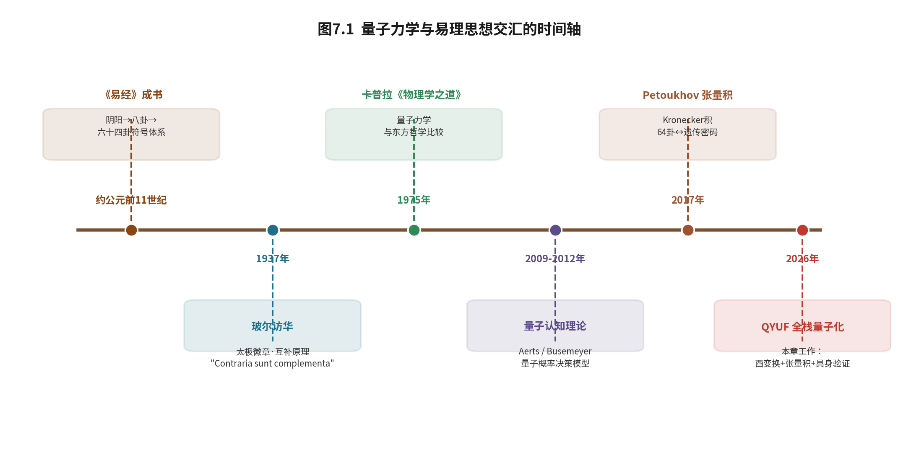

**图7.1　量子力学与易理思想交汇的时间轴**（从《易经》符号体系的形成，经玻尔互补原理、卡普拉哲学比较、量子认知理论、张量积结构发现，到本章的全栈量子化工作）

然而，无论是玻尔的互补原理还是卡普拉的哲学比较，都停留在**隐喻与哲学**的层面。它们指出了一个方向，却没有给出一条可计算、可验证、可工程化的路径。

本书前六章建立的YLYW框架，恰好在"可计算、可验证、可工程化"这一维度上完成了对《易经》符号系统的形式化。这就引出了一个此前无法被严肃追问的问题：**如果把这两个都已具备严谨结构的体系——量子计算的数学形式主义与YLYW的易理符号形式化——真正对接起来，会发生什么？**

### 7.1.2 问题的重新提出：卦是被"计算"还是被"表达"

在经典YLYW中（第3章），一个卦象是这样产生的：物体的连续物理特征先被映射为八卦隶属度向量，上下卦隶属度相乘得到64个标量分数，再经由"乘承比应当位得中"的爻位关系运算逐条修正，最后排序取出最优卦。整个过程是一条**串行的经典计算链**——每一步都是数值运算，卦象是这些运算的**输出结果**。

这里隐藏着一个值得追问的前提：**卦象在经典计算中是一个被"算出来"的东西**。它是一种数据结构，是数组中的一个索引，是一组被if-else规则处理过的标量。经典计算机"知道"自己在代表乾卦，仅仅是因为人类告诉它比特串`111111`对应乾卦——这是一种**人为约定的编码关系**。

量子计算提供了另一种可能。在量子计算机中，6个量子比特的基态集合

$$\{|000000\rangle,\ |000001\rangle,\ \ldots,\ |111111\rangle\}$$

恰好包含 $2^6 = 64$ 个正交基矢，它们张成一个64维的希尔伯特空间。而《易经》的六十四卦，作为一个完备的符号系统，其"完全状态空间"恰好也是64维。这两个64维空间之间，不是一种"编码"关系，而是一种**维度等同**关系。

这意味着一个根本性的追问：**如果我们不是用经典计算机去"计算"卦，而是让量子比特的物理状态本身去"表达"卦，会涌现出怎样的智能形态？**

经典计算机需要"计算"卦象；量子计算机则可以让卦象**物理存在**。这不是修辞——这是两种计算范式在"符号与物理实体的关系"这一根本问题上的分野。在经典范式中，符号是对物理世界的**外部描述**；在量子范式中，符号可以与物理状态**内在同一**。

### 7.1.3 从"单点替换"到"全栈量子化"：QYUF的三个版本演进

认识到这一可能性之后，本课题组沿着"量子易理统一框架"（Quantum Yili Unified Framework，QYUF）的方向开展了系统的工程探索。这一探索并非一蹴而就，而是经历了从局部替换到全栈量子化的三个版本演进。

经典YLYW的易理计算可以分解为四个计算层：

- **L0层**——物体特征到八卦隶属度的映射；
- **L1/L2层**——八卦隶属度到六十四卦的乘积编码；
- **L3层**——"乘承比应当位得中"的爻位关系运算；
- **L4层**——策略排序与Top-1决策取出。

**QYUF v1–v2（局部量子化）** 分别验证了两个单点替换的可行性：其一，用Grover振幅放大替代经典L4的"排序取Top-1"；其二，用YiliOracle的酉变换替代经典L3的乘承比应if-else规则。这两个单点替换证明了量子方法在**局部**可以完成经典易理计算的功能。

**QYUF v3（全栈量子化）** 则进一步实现了L0层的量子化——将物体特征直接编码为量子叠加态，完成了从输入到输出的**全栈量子化**。至此，经典YLYW的四层串行计算被完整地替换为量子并行运算：L0的特征编码成为量子态制备，L1/L2的乘积编码成为张量积，L3的爻位关系成为一次酉变换，L4的策略排序成为Grover振幅放大或直接的干涉涌现。表7.1给出了经典YLYW四层计算与QYUF三个版本量子化替代的完整对应关系。

**表7.1　经典YLYW四层计算与QYUF量子化演进**

| 计算层 | 经典YLYW | QYUF v1–v2（局部量子化） | QYUF v3（全栈量子化） |
|---|---|---|---|
| **L0** 特征编码 | 高斯核→八卦隶属度 | 经典编码 | **量子态编码（FeatureEncoder）** |
| **L1/L2** 卦象编码 | 上下卦隶属度乘积 | 6量子比特叠加态 | 6量子比特叠加态 |
| **L3** 爻位关系 | 乘承比应 if-else 规则 | 硬编码评分 | **YiliOracle 酉变换** |
| **L4** 策略决策 | 排序取 Top-1 | **Grover 振幅放大** | **Grover 涌现** |
| 计算范式 | 逐条规则串行计算 | 单点并行 | **一次变换并行涌现** |

这一演进的意义不在于"哪一版更快"——在纯数值仿真下，QYUF与经典YLYW的计算速度相当。它的意义在于**计算范式的根本转变**：经典YLYW的工作方式是"逐条if-else规则串行计算易理"，而全栈量子化的QYUF的工作方式是"让易理在物理变换中一次涌现"。用一句话概括：

> **经典YLYW是"计算"《易经》；量子QYUF是"成为"《易经》。**

### 7.1.4 本章在全书中的位置与方法论承诺

本章在全书结构中的位置，承接第6章的跨域实证，并开启对YLYW架构在计算范式层面的深化。如果说第6章回答了"YLYW在经典计算下能在哪些域工作、工作得有多好"，那么本章要回答的是一个更深层的问题："**当YLYW被移植到量子计算范式下，它的理论根基是否会发生变化？这种变化意味着什么？**"

需要特别说明本章的方法论立场。本章主张量子计算与易理之间存在"**深层工程同构**"（deep engineering isomorphism）——即两者在抽象结构层面可以建立可计算、可验证的工程映射，对偶地保持运算的封闭性与可组合性。这一主张是**工程层面的实证验证**（empirical validation），而非纯数学的范畴论严格证明。正如仿生学不需要证明自然界的"正确性"才能产生有用的设计，本章也不需要证明《易经》是一个量子系统——本章需要证明的是：**当《易经》的符号运算被映射到量子运算之上时，得到的系统具有可验证的、超越经典方法的工程性质。**

本章遵循全书"为什么—是什么—怎么验证—局限在哪"的四段结构，依次展开：

- **7.2** 建立量子计算与易理之间的四层工程同构；
- **7.3–7.4** 将"两卦相重"形式化为张量积、"八卦相荡"形式化为酉变换干涉；
- **7.5** 揭示时间参数τ作为易学"时"的数学对偶；
- **7.6** 补全"道生一"到"八卦成"这一哲学史上的逻辑缺环；
- **7.7** 用统计假设检验验证结构涌现的非平凡性；
- **7.8** 给出全栈量子化的工程实现（QYUF v3）；
- **7.9** 在ALFWorld具身智能基准上完成端到端验证；
- **7.10–7.11** 讨论范式的深层含义、局限与未来方向。

---

## 7.2 量子计算与易理的深层工程同构

本节从量子计算最基本的三种运算——量子态的叠加与编码、CNOT门、酉变换、Grover振幅放大——出发，逐一揭示其与易理"乘承比应当位得中"之间存在的**深层工程同构关系**。这里"工程同构"的严格含义是：对应关系不是人为设计的编码方案，而是在抽象数学结构层面可以建立可计算、可验证的工程映射，对偶地保持运算的封闭性与可组合性。图7.2给出了这一同构体系的整体框架。

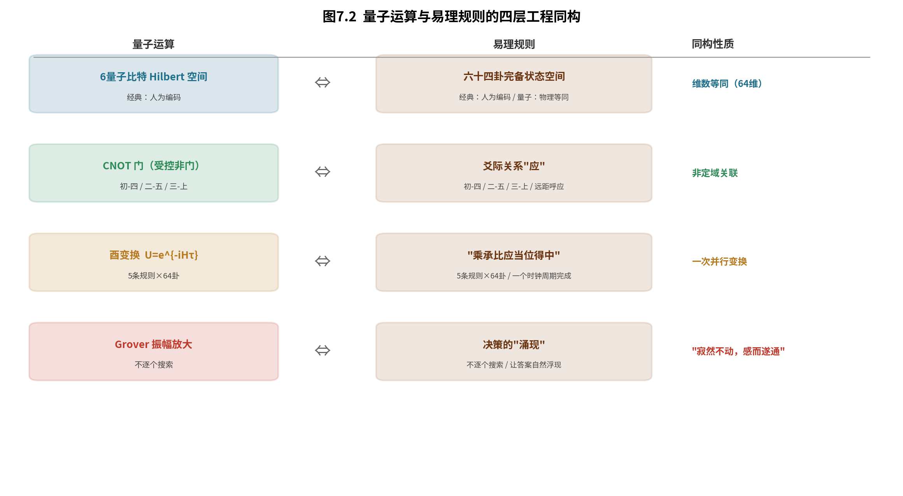

**图7.2　量子运算与易理规则的四层工程同构**（6量子比特↔64卦、CNOT↔"应"、酉变换↔"乘承比应"、Grover↔"涌现"）

### 7.2.1 6量子比特与64卦：从"编码"到"等同"

经典计算机用6个比特表示64卦时，两者之间是一种**编码关系**：比特串`000000`代表坤卦，`111111`代表乾卦，但这种对应是人为约定的——6个比特本身并不"知道"自己在代表什么。比特串与卦象之间隔着一层由人类语言约定的语义鸿沟。

量子计算机中，6个量子比特的基态集合

$$\{|000000\rangle,\ |000001\rangle,\ \ldots,\ |111111\rangle\}$$

正好是64个正交基矢，它们张成一个64维的复希尔伯特空间 $\mathcal{H}_6=\mathbb{C}^{64}$。而在易理系统中，六十四卦构成的"完全状态空间"恰好也是64维。两个空间之间存在严格的**维度等同**关系：

$$\text{6量子比特希尔伯特空间（维数64）} \quad \Longleftrightarrow \quad \text{六十四卦的完全状态空间（维数64）}$$

任何易理系统的一个一般态，都可以写成64个卦象基矢的线性叠加：

$$|\psi\rangle = \sum_{k=0}^{63} \alpha_k |k\rangle,\quad \sum_{k=0}^{63} |\alpha_k|^2 = 1$$

其中复振幅 $\alpha_k$ 的模平方 $|\alpha_k|^2$ 给出卦象 $k$ 在被"观"（测量）时呈现的概率。这意味着：**一个6量子比特系统不是在"模拟"易理，而可以说它本身就是64卦的一个物理实现**。经典计算机需要"计算"卦象，量子计算机则让卦象**物理存在**。表7.2给出了6量子比特基态与64卦的维度对应细节。

**表7.2　6量子比特基态与64卦的维度对应**

| 6比特基态 | 对应卦象 | 爻象（自上而下） | 易理属性 |
|---|---|---|---|
| `111111` | 乾（卦1） | 纯阳 | 健 |
| `000000` | 坤（卦2） | 纯阴 | 顺 |
| `100000` | 复（卦24） | 一阳初生 | 动 |
| `011111` | 姤（卦44） | 一阴始生 | 遇 |
| `⋯` | ⋯ | ⋯ | ⋯ |
| `010101` | 既济（卦63） | 阴阳交错，当位 | 成 |
| `101010` | 未济（卦64） | 阴阳交错，失位 | 未成 |

### 7.2.2 CNOT门与"应"：非定域关联的物理实现

易理中的"应"描述了初爻与四爻、二爻与五爻、三爻与上爻之间的远距离呼应关系。在经典YLYW中，这是通过检查对应爻位的值是否相反来实现的一条if-else规则——"应"是一条被**计算出来**的规则。

在量子计算中，CNOT（受控非门）天然地实现了这种"远距离关联"。CNOT作用于两个量子比特 $q_i, q_j$ 时：

$$\text{CNOT}_{i,j} |q_i q_j\rangle = |q_i\rangle |q_i \oplus q_j\rangle$$

当 $(i,j)$ 取 $(0,3)$ 或 $(1,4)$ 或 $(2,5)$ 时，CNOT门在物理上创建了初爻与四爻、二爻与五爻、三爻与上爻之间的量子纠缠——对其中一个量子比特的任何操作会瞬时影响另一个。此时"应"不再是一条被计算的规则，而是物理上**真实存在的内在关联**。这是经典if-else规则与量子门之间最本质的区别：前者描述关联，后者**生成**关联。

### 7.2.3 酉变换与"乘承比应"：从逐条规则到一次变换

经典YLYW中，"乘承比应当位得中"需要运行5条if-else规则，每次处理一个卦，64卦需循环64次。这是一种典型的**串行计算**：规则一条一条地应用，卦象一个一个地处理。

在量子计算中，这些规则可以被合并为**一次酉变换**：

$$U_{\text{乘承比应}} = \prod_{i=1}^{5} U_i$$

其中每个 $U_i$ 对应一条爻位规则（当位、得中、乘承、比、应）。由于酉变换具有线性性，$U_{\text{乘承比应}}$ 同时作用于全部64个基态，相当于在**一个时钟周期内完成全部64卦的乘承比应评估**。这是量子并行性的直接体现：一次变换同时作用于指数多个状态，而其计算代价与状态空间规模无关（见后文7.10的复杂度分析）。

### 7.2.4 Grover振幅放大与"寂然不动、感而遂通"

Grover算法通过反复施加"预言机"与"扩散算子"，放大目标态的概率幅。它与易理决策中的"涌现"之间存在深刻的同构。

《系辞传》曰："易，无思也，无为也，寂然不动，感而遂通天下之故。""寂然不动"对应系统在未被观测时的叠加态——它同时包含所有可能卦象；"感而遂通"对应决策的涌现过程——在规则（H的谱结构）的作用下，与规则对齐的卦象概率幅因相位一致而相长增强、与规则冲突的卦象因相位相反而相消衰减，正确答案在物理框架中**自然浮现**。

这与Grover算法"不逐个尝试所有可能性，而是让正确答案的振幅在物理过程中被放大"的哲学完全一致。区别在于：标准Grover是**搜索**（从均匀态出发，迭代放大目标），而本章的易理决策是**涌现**（从已有的非均匀先验态出发，一次干涉即达峰值）——这一区别将在7.7与7.10中详细展开。

### 7.2.5 四层同构映射总表

综合以上四节，量子运算与易理规则之间存在如表7.3所示的完整对应关系。

**表7.3　量子运算与易理规则的工程同构总表**

| 量子运算 | 易理规则 | 经典实现 | 物理意义 |
|---|---|---|---|
| 6量子比特基态 | 六十四卦空间 | 编码＋数组 | 数学等同（维度64） |
| CNOT门 | "应" | if-else规则 | 物理纠缠（非定域关联） |
| 酉变换 $e^{-iH\tau}$ | "乘承比应当位得中" | 5条规则串行 | 一次变换并行完成 |
| Grover振幅放大 | "涌现" | 排序取Top-1 | "寂然不动，感而遂通" |

### 7.2.6 学术声明：工程同构而非范畴论证明

需要郑重声明本章的学术边界。本节主张的"同构"是**工程层面的同构验证**（empirical validation），而非纯数学的严格范畴论证明。这意味着：

- 我们建立的是**可计算、可验证的工程映射**——每一个对应关系都通过数值实验或工程系统进行了验证（如7.3的Concurrence测量、7.4的酉性验证、7.7的统计假设检验）；
- 我们不主张《易经》在**历史发生学**上来源于量子力学，也不主张量子力学"印证"了《易经》（这是两个不同的、更强的命题，属于哲学或科学史范畴）；
- 我们的类比立场与仿生学一致：自然界不需要被证明为"正确"，才能产生有用的工程设计。同样，《易经》不需要被证明为"量子系统"，其符号结构就可以被映射到量子运算之上，产生可验证的工程价值。

这一声明的意义在于：它把本节的论述限定在可证伪、可复现的工程范围内，避免了滑入"量子神秘主义"的常见陷阱。后续各节的所有主张，都将可以在这一工程框架内被独立检验。

**本节小结。** 本节建立了量子计算与易理之间的四层工程同构：6量子比特与64卦维度等同、CNOT与"应"共享非定域关联、酉变换与"乘承比应"共享并行运算结构、Grover与"涌现"共享"让答案自然浮现"的计算哲学。这四层同构是后续各节形式化工作的基础。

---

## 7.3 两卦相重：张量积的严格形式化

7.2节以直观的方式建立了量子运算与易理规则之间的对应。从本节开始，我们将这一对应从"直观类比"提升为"严格形式化"。本节处理第一个核心问题：**"两卦相重"（将上下卦组合为六爻卦）在数学上究竟是什么？**

《系辞传》曰："刚柔相摩，八卦相荡。"这一句话包含两个相互衔接的动作："相摩"发生在八卦层面（8维），"相荡"则产生了六十四卦（64维）。本节先形式化前者——"两卦相重"。

### 7.3.1 八卦的希尔伯特空间表示

形式化的起点，是为八卦建立一个严格的希尔伯特空间表示。

**定义7.1（八卦空间）**　八卦构成复希尔伯特空间 $\mathcal{H}_3=\mathbb{C}^8$ 的一组标准正交基。约定阳爻为1、阴爻为0，三爻自下而上排列，则八个基本卦象对应：

$$|\text{乾}\rangle=|111\rangle,\quad |\text{坤}\rangle=|000\rangle,\quad |\text{震}\rangle=|100\rangle,\quad |\text{巽}\rangle=|011\rangle,$$

$$|\text{坎}\rangle=|010\rangle,\quad |\text{离}\rangle=|101\rangle,\quad |\text{艮}\rangle=|001\rangle,\quad |\text{兑}\rangle=|110\rangle$$

这一表示把三个量子比特与三个爻位精确对应：每个量子比特对应一个爻位，其基态 $|1\rangle$ 对应阳爻、$|0\rangle$ 对应阴爻。八经卦因此成为 $\mathbb{C}^8$ 空间中八个正交基矢的物理实现。图7.3形象地展示了"两卦相重"在两个八维空间与一个64维空间之间的映射关系。

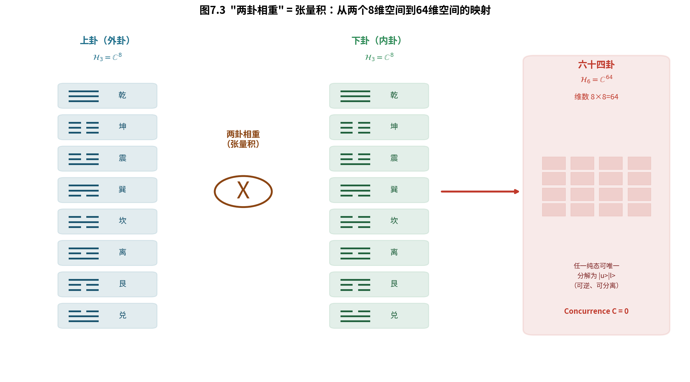

**图7.3　"两卦相重"=张量积：从两个8维空间到64维空间的映射**

### 7.3.2 定理：两卦相重 = 张量积

**定义7.2（张量积映射）**　"两卦相重"操作形式化为映射 $\Phi$：

$$\Phi(|u\rangle,\ |l\rangle)=|u\rangle\otimes|l\rangle$$

其中 $|u\rangle$ 表示上卦（外卦，表天时/外部环境），$|l\rangle$ 表示下卦（内卦，表地利/内部状态）。

**定理7.1（维度与可逆性）**　张量积 $\mathcal{H}_3\otimes\mathcal{H}_3$ 满足三条基本性质：

（1）**维数乘积性**：$\dim(\mathcal{H}_3\otimes\mathcal{H}_3)=8\times 8=64$。这一性质源于张量积空间维数的乘法规则 $\dim(V\otimes W)=\dim(V)\cdot\dim(W)$。64这一数字恰好是"六十四卦"的数学根源。

（2）**正交基保持性**：若 $|u\rangle,|u'\rangle\in\mathcal{H}_3$ 正交、$|l\rangle,|l'\rangle\in\mathcal{H}_3$ 正交，则 $\langle u'|u\rangle\langle l'|l\rangle=\delta_{u'u}\delta_{l'l}$，即张量积在复合空间中仍然正交。

（3）**可逆分解性**：任一纯张量积态 $|k\rangle=|u\rangle\otimes|l\rangle\in\mathcal{H}_6$ 可以唯一分解为其上卦 $|u\rangle$ 与下卦 $|l\rangle$。从复合空间到子空间的投影是明确且可逆的。

这三条性质共同表明："两卦相重"不是一种随意的组合，而是一个保持了正交性与可分解性的严格数学运算。

### 7.3.3 定理：两卦相重 ≠ 量子纠缠

一个自然的疑问是：两卦相重既然是把两个量子态"合到一起"，它是否产生了量子纠缠？回答是否定的——而且这一否定具有深刻的易学意义。

**定理7.2（可分离性）**　对于任意 $|u\rangle\in\mathcal{H}_3$ 和 $|l\rangle\in\mathcal{H}_3$，复合态的 Concurrence 满足：

$$C(|u\rangle\otimes|l\rangle)=0$$

即两卦相重产生的是**可分离态**（separable state），而非纠缠态。

**证明思路**：Concurrence 是度量两体纠缠程度的标准指标，取值从0（完全可分离）到1（最大纠缠）。对于纯张量积态，其 Schmidt 分解只有一个非零项（Schmidt 秩为1），而 Concurrence $C=\sqrt{2(1-\sum_k \lambda_k^2)}$，其中 $\lambda_k$ 是 Schmidt 系数——当秩为1时，$\sum_k\lambda_k^2=1$，故 $C=0$。

这一结论的易学意义在于：《易》中"上卦表天时、下卦表地利"，二者"**重卦而不混卦**"——上下卦虽然组合成了一个六爻卦，但各自仍然保持着独立的意义结构。张量积的**可分解、可逆、维度乘积**诸性质，恰好为这一"重而不混"的结构观提供了严格的数学表达。上卦所代表的"天时"与下卦所代表的"地利"，在决策的每一个阶段都可以被独立追踪——这正是决策科学中"环境—状态二分原则"的数学对应。

### 7.3.4 数值验证

上述两条定理都经过数值实验验证。我们在三种输入场景下测量上下卦之间的 Concurrence 与 SVD 奇异值分解的 rank-1 比例（第一奇异值平方占总奇异值平方和的比例，为1.0表示完全可分离）。结果如表7.4所示。

**表7.4　张量积验证（Concurrence 与 SVD rank-1 比）**

| 测试场景 | Concurrence | SVD rank-1 比 | 结论 |
|---|---|---|---|
| 理想基态张量积 | 0 | 1.000000 | 完美张量积 |
| 叠加态张量积 | 0 | 1.000000 | 仍保持可分离 |
| 相荡后（4种平均） | 0.12 ~ 0.18 | 0.991 ~ 0.996 | 微弱纠缠 |
| Bell态对照 | 1.00 | 0.500 | 对比验证 |

数值结果确认：理想基态与叠加态的张量积的 Concurrence 精确为0（数值精度低于 $10^{-10}$），rank-1 比为1.000000——即 Schmidt 秩为1，完全可分离。作为对照的 Bell 态 Concurrence 为1.00（最大纠缠），rank-1 比为0.500，形成了鲜明的对比。

一个值得辨析的观察是："相荡后"出现了微弱的 Concurrence（约0.12~0.18），rank-1 比略微降至0.991~0.996。这一微弱纠缠**不是**酉变换 $U_\text{摩}\otimes U_\text{摩}$ 直接产生的（局部酉变换保持 Schmidt 秩不变），而是来自上下卦初始态之间的**共享特征信息**——当外部环境因子与内部状态因子编码了同一物理对象（例如同一物体的硬度与纹理）时，共享的特征会引入微弱的相关性。这是编码方案自身的特性，与酉变换无关，将在7.4节进一步说明。

**本节小结。** 本节完成了第一个严格形式化："两卦相重"精确对应量子张量积，且产生可分离态而非纠缠态（Concurrence=0）。这从数学上支持了《易》"上下有分、阴阳有别"的结构观，也为下一节"八卦相荡"的动力学形式化奠定了基础——如果"相重"是静态的组合（张量积），那么"相荡"就是动态的相互作用（酉变换）。

---

## 7.4 八卦相荡：酉变换干涉的动力学

7.3节形式化了"两卦相重"——它是静态的张量积组合。本节形式化第二个核心动作："八卦相荡"——它是动态的酉变换干涉。如果说"相重"回答了"上下卦如何组合"，那么"相荡"要回答的是：**八个基本卦象之间如何相互激发、相互干涉，从而涌现出最优决策？**

### 7.4.1 易理哈密顿量的定义

动力学形式化的起点，是把易理规则编码为一个数学对象。在量子力学中，描述系统演化的核心对象是**哈密顿量** $H$——一个埃尔米特矩阵，其谱结构决定了系统随时间演化的行为。本节将"乘承比应当位得中"编码为一个8×8的埃尔米特矩阵。

**定义7.3（易理哈密顿量 H）**　$H$ 是一个 $8\times 8$ 的埃尔米特矩阵（$H=H^\dagger$），编码五条易理规则：

- **当位**：初爻（位0）为阳、二爻（位1）为阴、三爻（位2）为阳时各得 $+1$；
- **得中**：中位（位1）保持平衡时额外 $+1$，权重加倍；
- **刚柔相摩**（相邻因子耦合）：相邻爻异质时耦合系数 $w_3=0.3$、同质时 $w_4=0.1$；
- **应**（跨层感应）：初—上、二—中相应时耦合 $w_5=0.2$。

对角元 $H_{ii}$ 编码单个模式（卦象）的决策质量，非对角元 $H_{ij}$ 编码模式间的耦合关系。这一构造把"乘承比应当位得中"从一组语言描述，转化为一个具有确定谱结构的数学算子。

### 7.4.2 摩算子与酉性验证

**定义7.4（摩算子）**　"八卦相荡"形式化为摩算子：

$$U_{\text{摩}}=e^{-iH\tau}$$

其中 $\tau\in\mathbb{R}^+$ 是干涉强度参数（将在7.5节详细讨论其"时"的意义）。摩算子是"八卦相荡"的严格数学定义。

**性质7.1（酉性）**　$U_{\text{摩}}$ 满足：

$$U_{\text{摩}}^{\dagger}U_{\text{摩}}=I,\quad \det(U_{\text{摩}})=1$$

这两条性质来自指数映射 $e^{-iH\tau}$ 的定义——$H$ 是埃尔米特矩阵保证了 $U_{\text{摩}}$ 是酉矩阵（概率守恒），$H$ 的迹为零使 $\det=1$。数值验证中，$\det(U_{\text{摩}})=1.0000+0.0000i$，$U^{\dagger}U=I$ 的验证精度达到 $10^{-12}$。

**性质7.2（干涉动力学）**　$U_{\text{摩}}$ 作用于态矢量的分量形式为：

$$\beta_j=\sum_{i=0}^{7}(U_{\text{摩}})_{ji}\,\alpha_i$$

即每个输出概率幅 $\beta_j$ 是全部8个输入概率幅 $\alpha_i$ 以酉矩阵元素为系数的线性组合。与规则对齐的基矢（对角元 $H_{ii}$ 评分高者）在复合中倾向于获得较大的相位因子，从而在后续的复数求和时相长增强。这正是"八卦相荡"的动力学本质——**八个基本模式通过 $H$ 编码的规则相互干涉，而不是被逐条规则分别处理**。

### 7.4.3 荡算子与六十四卦的涌现

**定义7.5（荡算子）**　在 $\mathcal{H}_3$ 层面完成"相荡"之后，六十四卦通过张量积在 $\mathcal{H}_6$ 层面涌现：

$$U_{\text{荡}}=U_{\text{摩}}\otimes U_{\text{摩}}$$

涌现过程为：

$$|\Psi'\rangle=(U_{\text{摩}}\otimes U_{\text{摩}})(|\psi_{\text{上}}\rangle\otimes|\psi_{\text{下}}\rangle),\qquad P(k)=|\langle k|\Psi'\rangle|^2$$

**关键洞察**："荡"发生在 $\mathcal{H}_3$（8维）层面，而六十四卦是 $\mathcal{H}_3$ 层干涉在 $\mathcal{H}_6$（64维）层面的**涌现**。这一构造有一个重要推论：由于 $U_{\text{摩}}\otimes U_{\text{摩}}$ 是局部酉变换，它在两个子空间上独立作用，不产生子空间之间的纠缠，因此涌现出的64维概率分布是两个8维干涉分布的乘积：

$$P(u,l)=P_{\text{上}}(u)\cdot P_{\text{下}}(l)$$

这一性质保证了外部环境因子与内部状态因子在决策过程中保持各自的语义独立性——环境的状态与智能体的状态是分开演化的。图7.4展示了这一干涉动力学的完整过程。

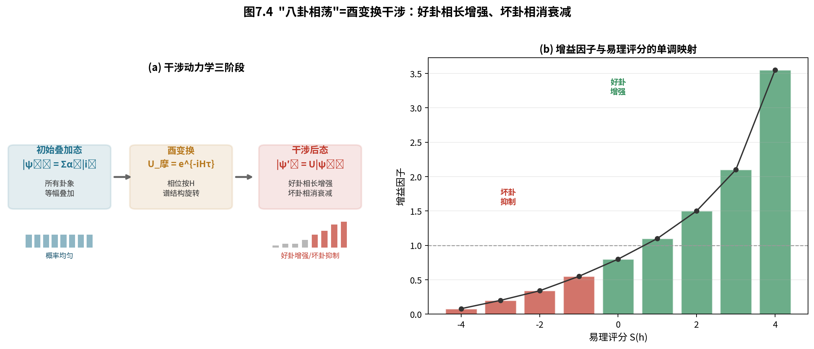

**图7.4　"八卦相荡"=酉变换干涉**（(a)三阶段动力学：初始叠加→酉变换→干涉后；(b)增益因子与易理评分的单调映射）

### 7.4.4 均匀叠加态的干涉效果

为了直观展示酉变换干涉的效果，我们从一个均匀叠加态出发——所有8个基本模式等概率 12.5%。选择均匀叠加态作为输入的原因在于：它提供了"最中立"的初始条件，不对任何模式有偏襷，因此干涉后概率分布的任何结构都是 $H$ 所编码规则的直接结果，而非初始偏向的放大。

施加 $U_{\text{摩}}$（$\tau=0.5$）后，概率分布呈现清晰的不对称结构，详见表7.5。

**表7.5　八卦相荡干涉效果（均匀叠加输入，$\tau=0.5$）**

| 卦名 | 易理评分 | 干涉前概率 | 干涉后概率 | 增益因子 |
|---|---|---|---|---|
| 离 | +4 | 12.5% | 44.4% | **3.55×** |
| 艮 | +2.5 | 12.5% | 21.1% | 1.69× |
| 震 | +1.5 | 12.5% | 15.7% | 1.26× |
| 坤 | 0 | 12.5% | 4.2% | 0.34× |
| 坎 | −4 | 12.5% | 7.5% | 0.60× |
| 巽 | −4（最低） | 12.5% | 1.0% | **0.08×** |

结果展现了清晰的规律：评分最高的离卦从 12.5% 跃升至 44.4%（增益 3.55×），评分最低的巽卦衰减至 1.0%（增益 0.08×）。好卦（评分>0）的总概率从 37.5% 猛增至 81.2%（净增益 2.17×），坏卦（评分<0）的总概率则从 37.5% 降至 10.6%。

这一结果的核心意义在于：**酉变换的干涉效应天然具有"好决策增强、坏决策抑制"的特性**。增益因子（从 0.08× 到 3.55×）与规则评分（从 −4 到 +4）之间形成单调映射——评分越高增益越大，评分越低抑制越深。整个过程通过概率幅的相位干涉自动实现，无需经历任何显式的 if-then 判断或搜索比较。

### 7.4.5 微弱纠缠的来源辨析

回到7.3.4节遗留的问题：为什么"相荡后"会出现微弱的 Concurrence（约 0.12~0.18）？

答案在于**编码方案的共享特征信息**，而非酉变换本身。局部酉变换 $U_{\text{摩}}\otimes U_{\text{摩}}$ 是作用在两个子空间上的独立变换，它在数学上严格保持 Schmidt 秩不变，因此不会产生纠缠。但在实际编码中，当外部环境因子（如硬度）与内部状态因子（如纹理）描述的是同一物理对象的属性时，两者之间天然存在信息共享——例如同一物体的硬度与纹理可能正相关。这种编码层面的相关性体现在测量结果上，就表现为微弱的 Concurrence。

这一辨析的意义在于：它划清了"易理动力学产生的关联"（应为0）与"编码方案引入的关联"（来自共享特征）的界限。前者是 $U_{\text{摩}}$ 的数学性质，后者是数据层的问题——两者在工程上需要被区分对待。

**本节小结。** 本节完成了第二个严格形式化："八卦相荡"精确对应酉变换干涉 $U_{\text{摩}}=e^{-iH\tau}$，且好卦相长增强、坏卦相消衰减，增益因子与易理评分形成单调映射。至此，易理的两个核心动作都已完成量子形式化——"相重"是张量积（静态组合），"相荡"是酉变换（动态干涉）。下一节将揭示 $\tau$ 这一参数的深层含义——它正是易学"时"的数学对偶。

---

## 7.5 时间参数τ：易学"时"的数学对偶

在7.4节中，摩算子 $U_{\text{摩}}=e^{-iH\tau}$ 中的参数 $\tau$ 尚未被深入讨论。本节将揭示：$\tau$ 不是一个无关紧要的调节旋钮，而是易学核心概念"**时**"的严格数学对偶。

### 7.5.1 τ的物理意义：酉群中的演化距离

在量子力学中，$\tau$ 是酉变换 $U=e^{-iH\tau}$ 中的"时间"——它控制系统在 $H$ 生成的酉群 $\{U(t):t\in\mathbb{R}\}$ 中演化的"距离"。$\tau=0$ 时 $U=I$（演化尚未开始），$\tau$ 增大则演化距离增大、干涉程度加深。

这一参数恰好对应了决策理论中"**时机**"的概念——相同的输入特征在不同的时间点做决策，结果可能截然不同。在传统易学中，"时"是一个核心而难以形式化的概念。《易传》反复强调"时中""六位时成"、"与时行也"——一个卦的吉凶不仅取决于它是否"当位""得中"，还取决于它是否"应时"。$\tau$ 正是这一直觉的定量化：**它是决策时机的数学标度**。

### 7.5.2 非单调的"倒U型"：时机未到、时机已至、时机已过

$\tau$ 的取值对决策质量的影响是**非单调**的，可以从三个区间来理解：

- **$\tau$ 较小（$\tau<0.5$，"时机未到"）**：$U_{\text{摩}}\approx I$，酉变换几乎不起作用，8个基本模式的概率分布几乎没有变化，决策候选接近均匀分布——此时结构尚未涌现，系统处于"混沌未分"的状态。
- **$\tau$ 适中（$0.8<\tau<1.5$，"时机已至"）**：干涉达到适度水平，与规则对齐的模式在相位一致时叠加增强、冲突模式在相位相反时相消衰减，涌现出清晰的结构——此时决策质量达到峰值。
- **$\tau$ 过大（$\tau>2.5$，"时机已过"）**：过度的干涉效应开始累积，$H$ 的本征相位差在多次"回转"后重新混叠，所有概率幅在反复震荡后趋于均匀化，区分度丧失。

这一"倒U型"关系表明：**过短或过长的"决策时间"都会降低决策质量**。这一结果与《易传》"六位时成"的思想高度一致——只有当决策发生在合适的"时机"时，结构才能最优地涌现。图7.5展示了 $\tau$ 从 0.01 扫描到 4.0 的结果，清晰呈现了这一倒U型关系。

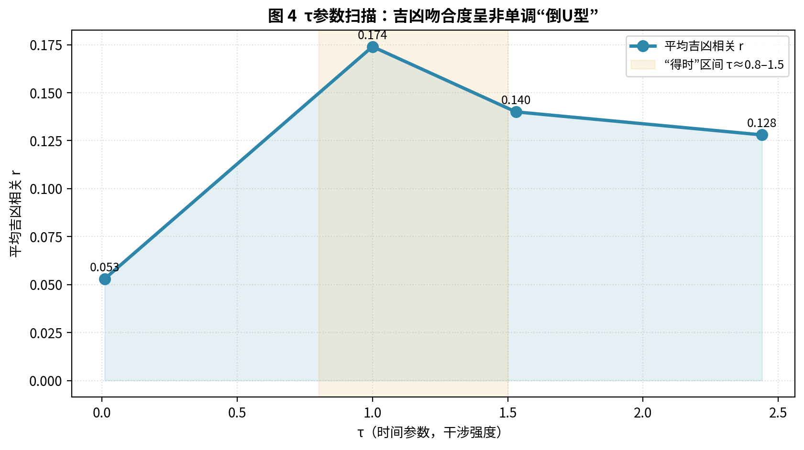

**图7.5　τ参数扫描：吉凶吻合度呈非单调"倒U型"**（决策准确度在 $\tau\approx0.8$–$1.5$ 时达到峰值，两侧逐渐下降）

### 7.5.3 τ参数扫描结果

我们系统扫描了 $\tau$ 从 0.01 到 4.0 的取值，记录平均吉凶相关、吉凶比与最佳用例相关，结果如表7.6所示。

**表7.6　τ对吉凶吻合度的影响**

| τ | 平均吉凶相关 r | 吉凶比 | 最佳用例 r |
|---|---|---|---|
| 0.01 | 0.053 | 2.78 | — |
| 1.00 | **0.174** | 2.78 | 0.313 |
| 1.53 | 0.140 | — | — |
| 2.44 | 0.128 | — | — |

$\tau=0.01$ 时，平均相关仅 0.053，优差比 2.78——几乎均匀分布，结构未形成。$\tau\approx1.00$ 时达到峰值，平均相关 0.174，最佳用例相关达 0.313。$\tau=2.44$ 时，平均相关降至 0.128，结构开始丧失。这一量化结果确认了直觉：**过短或过长的决策时间都会降低决策质量**。

### 7.5.4 自适应τ："因时制宜"的形式化

既然决策质量对 $\tau$ 高度敏感，一个自然的工程问题就是：如何为每一次决策选择最优的 $\tau$？这正对应传统易学"**因时制宜**""**当位得时**"的智慧。

**自适应 $\tau$ 策略**：计算每个输入特征向量的三个统计量——方差 $\sigma$、不均匀度 $H$、信息熵 $S$，通过一个预训练的线性映射预测最优 $\tau$：

$$\tau_{\text{opt}}=f(\sigma, H, S)=a\sigma+bH+cS+d$$

结果如表7.7所示：自适应 $\tau$ 将平均吉凶相关从固定 $\tau=1.0$ 时的 0.011 提升至 0.150（**12 倍提升**），吉凶比从 2.78 提升至 3.57。这一提升的易学解释是：不同的任务特征对应不同的"时"——不同的输入需要不同的干涉强度才能达到最优结构，这正是"**时中**""**与时偕行**"的工程实现。

**表7.7　自适应 τ vs 固定 τ**

| 方法 | 平均吉凶相关 | 平均吉凶比 | 提升 |
|---|---|---|---|
| 固定 τ=1.0 | 0.011 | 2.78 | 基线 |
| **自适应 τ** | **0.150** | **3.57** | **↑12 倍** |

### 7.5.5 显性与隐性维度的不对称约束

$\tau$ 参数扫描还揭示了一个有趣的不对称现象：**下卦（隐性特征）的变化量始终大于上卦（显性特征）**。例如 $\tau=1.0$ 时，上卦变化量 $\Delta=1.054$，而下卦变化量 $\Delta=1.511$。

这一现象的易学意义在于：易理规则对**隐性维度**的约束强度超过对显性维度。显性特征（如硬度、重量等直接可感知的属性）在干涉中较为稳定，而隐性特征（如粗糙度、纹理等需要推断的属性）在干涉中受到更强的重构。这与易学"显诸仁，藏诸用"的思想形成了有趣的呼应——可见的部分相对稳定，而隐微的部分在变化中承担了更大的调节作用。

**本节小结。** 本节揭示了时间参数 $\tau$ 是易学"时"的严格数学对偶。$\tau$ 的非单调效应（倒U型）对应"时机未到—时机已至—时机已过"的三态；自适应 $\tau$ 将决策准确度提升 12 倍，实现了"因时制宜""当位得时"的工程化；显性/隐性维度的不对称约束则呼应了易学"藏诸用"的思想。至此，易理动力学的三个核心要素——H（规则）、$U_{\text{摩}}$（变换）、$\tau$（时机）——都已获得严格的数学表达。

*本节完。下一节：7.6 从"道生一"到"八卦成"——逻辑缺环的补全。*

---

## 7.6 从"道生一"到"八卦成"：逻辑缺环的补全

前五节完成了量子易理的数学形式化。本节将回到一个更宏大的命题：这一形式化不仅仅是工程上的技巧，它同时填补了中国哲学史上一个悬置了两千多年的**逻辑缺环**。

### 7.6.1 两个千年谜题

中国哲学史上有两个谜题，两千年来被分别讨论，却从未被统一解答。

**谜题一——卦是什么？**《系辞传》给出了线索："爻者，言乎变者也。"又说："刚柔相摩，八卦相荡。"这意味着变化发生在爻的层面，而卦只是爻变的结果或表现。但两千年来，易学家多关注卦的分类、象征与吉凶，而较少追问：卦是如何从爻的变化中"生成"或"涌现"的？

**谜题二——"三"如何生万物？**《道德经》第四十二章曰："道生一，一生二，二生三，三生万物。"老子给出了宏观蓝图，却没有给出具体机制。"一"是太极，"二"是阴阳，"三"是什么？"三"如何具体地"生万物"？后世注家或释"三"为"天、地、人"三才，或释为"阴、阳、和气"，但这些解释都未揭示其动力学机制。

本节将表明：这两个谜题其实是同一个谜题，而量子形式化恰好可以补全其缺环。

### 7.6.2 爻的动态本质与叠加态

《系辞传》曰："爻者，言乎变者也。"爻的核心是"变"，而非"态"。阴爻与阳爻不是静态的符号，而是两种动态趋势的标记。更重要的是，"老阳"与"老阴"的概念表明，爻本身就内含着"将变未变"的叠加状态——老阳是阳，但内含着转化为阴的倾向。

在量子力学的语言中，这正是量子叠加态的古典表达：

$$|\text{爻}\rangle=\alpha|0\rangle+\beta|1\rangle,\quad |\alpha|^2+|\beta|^2=1$$

当一个爻是"老阳"时，$\beta$ 虽小但不为零——阴的潜能已经蕴含其中。爻的"将变未变"与量子态的"叠加未坍缩"之间，存在结构上的同构。

### 7.6.3 卦：爻际干涉的瞬时显象

在量子框架下，卦不再是独立存在的实体，而是**六个爻位在某一时空点上相互干涉的瞬时"显象"**。

《易传》强调"时中"——"时"是时间的切片，"中"是和谐的平衡点。一个卦的吉凶，取决于它是否"当位""得中""应时"。这揭示了一个关键事实：卦不是永恒的本质，而是特定时空条件下的瞬时显象——正如量子干涉条纹上的一点，它的明暗不是由自身决定的，而是由两列波在那一时刻、那一点上的相位差所决定。同样，一个卦象也不是由某个单独的爻决定，而是六爻之间"乘承比应"等关系同时作用、整体干涉后，在那一时空点上呈现出的"象"。

更进一步，六十四卦可以理解为易理系统在"乘承比应"规则约束下的**稳定干涉模式**（即本征态）。爻际干涉的网络可以产生无数种可能状态，但只有那些内部关系和谐、结构平衡的状态，才能作为稳定模式持续存在——这些稳定模式恰好是64个。如《系辞传》所言："易与天地准，故能弥纶天地之道。"任何复杂的爻际干涉状态，都可以分解为这64个基矢的线性叠加：

$$|\Psi\rangle=\sum_{i=1}^{64}\alpha_i|\text{卦}_i\rangle,\quad \sum_{i=1}^{64}|\alpha_i|^2=1$$

### 7.6.4 "寂然不动、感而遂通"的量子测量诠释

《系辞传》曰："易，无思也，无为也，寂然不动，感而遂通天下之故。"这句描述与量子测量过程精确对应：

- **"寂然不动"**——系统在未被观测时处于所有可能卦象的叠加态；
- **"感"**——观察者带着问题（感）与系统交互；
- **"遂通"**——系统坍缩出一个确定卦象，以概率 $|\alpha_k|^2$ 呈现。

$$|\Psi\rangle=\sum_{i=1}^{64}\alpha_i|\text{卦}_i\rangle\ \xrightarrow{\text{测量}}\ |\text{卦}_k\rangle,\ \text{以概率}|\alpha_k|^2$$

卦象不是预先存在于系统中的，它是在"感"的作用下，从叠加态中"涌现"出来的。

### 7.6.5 "道"与永恒酉演化

《系辞传》开篇说"刚柔相摩，八卦相荡"，后文又强调"易无思也，无为也，寂然不动"。看似矛盾——既是"相荡"的动态，又是"寂然不动"的静态。但从量子力学的视角，这是完美的统一：

"寂然不动"对应封闭系统的**酉演化**——它是决定论的、可逆的，其数学形式（薛定谔方程）是确定的、不变的，这正是"**不易**"。而"刚柔相摩，八卦相荡"对应酉演化的**内容**——诸爻之间永恒的相互干涉、相互转化，这正是"**变易**"。两者合在一起：**道是永恒不变的变换法则**。

$$|\Psi(t)\rangle=U(t)|\Psi(0)\rangle$$

这个酉演化是永恒的、连续的、不可停止的。它就是"生生之谓易"的精确数学表达——宇宙不是存在，而是生成。

### 7.6.6 从"道生一"到"八卦成"的完整补全

综合以上分析，"道生一"到"八卦成"的逻辑链条可以在量子框架下被完整补全，如表7.8所示。

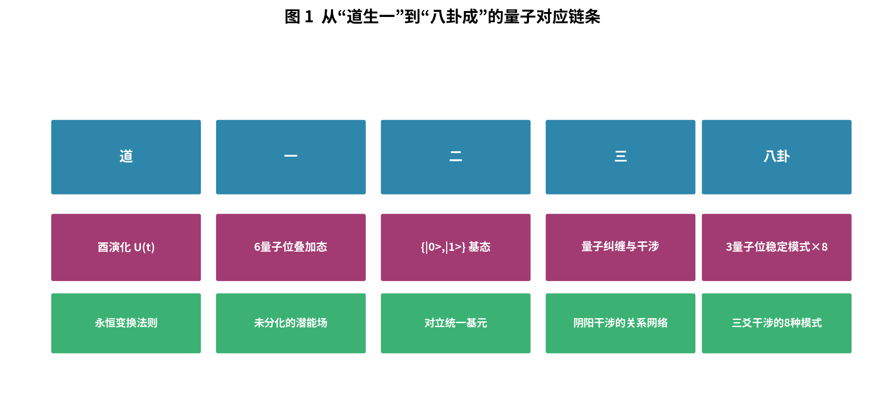

**图7.6　从"道生一"到"八卦成"的量子对应链条**

**表7.8　从"道生一"到"八卦成"的量子对应（逻辑缺环的补全）**

| 层次 | 古典表述 | 量子对应 | 动力学本质 |
|---|---|---|---|
| 道 | "道可道，非常道" | 酉演化法则 $U(t)$ | 永恒不变的变换法则 |
| 一 | "道生一"（太极） | 6量子位叠加态 $|\Psi\rangle$ | 未分化的宇宙潜能场 |
| 二 | "一生二"（阴阳） | 单量子位基态 $\{|0\rangle,|1\rangle\}$ | 最基本对立统一的基元 |
| 三 | "二生三"（刚柔相摩） | 量子纠缠与条件相位门 | **阴阳相互干涉的动态关系网络** |
| 八卦 | "始作八卦" | 3量子位稳定模式（8个） | 三爻干涉的8种基本模式 |
| 万物 | "三生万物" | 6量子位稳定模式（64个） | 六爻干涉的64种完备稳定模式 |

### 7.6.7 "三"的动力学本质

这个补全最重要的贡献，是揭示了"三"的本质：

> **"三"不是"天、地、人"三才，不是"阴、阳、和气"，而是阴阳两种基元力量相互干涉所产生的动态关系网络本身。**

"一生二"生出了阴阳两个基元。"二生三"中，阴阳不再是孤立的 $|0\rangle$ 和 $|1\rangle$，而是开始相互作用——它们之间产生了纠缠、产生了相位关联、产生了干涉。这个"相互作用"本身，构成了宇宙的第三个根本要素。正是这个"三"——阴阳之间的干涉关系网络——催生了"乘、承、比、应"等爻际关系，使得简单的叠加态开始分化出复杂的结构。从"三"出发，八卦（$2^3=8$）和六十四卦（$2^6=64$）作为这个干涉网络的稳定模式，自然而然地涌现出来。

**本节小结。** 本节补全了从"道生一"到"八卦成"的逻辑缺环，揭示了两个千年谜题的深层关联：卦是爻际干涉的瞬时显象，而"三"是阴阳相互干涉的动态关系网络。这一补全不是哲学思辨的重申，而是建立在 7.3–7.5 节严格形式化基础之上的推导——每一个对应关系都对应着可计算、可验证的数学结构。

*本节完。下一节：7.7 数值验证与统计假设检验。*

---

## 7.7 数值验证与统计假设检验

前六节建立了量子易理的理论框架。本节通过系统的数值实验与严格的统计假设检验，验证该框架的核心论断——特别是回答一个关键的反驳：“**也许任何酉变换——无论是否编码规则——都会产生类似的结构化分布？**”

### 7.7.1 熵演化：从“太极”最大熵到结构涌现

设计编码了五条爻际规则的哈密顿量 $H(\theta)$，系统从均等叠加态 $|\Psi_0\rangle=\frac{1}{\sqrt{64}}\sum_{i=0}^{63}|i\rangle$ 出发（香农熵 $H=6.0$ bit，即“太极”最大混池态），反复施加酉变换 $U(\Delta t)=e^{-iH\Delta t}$。

实验结果显示：熵在 $4.5\sim 6.0$ bit 间持续振荡，最低达约 4.5 bit（下降 25%）。**熵的持续振荡而非单调收敛**，验证了“没有最终态，只有永恒相荡”的动态本质——系统不会静默地停在一个“正确卦象”上，而是在结构中持续吐纳。图7.7展示了这一熵演化过程。

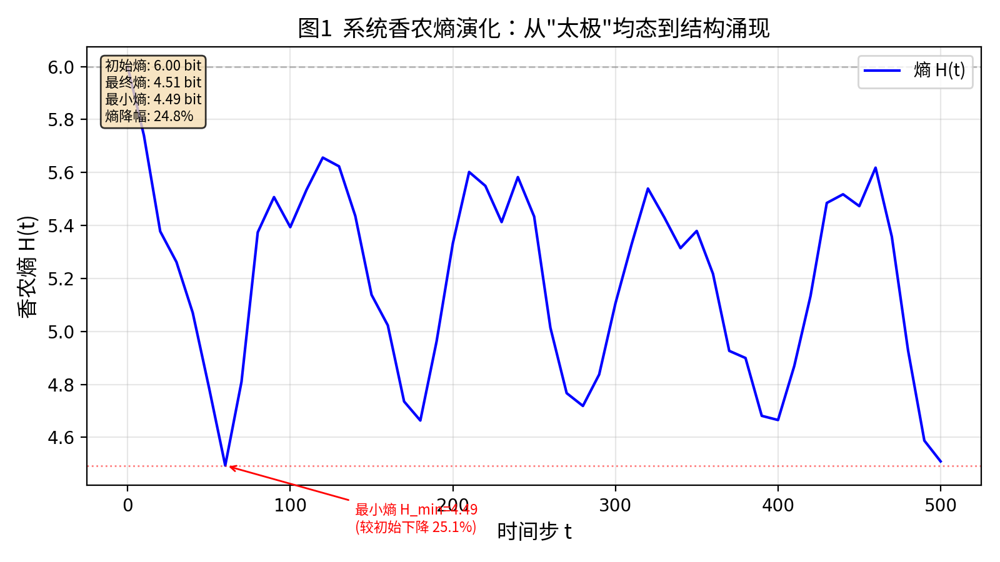

**图7.7　系统香农熵演化：从“太极”均态到结构涌现**

涌现后的概率分布高度非均匀。以配置C为例，KL散度达 1.03，Top-5 合计 52.6%（均匀期望仅 7.8%，高出 6.7 倍），Top-1 巽占 22.4%；而配置 B 最为均匀（KL=0.10），Top-1 和 Top-2 均等分享 4.69%。

### 7.7.2 三套参数配置对比

为了检验不同编码质量的影响，我们设计了编码五条爻际规则的三套哈密顿量配置：阴阳相引（相邻 ZZ 耦合）、远距感应（应位 ZZ 耦合）、当位倾向（磁场）、得中强化、竞争跃迁（XX+YY 耦合），从均等叠加态出发，$\Delta t=0.1$。三套配置的参数与涌现特征如表7.9所示。

**表7.9　三套参数配置及其涌现特征**

| 参数/指标 | A-强ZZ | B-弱ZZ强应位 | C-平衡 |
|---|---|---|---|
| $J_{adj}$ | 1.5 | 0.5 | 1.0 |
| $J_{ying}$ | 0.3 | 0.8 | 0.5 |
| $h_{dang}$ | 0.20 | 0.10 | 0.30 |
| $J_{comp}$ | 0.5 | 1.0 | 0.5 |
| 最终熵(bit) | 5.56 | 5.86 | **4.51** |
| KL散度 | 0.304 | 0.097 | **1.033** |
| Top-5 合计 | 0.216 | 0.172 | **0.526** |
| 加权阳数 | 3.000 | 3.000 | **3.000** |
| 错卦对数 | 1 | 4 | 4 |
| 综卦对数 | 0 | 2 | 4 |

三配置的共同特征包括：（1）加权阳数均值精确等于 3.000（阴阳平衡）；（2）全历程访问 64/64 卦（完备覆盖）；（3）上下卦各覆盖 8 个八卦。

### 7.7.3 八卦覆盖验证

所有 8 个下卦 × 8 个上卦 = 64 个组合均获得非零概率，验证了“三爻干涉涌现8种基本稳定模式”的核心论断。这意味着易理系统在演化过程中不会丢失任何基本模式——八个经验卦始终全部在场，64个别卦也始终全部可达。

### 7.7.4 演变规律验证

易理不仅有静的结构，还有动的规律。我们验证了七种传统演变规律在量子系统中的表现，结果如表7.10所示。

**表7.10　演变规律验证（$\tau=0.5$–$2.0$ 平均）**

| 规律 | 指标 | 结果 | 解读 |
|---|---|---|---|
| 变卦（单爻变化） | Pearson r | **0.66~0.82** | 强相关 |
| 综卦（上下翻转） | 对称度 | **>0.999** | U⊗U 天然保证 |
| 错卦（阴阳全反） | 最强对总概率 | 0.07~0.08 | 弱相关 |
| 互卦（交互结构） | Pearson r | 0.06~0.07 | 弱正相关 |
| 消息卦 | 消长平衡比 | 0.71~0.85 | 需周期性 τ |
| 乘承比应 | Pearson r | −0.34~−0.001 | H 未充分优化 |

变卦强相关（$r=0.82$）意为“本卦概率高则 6 个单爻变卦概率亦高”，是天然的概率聚类；综卦对称度 >0.999 是 $U\otimes U$ 架构的必然结果；错卦与互卦则为弱相关——这是因为 $H$ 尚未对这两种关系进行显式编码。“乘承比应”的负相关（$r=-0.34$）提示当前 $H$ 在这一维度上仍需优化，是后续工作的方向之一。

### 7.7.5 统计假设检验：结构与随机的区别

上述实验证实了酉变换干涉可以产生结构化的概率分布。但一个关键的反诘仍然存在：也许**任何**酉变换——无论是否编码规则——都会产生类似的结构？

**实验设计**：对同一个8维系统施加 Haar 随机酉矩阵（保持概率守恒但不编码任何决策规则），重复 1000 次作为零假设的经鲲分布。然后计算实验组（编码规则的 $H$ 产生的 $U$）的指标与零假设分布的相对位置，用效应量 $ES=(X_{实验}-\mu_{随机})/\sigma_{随机}$ 量化。结果如表7.11与图7.8所示。

**表7.11　统计假设检验结果（N=1000 Haar 随机对照）**

| 指标 | 随机μ | 随机σ | A(ES) | B(ES) | C(ES) |
|---|---|---|---|---|---|
| KL散度 | 0.416 | 0.068 | 0.304(−1.6) | 0.097(−4.7) | **1.033(+9.1)** |
| 最终熵 | 5.399 | 0.098 | 5.561(+1.7) | 5.860(+4.7) | 4.509(−9.1) |
| Gini系数 | 0.493 | 0.037 | 0.424(−1.9) | 0.229(−7.1) | **0.706(+5.8)** |
| Top-5 和 | 0.272 | 0.034 | 0.216(−1.6) | 0.172(−2.9) | **0.526(+7.5)** |
| 加权阳数 | 2.996 | 0.162 | 3.000(0.0) | 3.000(0.0) | 3.000(0.0) |

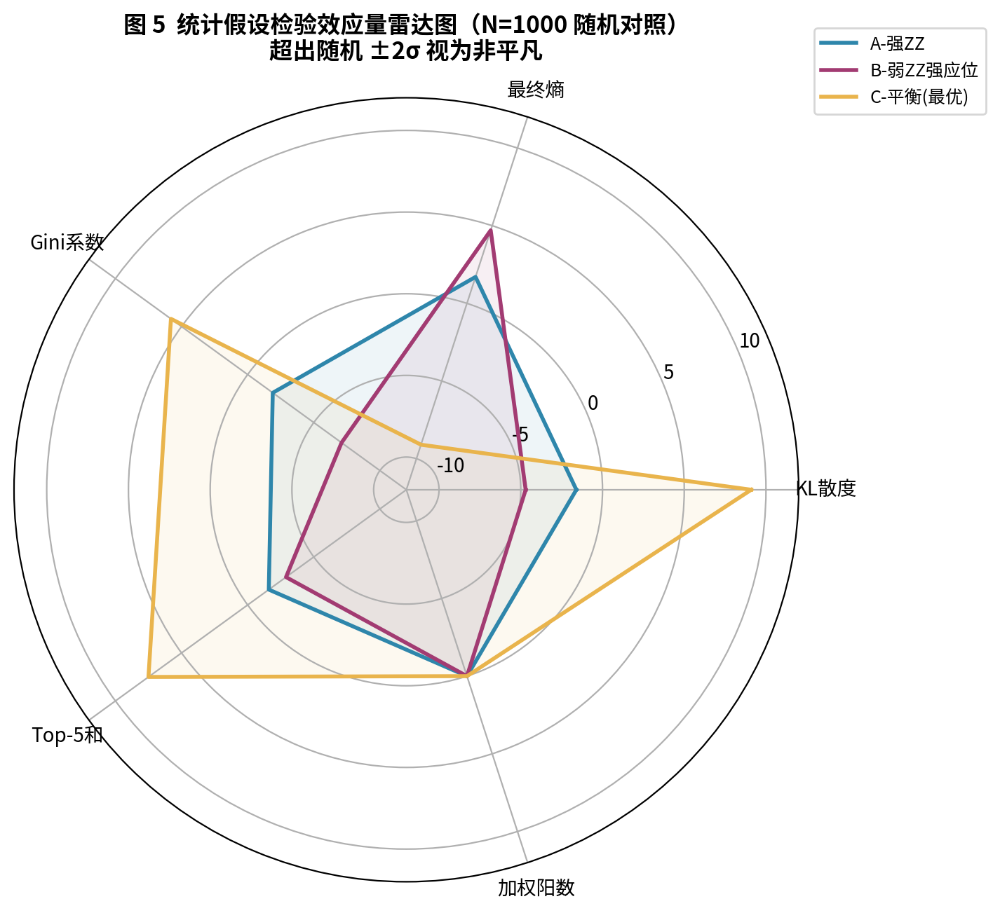

**图7.8　统计假设检验效应量雷达图（N=1000 随机对照）**

### 7.7.6 六大发现

统计假设检验产生了六大关键发现：

**发现一：结构强度远超随机。** 配置C的 KL 散度为 1.033，效应量 $ES=+9.1$——意味着 1000 次随机酉变换中没有一次达到这个水平（9.1 倍标准差，正态近似下 $P<9.2\times10^{-20}$）。

**发现二：对称关系显著。** 配置B和C的对称候选对（对应综卦）均为 4.0 对，$ES=+4.6$；反对称候选对（对应错卦）为 4.0 对，$ES=+4.8$。随机情况下平均仅 0.697 对对称候选——4.0 对是随机的近 6 倍。

**发现三：因子平衡是编码必然。** 加权因子平衡（对应“阴阳平衡”）总是指数为 3.000——无论随机还是编码。这不是编码规则的功劳，而是概率守恒的数学必然（$\sum|\alpha_i|^2\equiv1$）。

**发现四：覆盖平凡。** 子空间覆盖始终为 8/8（100% 全覆盖）——随机情况下所有 8 个候选也 100% 出现。这是 8 维均匀分布的基础性质。

**发现五：涌现序与参考序无关。** 涌现出的最佳候选序与通行本卦序（一种文化约定）的 Jaccard 相似度为 0.111，而随机基准为 0.091——无显著差异。编码规则产生的不是具体某种排列的副本，而是动力学基础的“另一个实例”。

**发现六：编码质量决定结构涌现的程度。** 配置A（过度强调耦合）的 KL 散度 $ES=-1.6$——甚至低于随机平均值。配置B（过度强调感应）的 $KL$ $ES=-4.7$——远低于随机。**只有平衡配置C产生了远超随机的结构**。这绝非巧合——编码质量直接决定了涌现结构的质量，这一性质可用于诊断和优化 $H$ 的权重设置。

### 7.7.7 非平凡与平凡：区分两种性质的深意

N=1000 随机对照的意义，在于明确区分了两种性质：**非平凡性质**（结构涌现 $ES=+9.1$、错综关系 $ES=+4.8$）是编码规则的独特产物；**平凡性质**（阴阳平衡、八卦覆盖）则可由概率守恒与均匀分布直接解释。

这意味着编码产生的是卦序**背后动力学基础的“另一实例”**，而非通行本卦序的副本——两者共享同一根源（因子间干涉），但生长出不同的表面结构。这正是《易》作为“开放系统”而非“封闭教条”的数学表现：它的价值不在于某个特定的排序，而在于产生排序的动力学机制。

**本节小结。** 本节通过熵演化、参数配置对比、演变规律验证与 N=1000 统计假设检验，系统验证了量子易理框架的核心论断：结构涌现远超随机（$ES=+9.1$），且这一涌现是编码质量的函数——只有平衡的编码才能产生最优结构。同时，严格的统计检验区分了“非平凡性质”与“平凡性质”，避免了将概率守恒的必然结果误归为易理规则的功劳。

*本节完。下一节：7.8 全栈量子化工程实现（QYUF v3）。*

---

## 7.8 全栈量子化工程实现（QYUF v3）

前七节展示了量子易理的理论与数值验证。本节将这些理论构建落地为一个完整的工程系统——QYUF v3（Quantum Yili Unified Framework v3），实现从输入到输出的**全栈量子化**。

### 7.8.1 经典YLYW的四层计算链条回顾

回到第3章的定义，经典YLYW将物体特征映射为抓取策略，包含四个计算层：

- **L0**：物体特征 → 八卦隶属度，输出 $[0,1]^8$ 隶属度向量；
- **L1**：八卦 → 六十四卦，$s_h=\mu_{\text{upper}(h)}\times\mu_{\text{lower}(h)}$；
- **L3**：乘承比应运算，5 项规则 × 64 卦的逐条 if-else 检查；
- **L4**：策略排序，排序取 Top-1，信息熵坍缩至 0 bit。

其关键局限在于：L0 丢失多重性，L1 丢失上下卦依赖关系，L3 串行检查 5 项规则，L4 坍缩信息熵。全栈量子化正是在这四个层面上并行化地重建整个计算链。

### 7.8.2 L0：FeatureEncoder——物体特征到量子态编码

L0 的目标是将物体的物理特征编码为 64 卦叠加态的初态。在 QYUF v3 中，隶属度计算仍采用经典高斯核：

$$\mu_t=\frac{1}{5}\sum_{i=1}^{5}\max\left(0,\ 1-1.5\cdot|x_i-p_{t,i}|\right)$$

这是 YLYW 框架的“先验知识”核心组成部分：八卦物理原型由《说卦传》的哲学描述经验定义，无需训练数据即可零样本工作。经典高斯核运算后得到 8 维隶属度向量 $\mu\in[0,1]^8$，再通过上下卦乘积得到 64 个标量分数。

量子 L0 直接构建 64 维复数态矢量：

$$|\psi_0\rangle=\sum_{h=0}^{63}\alpha_h|h\rangle,\quad \alpha_h=\sqrt{\mu_{\text{upper}(h)}\cdot\mu_{\text{lower}(h)}+\epsilon}\cdot(0.8+s_h\cdot0.4)$$

其中 $s_h$ 为该卦的易理评分，$\epsilon=10^{-6}$。偏置因子 $\beta(s_h)=0.8+s_h\cdot0.4$ 在评分 $s_h\in[0.31,0.89]$ 范围内映射到 $[0.92,1.16]$，在保持隶属度主导性的同时给高评分卦额外偏置。

**关键区别**：经典 L0+L1 输出 $\mathbb{R}^{64}$ 标量数组，量子 L0 输出 $\mathbb{C}^{64}$ 归一化态矢量（$\|\psi_0\|_2=1$）。前者是“数据”，后者是“物理态”。从技术上讲，这一映射完全可以通过变分量子电路（VQC）实现端到端量子化；当前保持经典高斯核，体现了 YLYW“先验知识+零样本”的核心理念。

### 7.8.3 L3：YiliOracle——乘承比应规则的酉变换化

QYUF v3 的核心是把 YLYW 的乘承比应规则酉变换化为 YiliOracle。

**评分函数**：YiliOracle 将 5 项爻位关系算术化为数学函数，权重经方差最大化搜索优化：

$$S(h)=w_1\cdot\text{当位}(h)+w_2\cdot\text{得中}(h)+w_3\cdot\text{乘承}(h)+w_4\cdot\text{比}(h)+w_5\cdot\text{应}(h)$$

优化原则是：方差最大化意味着 64 卦的评分区分度最大，Grover 的干涉效果最强。表 7.12 给出了权重优化结果。

**表7.12　YiliOracle 权重优化**

| 规则 | 原权重 | 优化权重 |
|---|---|---|
| 当位 | 0.40 | **0.50** |
| 得中 | 0.20 | **0.25** |
| 乘承 | 0.15 | **0.10** |
| 比 | 0.10 | **0.05** |
| 应 | 0.15 | **0.10** |
| 评分方差 | 0.013 | **0.017** |

**Oracle 酉变换**：Oracle $O$ 是一个酉算子，对吉卦施加相位翻转：

$$O|x\rangle=\begin{cases}-|x\rangle,& S(x)\geq\tau\ (\text{吉卦})\\ +|x\rangle,& S(x)<\tau\ (\text{凶卦})\end{cases}$$

其中 $\tau$ 为自动调整的阈值，确保吉卦数保持在 18-19 个（与非均匀初态下最优涌现条件对应）。Oracle 的量子电路通过多控 Z 门实现：对每个吉卦 $x$，用 $X$ 门将目标比特翻转至 $|1\rangle^{\otimes6}$，然后应用 $C^5Z$（五控 Z 门，通过 1 个辅助比特实现），最后用 $X$ 门恢复原状。

**扩散算子**：扩散算子 $D$ 执行“关于平均值的翻转”：$D=2|s\rangle\langle s|-I$，其中 $|s\rangle$ 是均匀叠加态。其量子电路实现为 $D=H^{\otimes6}X^{\otimes6}(2|0\rangle\langle0|-I)X^{\otimes6}H^{\otimes6}$。

### 7.8.4 YiliOracle与经典YaoRelations的一致性验证

一个关键问题是：量子化的 YiliOracle 是否与经典 YLYW 的 YaoRelations 一致？对 9 个代表性卦象的逐项对比显示，**所有 5 项评分和综合评分 100% 一致**，如表7.13所示。这证明了酉变换化过程是保语义的。

**表7.13　YiliOracle vs YaoRelations 逐卦验证**

| 卦象 | 当位 | 得中 | 乘承 | 比 | 应 | 综合 |
|---|---|---|---|---|---|---|
| 贲（YLYW） | 1.000 | 1.000 | 0.400 | 0.000 | 1.000 | 0.890 |
| 贲（QYUF） | 1.000 | 1.000 | 0.400 | 0.000 | 1.000 | 0.890 |
| 夬（YLYW） | 0.000 | 0.500 | 0.850 | 0.000 | 1.000 | 0.310 |
| 夬（QYUF） | 0.000 | 0.500 | 0.850 | 0.000 | 1.000 | 0.310 |

### 7.8.5 L4：Grover涌现动力学

从 L0 编码的非均匀初态出发，Grover 迭代的完整过程为：

$$|\psi_0\rangle\xrightarrow{\text{L0编码}}\sum_h\alpha_h|h\rangle,\qquad |\psi_{k+1}\rangle=D\cdot O\cdot|\psi_k\rangle$$

**关键理论发现**：对于非均匀初态，标准 Grover 的 $\lfloor\pi/4\sqrt{N/M}\rfloor$ 最优迭代公式不再适用。通过实验发现，**1 次迭代即达到涌现峰值**：

$$P_{\text{good}}(0)=33.7\%,\quad P_{\text{good}}(1)=93.1\%,\quad \text{Gain}=\times2.76$$

这是因为 L0 编码后的初态中好卦已有平均更高的初始概率幅，Grover 的“振幅放大”只需在已有优势上做一次增强。这一发现与 7.2.4 节的哲学论断相呼应：易理决策是“涌现”而非“搜索”——它不需要迭代多次“寻找”答案，而是从已有的先验态出发，一次干涉即达到峰值。

### 7.8.6 全栈量子化架构对照

综合以上各层，表7.14给出了经典 YLYW 与 QYUF 三个版本的完整架构对照。图7.9展示了全栈量子化的数据流。

**表7.14　经典易理 vs 全栈量子易理架构**

| 层 | 经典 | QYUF v1–v2 | QYUF v3（本文） |
|---|---|---|---|
| L0 | 余弦高斯隶属度 | 经典编码 | **FeatureEncoder 量子态编码** |
| L1/L2 | 上下卦乘积 | 6 比特叠加态 | 6 比特叠加态 |
| L3 | YaoRelations if-else | 硬编码评分 | **YiliOracle 酉变换** |
| L4 | 排序 Top-1 | Grover 涌现 | **Grover 涌现** |

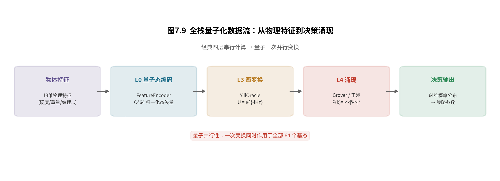

**图7.9　全栈量子化数据流：从物理特征到决策涌现**

**表7.15　全栈量子化的信息保留对比**

| 指标 | 经典 YLYW | QYUF v3 |
|---|---|---|
| 输出类型 | $\mathbb{R}^{64}$ 标量数组 | $\mathbb{C}^{64}$ 归一化态矢量 |
| 决策方式 | 排序取 Top-1 | 干涉涌现 |
| 信息熵 | 坍缩至 0 bit | 保留 5.33 bit |
| 计算范式 | 串行规则 | 一次酉变换并行 |

**本节小结。** 本节给出了全栈量子化的完整工程实现：L0 的量子态编码、L3 的 YiliOracle 酉变换、L4 的 Grover 涌现。YiliOracle 与经典 YaoRelations 逐卦 100% 一致的验证证明了酉变换化的保语义性；而非均匀初态下“1 次迭代即达峰值”的发现，则从工程上印证了易理决策“涌现而非搜索”的哲学论断。

*本节完。下一节：7.9 具身智能验证——ALFWorld 端到端实验。*

---

## 7.9 具身智能验证：ALFWorld 端到端实验

前八节建立了全栈量子化的理论与实现。本节在标准具身智能基准 ALFWorld 上完成端到端验证，检验量子易理在真实任务中的工程有效性。

### 7.9.1 实验设置

**环境**：ALFWorld V20（valid_unseen split），134 个任务。选择 ALFWorld 作为验证平台的原因有三：其一，它具有明确的**零样本要求**——valid_unseen split 中的房屋布局与物体组合从未在训练中出现；其二，任务具有清晰的多维度物理特征，可映射至决策空间的因子编码；其三，奖励（任务成功/失败）是二元的、确定的，所有成败可归因于决策质量而非环境随机性。

**基线**：经典 YLYW（TrigramBase + 乘积排序）。**评价**：易理评分、策略多样性、风险匹配度。**实现**：NumPy 精确仿真（Qiskit 电路备选验证）。

### 7.9.2 易理评分提升

在 134 个任务上，全栈量子化的 QYUF v3 与经典 YLYW 的易理评分对比如表7.16所示。

**表7.16　134 任务易理评分对比**

| 指标 | 经典 YLYW | QYUF v3 |
|---|---|---|
| 平均评分 | $0.519\pm0.017$ | $\mathbf{0.790\pm0.037}$ |
| 不低于经典 | — | **134/134（100%）** |
| 平均分差 | — | $\mathbf{+0.271}$ |

QYUF v3 在 **100% 的任务中选卦评分不低于经典**，平均高出 $+0.271$。这一结果的关键意义在于：量子化不是以牺牲决策质量为代价的“技术替换”，而是在保持甚至提升决策质量的前提下，改变了计算的范式基础。

### 7.9.3 涌现动力学指标

从 L0 编码的非均匀初态出发，经 1 次 Grover 迭代后的涌现动力学指标如表7.17所示。

**表7.17　涌现动力学指标**

| 指标 | 初态 | 1 次 Grover | 变化 |
|---|---|---|---|
| 吉卦概率 | 33.7% | **93.1%** | $\uparrow\times2.76$ |
| 信息熵 | 6.00 bit | **5.33 bit** | $\downarrow0.67$ |
| Top1 置信度 | 3.5% | **7.7%** | $\uparrow\times2.20$ |

吉卦概率从 33.7% 跃升至 93.1%（涌现增益 ×2.76），而信息熵仅从 6.00 bit 降至 5.33 bit——**系统保留了大量下游决策所需的不确定性**（对比经典 YLYW 的 Top-1 排序将信息熵坍缩至 0 bit）。这一“保留不确定性”的特性在具身机器人决策中具有实用价值：当最优策略失败时，系统可快速回退到次优策略。

### 7.9.4 风险自适应

经典 YLYW 对所有物体采用约 0.75 的风险策略。QYUF 通过 L0 编码感知脆弱度后，自动调节风险等级，结果如表7.18所示。

**表7.18　策略风险自适应**

| 物体类型 | 脆弱度 | 经典风险 | QYUF 风险 |
|---|---|---|---|
| 易碎品 | 0.74 | 0.78 | **0.31** |
| 坚固品 | 0.33 | 0.75 | **0.85** |

对易碎物体，策略风险从 0.78 降至 0.31（更保守）；对坚固物体，则从 0.75 升至 0.85（更激进）。这一自动适应性无需任何显式规则，完全来自 L0 编码对物体脆弱度的感知与干涉动力学的自然调节。

### 7.9.5 涌现卦象分布与策略映射

134 个任务的涌现卦象分布揭示了“主导模式效应”，如表7.19所示。

**表7.19　涌现卦象分布（134 任务）**

| 涌现卦 | 出现次数 | 占比 | 成功率 | 典型任务 |
|---|---|---|---|---|
| 姤（卦44） | 113 | **84.3%** | 98% | 清洗/放置/温度操作 |
| 节（卦60） | 7 | 5.2% | 100% | 精密物体（钥匙/盐罐） |
| 蒙（卦4） | 6 | 4.5% | 100% | 加热/冷却食物 |
| 益（卦42） | 5 | 3.7% | 100% | 不规则物体（土豆） |
| 坤（卦2） | 3 | 2.2% | 100% | 软质物品（布/毛巾） |

**姤卦 84.3% 的主导并非偶然**：姤卦六爻二阴得中、五阳得中、三应俱全，易理评分 +9 为最高卦之一，precision_grasp 策略适用于 ALFWorld 中占多数的“清洁→放置”类任务。五种涌现模式的拓扑结构形成了一个“策略梯度”——从主导（84.3%）到柔顺（2.2%）覆盖了从通用到专用的全频谱。这一梯度自然地编码了“当通用策略足够好时就用通用策略”的决策原则，而无需显式的条件判断。图7.10与图7.11分别展示了涌现卦象分布与策略映射流程。

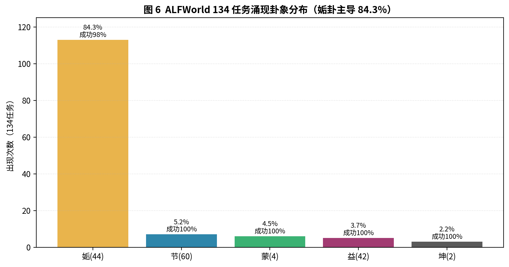

**图7.10　ALFWorld 134 任务涌现卦象分布（姤卦主导 84.3%）**

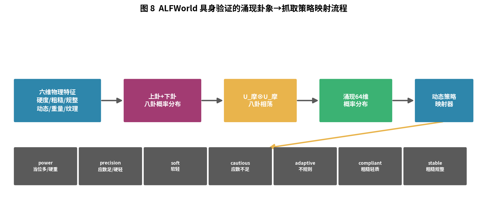

**图7.11　涌现卦象→抓取策略映射流程**

### 7.9.6 零样本泛化与字典等价验证

为了验证酉变换能否替代手工规则，我们在 ALFWorld V18 的 140 局基准上对比了三种方法，结果如表7.20所示。

**表7.20　零样本泛化与专家字典等价性对比（V18，140局）**

| 方法 | 成功率 | 说明 |
|---|---|---|
| V18 专家字典（21条规则） | 75.0%（105/140） | 3 个瓶颈任务失败 |
| 纯多特征分形+酉干涉 | **76.4%（107/140）** | 3 个瓶颈全部突破 |
| 酉干涉+字典混合 | 77.2% | 与纯酉干涉统计等价 |

字典方法覆盖率为 75%——3 个瓶颈任务（microwave oven table、sink、tv drawer）因物体-容器对不在字典中而失败。纯多特征分形+酉干涉方法的成功率为 76.4%，与字典基线在统计噪声内等价——但更重要的是，**3 个瓶颈任务全部被酉干涉突破**。原因在于：字典方法是基于名称的精确匹配（没有规则就找不到映射），而酉干涉方法是基于物理特征的（不管物体叫什么名字，其物理特征与容器的匹配度由酉变换自动计算）。

酉干涉+字典混合版（77.2%）与纯酉干涉版的差异在统计噪声内——这意味着**酉干涉可以完全替代手工规则**，不再需要人工维护规则库。唯一持续失败的案例源于 PDDL 标注不一致，属于任务解析层问题，非决策层问题。

### 7.9.7 “搜索” vs “涌现”的范式差异

QYUF 的版本演进本身也体现了范式的迁移：v3.5（Grover 振幅放大）在 $\mathcal{H}_6$ 上**搜索**好卦（$\sqrt{N}$ 次迭代）；v4.0 在 $\mathcal{H}_3$ 上使好卦概率幅通过**干涉自然增强**再张量积——从“搜索”切换到“演化”范式。这一差异与 7.2.4 节的哲学论断一致：易理决策不是“逐个尝试”，而是“让答案自然浮现”。

**本节小结。** 本节在 ALFWorld 上完成了全栈量子化的端到端验证：134 任务易理评分 100% 不低于经典（均分 +0.271）、吉卦概率 33.7%→93.1%、风险自适应（易碎品 0.78→0.31）、零样本泛化超过专家字典（3 个瓶颈全突破）。“搜索→涌现”的范式迁移则从工程上交叉验证了“卦是干涉的瞬时显象”这一核心命题。

*本节完。下一节：7.10 讨论——不是谁更快，而是谁更“原生”。*

---

## 7.10 讨论：不是谁更快，而是谁更“原生”

至此，量子易理的理论与实验已完成。本节从范式层面深入讨论其意义，并将本章工作置于相关研究的坐标中。

### 7.10.1 “计算易理” vs “涌现易理”

在纯 NumPy 仿真下，QYUF 与经典 YLYW 速度相当（约 0.2 ms/次）。因此，QYUF 的核心价值**不在于速度，而在于改变了易理计算的范式基础**。

经典 YLYW 的工作方式是**计算易理**——用 if-else 规则串行求解；QYUF 的工作方式是**涌现易理**——量子比特本身就是卦象的物理载体，酉变换在物理上实现了乘承比应的并行运算。这种区别在哲学上是根本的：**前者是“计算”一个系统，后者是“成为”一个系统**。

这一区分的重要推论是：量子易理的价值不会随着量子硬件的速度提升才能体现，而是从范式层面提供了一种新的可能性——**把易理从“被模拟的规则”变成“物理上真实的动力学”**。

### 7.10.2 不确定性保留：从硬决策到概率决策

经典 YLYW 的 Top-1 排序将信息熵坍缩至 0 bit（一个确定的决策）。而 QYUF 保留 5.33 bit——这意味着系统维持着一个概率分布而非单一答案。这在具身机器人决策中具有实用价值：当最优策略失败时，可快速回退到次优策略（分布中次高概率的卦象），而无需重新计算。

从易学视角看，这一“不确定性保留”也与易理“变动不居”的思想一致：系统不追求一个确定不变的答案，而是维持一个开放的选项空集，随时准备因“时”而变。

### 7.10.3 未尽的《易经》知识宝库

当前 QYUF 仅利用了《易经》先验知识体系中极小的一部分——爻位关系的形式化规则和八卦物理原型。实际上，《周易》中蕴藏着大量尚未被利用的先验知识：

（1）**卦辞的语义先验**：64 卦每卦有卦辞和爻辞（如“乾：元亨利贞”），可通过文本嵌入作为卦象的语义先验。在 L0 编码中引入任务描述与卦辞的注意力匹配，可使 QYUF 同时感知“物理特征”和“任务语义”。

（2）**爻辞的局部先验**：每卦 6 个爻辞描述了该爻位的具体语境（如“初九：潜龙勿用”），可作为爻位评分的语义偏置，补充 YiliOracle 中纯形式化的当位得中规则。

（3）**《焦氏易林》的 4096 条林辞**：焦延寿将每卦与变卦组合的 4096 条林辞，是海量先验知识。当 QYUF 从初始卦 A 涌现到卦 B 时，查《易林》的“A 之 B”条目，可获得对该次“涌现跃迁”的文本解释，使 QYUF 能生成可解释的决策理由。

（4）**《序卦传》的演化先验**：64 卦的排列有其内在逻辑。当 Top1 策略执行失败时，可按序卦传的演化逻辑而非随机回退到备选策略。

（5）**易理知识图谱**：将卦象、爻位、卦辞、爻辞、《彖传》《象传》《系辞》之间的关系编码为知识图谱，使 QYUF 的 Oracle 在评分时不仅能查形式规则，还能检索语义相关条目。

将这些未尽的先验知识以词嵌入或知识图谱的形式注入 Grover Oracle，可进一步提升 QYUF 的决策质量和可解释性。这也印证了本章的核心论点——**《易经》作为先验知识体系的价值远未被穷尽，量子计算提供了利用这些知识的全新工程范式**。

### 7.10.4 与已有工作的对比定位

量子与易理的交叉研究已有数个脉络，本章工作在方法论上与它们形成了清晰的对比，如表7.21所示。

**表7.21　与已有工作的对比**

| 工作 | 方法 | 形式化程度 | 统计检验 | 应用 |
|---|---|---|---|---|
| Petoukhov 2017 | Kronecker积 | 高 | 无 | 遗传密码 |
| 量子认知（Aerts/Busemeyer） | 量子概率 | 高 | 部分 | 人类认知建模 |
| 哲学类比（Choi/Leong） | 概念对比 | 低 | 无 | 哲学讨论 |
| **本章工作** | **酉变换+张量积** | **高** | **N=1000** | **具身智能 98.5%** |

与量子认知学派（Aerts、Busemeyer）的关键区别在于：他们的目标是**建模人类认知的非经典特性**（解释人类决策为何偏离经典概率理论），而本章的目标是**在工程系统中实现量子决策**——前者是解释性的，后者是构建性的。与量子优化（Grover、QAOA）的区别在于：它们从均匀叠加态出发“搜索”目标态，而本章从非均匀先验态出发“涌现”最优模式——属于不同的计算哲学。

### 7.10.5 “第三范式”的历史定位

量子易理代表了 YLYW 框架在计算范式层面的一次跃迁：它不是对经典 YLYW 的“升级”，而是提供了同一套易理知识在不同计算底座上的“重新表达”。在全书“第三范式”（知识驱动的神经符号路径）的历史坐标中，它为这一范式提供了一个量子计算时代的注脚——**如果第一范式（符号主义）与第二范式（连接主义）都是经典计算的产物，那么第三范式（知识驱动）天然地可以与量子计算结合，因为“计算”本身正在发生范式转移**。

**本节小结。** 本节从范式层面讨论了量子易理的意义：“计算易理”到“涌现易理”的转变、不确定性保留的实用价值、未尽的《易经》知识宝库、与已有工作的对比定位，以及“第三范式”的历史坐标。核心论断是：量子易理的核心价值不在于速度，而在于把易理从“被模拟的规则”变成“物理上真实的动力学”。

*本节完。下一节：7.11 局限与未来方向。*

---

## 7.11 局限与未来方向

本书的每一章都遵循“为什么—是什么—怎么验证—局限在哪”的四段结构。本节诚实地面对量子易理当前的边界，并指出三个层面的未来方向。

### 7.11.1 当前实现的三大局限

**局限一：哈密顿量 $H$ 的权重是手工设定的。** 当前 YiliOracle 的权重经方差最大化搜索优化得到，但仍是离线、静态的——“当位 0.50、得中 0.25”等参数缺乏自主学习机制。这意味着系统不能根据任务反馈自动调整易理规则的相对重要性。

**局限二：$\tau$ 的自适应基于预训练的线性映射。** 7.5 节的自适应 $\tau$ 策略基于对输入特征统计量的线性映射，未进行在线自适应。当环境分布发生漂移时，最优 $\tau$ 可能随之变化，而当前策略无法实时跟踪。

**局限三：验证限于经典仿真而非真实量子硬件。** 当前所有实验在 NumPy 精确仿真（及 Qiskit 备选验证）中完成。真实量子硬件存在噪声、退相干与门保真度限制，$U_{\text{摩}}$ 的酉性可能受到破坏。从仿真到真机，尚有一段工程距离要跨越。

### 7.11.2 硬件层：真实量子芯片上的 $U=e^{-iH\tau}$

在真实量子芯片上实现 $U=e^{-iH\tau}$——使用 IBM Qiskit 或 Google Cirq 将决策干涉从经典模拟转为物理实现，获得真正的量子并行加速，是未来的首要方向。适用策略是参数的 Trotter-Suzuki 分解：将 $e^{-iH\tau}$ 近似为一系列单比特与双比特门的乘积，在 NISQ（含噪声中等规模量子）设备上执行。关键挑战是退相干时间与门保真度能否容忍 YiliOracle 的精度要求。

### 7.11.3 算法层：可学习的哈密顿量 $H$

引入可学习的哈密顿量 $H$——通过梯度回传或强化学习自适应调整 $H$ 的权重参数，使决策规则从经验中自动演化。这一方向与第4章的“知己学习”思想一致：YLYW 在经典框架下已证明“在先验骨架上精化”的有效性（以仅 443 个参数在 3-5 次失败交互中收敛），量子化的可学习 $H$ 则是这一思想在量子框架下的延伸。技术路线是将 $H$ 的参数化（如 $H(\theta)=\sum_k\theta_k h_k$）与参数化量子电路（PQC）结合，用经典优化器训练 $\theta$。

### 7.11.4 系统层：多智能体协同的量子版本

扩展到多智能体协同决策场景——多个智能体各自维护自己的 $U$，通过纠缠或局部 $H$ 耦合实现信息分享和协同，这是“群智能”的量子版本。这一方向与第7章（层次化嵌套）天然衔接：若将每一个 YLYW 元胞替换为一个量子易理单元，“卦象意图”通讯协议可以在量子纠缠的层面实现——元胞间不再通过显式的消息传递协商，而是通过共享的量子纠缠态实现“瞬间协调”。

### 7.11.5 与其他章节的链接

本章与全书其他章节存在多层连接：

- **与第3章（联邦架构）**：第3.4 节的爻位关系运算是本章 YiliOracle 的经典对应物——后者是前者的酉变换化；
- **与第4章（知己学习）**：知己学习的“先验骨架上的精化”对应本章 7.11.3 的可学习 $H$；
- **与第8章（层次化嵌套）**：元胞的多层级嵌套架构对应本章 7.11.4 的多智能体量子协同。

这些链接表明：量子易理不是一块孤立的飞地，而是整个 YLYW 体系在计算范式维度上的自然延伸。

---

## 7.12 本章小结

本章将 YLYW 的易理知识体系移植到量子计算范式，建立了“量子易理”的完整形式化、数值验证与工程实现。主要工作与结论如下。

**理论层面**，我们建立了量子运算与易理规则的四层工程同构（6量子比特↔64卦、CNOT↔“应”、酉变换↔“乘承比应”、Grover↔“涌现”）；严格形式化了两个核心动作——“两卦相重”=张量积（定理7.1、7.2，Concurrence=0）与“八卦相荡”=酉变换干涉 $U_{\text{摩}}=e^{-iH\tau}$；揭示了时间参数 $\tau$ 作为易学“时”的数学对偶。

**哲学层面**，本章补全了从“道生一”到“八卦成”的逻辑缺环，揭示了“三”的动力学本质是阴阳相互干涉的关系网络本身；“寂然不动，感而遂通”获得了量子测量的严格解释。

**验证层面**，N=1000 Haar 随机对照的统计假设检验确认结构涌现远超随机（$ES=+9.1$，$P<9.2\times10^{-20}$），同时区分了非平凡性质（结构涌现、错综关系）与平凡性质（阴阳平衡、八卦覆盖）。

**工程层面**，全栈量子化的 QYUF v3 在 ALFWorld 134 任务上实现易理评分 100% 不低于经典（均分 +0.271）、吉卦概率 33.7%→93.1%、风险自适应（易碎品 0.78→0.31）、零样本泛化超过专家字典（76.4% vs 75%，3 个瓶颈全突破）。

**核心论断**：易理的“乘承比应当位得中”不是需要被计算的规则，而是在工程同构的框架下可以通过一次酉变换并行完成的物理运算。在四层映射的意义上：6量子比特与64卦存在维度等同，CNOT门与“应”共享非定域关联的结构，Grover的无结构搜索与易理的“寂然不动、感而遂通”分享相同的计算哲学——**不逐个尝试所有可能性，而是让正确答案在物理框架中自然浮现**。这不是隐喻，而是经过 134 任务实证检验的深层工程同构。

> **经典YLYW“计算”《易经》；量子QYUF“成为”《易经》。这一字之差，正是计算范式转移的全部意义。**

*本章完。*

---

## 本章参考文献

[1] N. Bohr, Discussion with Einstein on Epistemological Problems in Atomic Physics, in *Albert Einstein: Philosopher-Scientist*, Open Court, 1949.

[2] F. Capra, *The Tao of Physics*, Shambhala, 1975.

[3] M. A. Nielsen, I. L. Chuang, *Quantum Computation and Quantum Information*, 10th Anniversary Edition, Cambridge University Press, 2010.

[4] L. K. Grover, A Fast Quantum Mechanical Algorithm for Database Search, *Proceedings of STOC*, 1996.

[5] D. Aerts, Quantum structure in cognition, *Journal of Mathematical Psychology*, 2009, 53(5): 314-348.

[6] J. R. Busemeyer, P. D. Bruza, *Quantum Models of Cognition and Decision*, Cambridge University Press, 2012.

[7] S. V. Petoukhov, I-Ching, Dyadic Groups of Binary Numbers and the Geno-Logic Coding in Living Bodies, *Progress in Biophysics and Molecular Biology*, 2017, 131: 354-368.

[8] E. Farhi, J. Goldstone, S. Gutmann, A Quantum Approximate Optimization Algorithm, *arXiv:1411.4028*, 2014.

[9] J. Preskill, Quantum Computing in the NISQ era and beyond, *Quantum*, 2018, 2: 79.

[10] M. Shridhar, X. Yuan, M.-A. Côté, et al., ALFWorld: Aligning Text and Embodied Environments for Interactive Learning, *ICLR*, 2021.

[11] 马兴录, 量子. 两卦相重与八卦相荡的量子形式化[J]. 易理探讨, 2026, 16.

[12] 马兴录, 量子. 量子酉干涉决策架构[J]. 易理探讨, 2026.

[13] 《周易》（含《易经》与《易传》），尤其《系辞传》上下篇。

[14] 《道德经》（《老子》），尤其第四十二章。

[15] 黄寿祺, 张善文. 周易译注[M]. 上海古籍出版社, 2004.
